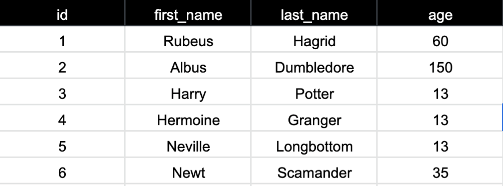

## CSV Exploration

### Introduction

Think back to your first two projects. How have you currently been making instances of objects in those projects? Likely you have been creating an instance of the objects you need in the `runner` file or having the user input information that was then used to create the object. What if there was a larger set of data that you wanted to use to create objects?

### Using files to create objects

Sometimes the data that we want to use will be stored in a CSV. CSV is a file type that stands for _comma separated values_. Think of it similar to a spreadsheet or an excel sheet. The information within these files can be organized in columns and rows and might look like this:



The first row is the headers for each column which gives us information about the values in the rows below. Each row we can think of as being a package of information that belongs together. Looking at our example we should see the first package of information is `1, Rubeus, Hagrid, 60`. We know that `1` is the id, `Rubeus` is the first name, `Hagrid` is the last name and `60` is the age because of the header for each column in which the information is located.

Rows and columns are nice for us to visually organize information, but what if we want to use that information in our application? Ruby has helped us by having a defined class called CSV. This class contains methods that we can use to interact with a file.

### Challenge

Fork and clone [this repo](https://github.com/turingschool-examples/csv_example).

For the next 30 minutes, read and use the ruby docs for CSV found [here](https://ruby-doc.org/stdlib-2.6.5/libdoc/csv/rdoc/CSV.html#method-c-new). Within the `runner.rb` file write some code that will print each row from `animal_lovers.csv` to the terminal. If you've been able to print each row, now see if you can also print the header with the value for each row.

If you complete the above, try doing the same for the `magical_pets.csv`.

_The docs may not be the easiest to read, but do start there to gather information and get some practice reading documentation. After you've looked through the documentation, you can also google for additional resources to help you._


 _If you've tried the docs and have googled additional resources and you are not making any progress try this_
<details open>
<summary>Last Resort</summary>
<br>
<a href="https://github.com/turingschool/backend-curriculum-site/blob/gh-pages/module1/lessons/csv_walkthrough.md">CSV Walkthrough</a>
</details>


## Introduction to Black Thursday Lite

Shortly you will be working through Black Thursday Lite. This is a mini-project for you to work through. It is okay if you do not complete this project, but please work through as much as possible because we will revisit it next week to do some code share and use as a reference in the Class Methods Lesson.

### Class Methods at a High Level

Currently in the projects you have completed the methods you have been creating are instance methods. This means that you call a method on an instance of an object. However, in order to create an instance of an object we call `new` on the class itself. `new` is a class method.

For example, in the following code:

```ruby
hagrid = AnimalLover.new(1,'Rebeus','Hagrid',60)
harry = AnimalLover.new(3,'Harry','Potter',13)
```

the `new` is a class method because it is called on the name of the class `AnimalLover`.

Now if we had, `hagrid.full_name` or `harry.full_name` this is an instance method. The method is called on a single instance method and the return would be different depending on which instance it is call on.

When writing an instance method the format looks like this

``` Ruby
def name_of_method
  #code here
end
```

When writing a class method the format looks like this

```Ruby
def self.name_of_method
  #code here
end
```

Use this exploration as an opportunity to see how these behave differently. It is okay if it isn't completely clear during or at the end of this exploration. The goal is that you try it on your own for now and we will dive into the specifics in our Class Method Lesson.

### ORM at a High Level

ORM stands for Object Relational Mapper. Earlier we were worked through taking a package of information from each row and creating an object so that we could more easily use the information in our application. That idea--the idea of turning data (such as rows of data from a CSV) into objects and allowing you to interact with those objects is the concept of an ORM.

Once you've done that, an ORM also allows you to *query* (ask for specific objects that meet certain criteria-- like a `find` or `find_all`, plus many, many more) all of that data, using the objects that you've created.

ORMs are good because:

1. DRY: It makes it easier to update, maintain, and reuse your code.
2. A lot of stuff is done for you, behind the scenes
3. You don't have to write SQL, which is a language for querying databases
4. You can clean up the data that you're taking in very quickly and easily (data can be a real mess sometimes, with the crazy ways that people input things)
5. It helps you follow the principles of OOP

This is an example of something an ORM gives you:
```
Person.find(10)
```
✅ It's nice, right? Pretty much human-readable.
This is the alternative in SQL:
```
SELECT * FROM clients WHERE (clients.id = 10) LIMIT 1
```
😬 Less nice.

ORMs can be tricky because:

1. They can be pretty heavyweight, and require you to learn a new set of tools
2. Performance is not as good as writing SQL
3. It _abstracts_ your data, which means that it hides a lot of the work away from you. That's good in some ways, but it can make it harder to understand what's really happening behind the scenes.

*Don't worry too much about the details here-- just remember that an ORM gives you the ability to interact with objects instead of raw data.*


### Go Forth and Explore

Ruby on Rails relies heavily on an ORM called Active Record (https://guides.rubyonrails.org/active_record_basics.html), which is really extensive and powerful.  It's a great tool, but it does hide away a lot of the work that it does.  We're going to have you build out a little mini-project that mimics the behavior of an ORM so you can see a little bit of how the under-the-hood concepts work.

Just to reiterate, work through the mini-project as much as you can and use this as an opportunity to think about the concepts we've introduced so far. We will revisit this next week, so you will have better context as we go through our classes next week. Have fun!

## [Black Thursday Lite](https://github.com/turingschool-examples/black_thursday_lite)
