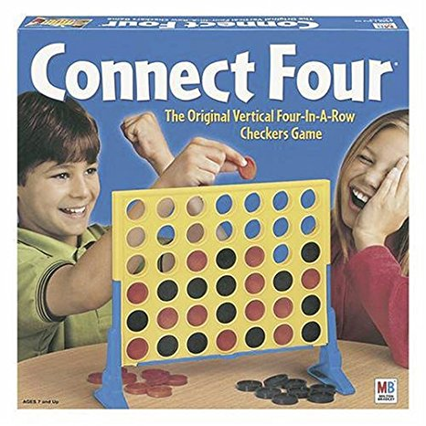

## Background

Connect Four is a classic board game where players take turns trying to create a line of four of their own pieces without being blocked by their opponent. The game ends when one of the two players successfully lines up four of their pieces horizontally, vertically, or diagonally and wins, or in a draw if the 7-column, 6-row grid is filled without either player successfully connecting four pieces. For more information, see the [wikipedia page](https://en.wikipedia.org/wiki/Connect_Four).

## Learning Goals / Areas of Focus

* Practice breaking a program into logical components
* Testing components in isolation and in combination
* Applying Enumerable techniques in a real context
* Practice implementing a useable REPL interface

## Overview

In this project you'll use Ruby to build a command line implementation of the classic game Connect Four. More detail can be found in the pages below:

* [Setup](./setup)
* [Technical Requirements](./requirements)
* [Peer Code Share](./peer_code_share)
* [Evaluation Presentation Requirements](./evaluation)
* [Evaluation Rubric](./rubric)
