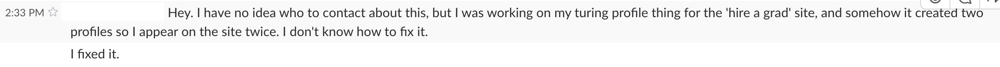

# Welcome to M1

---

# Warmup

* What were you doing before Turing?
* How did you hear about Turing?
* What made you decide to come to Turing?

---

# Share

---

# Overview

* Concepts
* Portfolios
* End of Module Assessment
* Projects
* Resources
* Tips for Success
* Community
* Prework Review

---

# Concepts

* M1: OO with Ruby (Ruby Fundamentals)
* M2: Web Applications with Ruby
* M3: Professional Rails Applications
* M4: Client-Side Development with JS

Gradual release of responsibility

---

# M1 Concepts (M1 Success)

* Ruby Syntax & Style
* Breaking Logic Into Components
* Debugging
* Test Driven Development
* Version Control
* Desktop Environment
* Collaboration
* Career Development

---

# Projects

* Credit Check
* Jungle Beats/Date Night
* Complete Me/Enigma (paired)
* Battleship
* Black Thursday (paired)

---

# Lightning Talks

* Five minutes
* Topic of your choice
* Sign up for a day to present

---

# End of Module Pentathlon

* Paired Assessment
* Independent Assessment
* Written Assessment
* Final Project
* Portfolio

---

# Portfolios

* Areas of Emphasis
* Projects
* Community
* Self-Assessment

---

# Resources

* Calendar
* Weekly Outlines
* Instructors
* Each other

---

# Tips for Success

* Make learning your goal
    * Deciding what to tackle
    * Deciding when you're done
    * Deciding how to supplement our instruction
* Embrace your own agency in any situation
* Practice a growth mindset
* Maintain a bias toward action
* Find a way to ask questions

---

# Typical Day at Turing

---

# Community (New Pair)

* What will make you feel welcome?
* What will make you feel valued?
* What will make you likely to ask questions?

---

# Share

---

# Pair and Share Pre-Work Games
