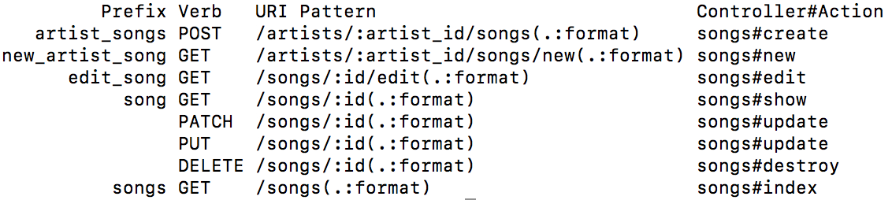
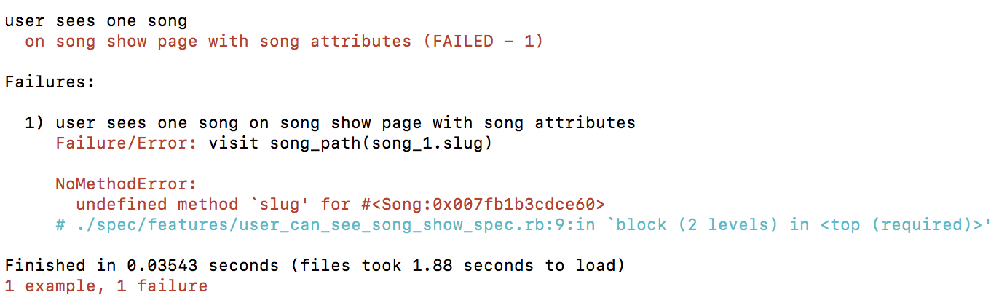
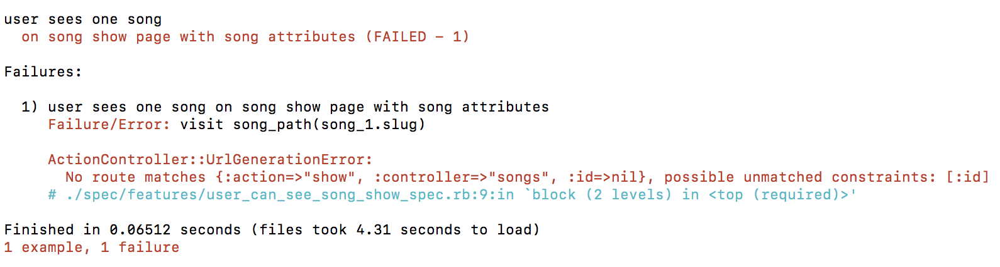
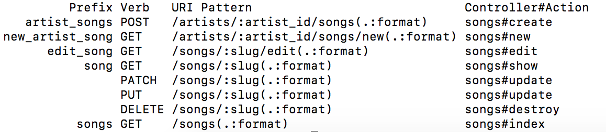
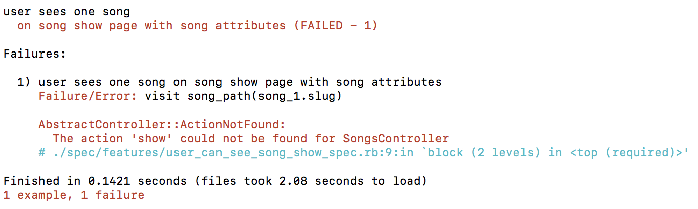
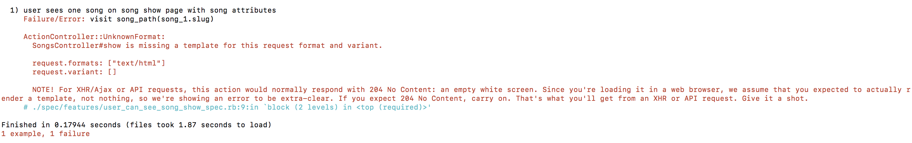

## Learning Goals

* Understand how callbacks work
* Know some common callbacks
* Use callbacks to your advantage

## Slides

Available [here](../slides/callbacks_and_refactoring.md)

## Vocabulary

* callback
* DRY
* slug

## WarmUp

Using the internet:

* In your own words, what is a Rails callback?
* Why do people seem to hate them so much?
* Why might we teach you about them even though people seem to hate them?

## Background

### What is a Callback

From the [Rails Guides](http://guides.rubyonrails.org/active_record_callbacks.html):

> Methods that get called at certain moments of an object's life cycle. With callbacks it is possible to write code that will run whenever an Active Record object is created, saved, updated, deleted, validated, or loaded from the database.

### [Rails/ActiveRecord Callbacks](http://api.rubyonrails.org/classes/ActiveRecord/Callbacks.html)

1. Creating an Object
  * `before_validation`
  * `after_validation`
  * `before_save`
  * `around_save`
  * `before_create`
  * `after_create`
  * `after_save`
  * `after_commit`/`after_rollback`
1. Updating an Object
  * `before_validation`
  * `after_validation`
  * `before_save`
  * `around_save`
  * `before_update`
  * `after_update`
  * `after_save`
  * `after_commit`/`after_rollback`
1. Destroying an Object
  * `before_destroy`
  * `after_destroy`
  * `after_commit`/`after_rollback`

**Note:** Some of these are called both when an object is created and when it is updated since in both cases the object is saved.

### When to Use a Callback

Almost never. "After" callbacks can get messy. A PORO is a better option, most of the time.

### Callbacks Are Often Code Smells

What do we mean by Code Smell?
Typically this means the code is a symptom that is pointing to a deeper issue.
Thinking of this metophorically, if we have a leak in our roof and simply use a bucket to catch the water rather than repairing the roof.
Our bucket solution would be the 'code smell' that is pointing to the deeper issue of a leak in the roof.

Callbacks are super powerful, but why should we use them with care?

Let's break up into 4 groups to research this.

Try to be diligent with your research and come to your own conclusions. This practice will come in handy when navigating opinionated developers in your career.

## Exploration

### Setup

We are going to continue to use `music_box`.

### Use Case

We want to access our songs by title in the url. for example `/songs/my-heart-will-go-on`. Right now, we have access to our song show page by `/songs/:id`. How do we create this new url?

Current Rails Routes



### Write Our Test

```ruby
#spec/features/user_can_see_show_spec.rb

require 'rails_helper'

describe "user sees one song" do
  it "on song show page with song attributes" do
    artist = Artist.create(name: 'Celine Dion')
    song_1 = artist.songs.create(title: "My Heart Will Go On", length: 233, play_count: 8790)
    song_2 = artist.songs.create(title: "Beauty and the Beast", length: 342, play_count: 7980)

    visit song_path(song_1.slug)

    expect(current_path).to eq("/songs/#{song_1.slug}")

    expect(page).to have_content(song_1.title)
    expect(page).to have_content(song_1.length)
    expect(page).to have_content(song_1.play_count)

    expect(page).to_not have_content(song_2.title)
    expect(page).to_not have_content(song_2.length)
    expect(page).to_not have_content(song_2.play_count)
  end
end
```

But what is a slug??? A slug is a piece of the URL’s path that is typically a hyphenated version of the title or main piece of a webpage you’re on.

### Creating a Slug Column

We run into an issue when we run the tests that `slug` does not exist for `song`. Lets add that migration:



`rails g migration AddSlugToSongs slug:string`

Check our migration and `rails db:migrate`

### Updating Song with Slug

- The reality is that we want to create our slug and then save our song with the slug we generated. How can we handle this? What type of callback could we use?

- How do we create a hyphenated title. Research for a few minutes. Any suggestions? `parameterize`

Running our test we should get an error:



Step 1: In Our Routes Add
```ruby
resources :artists, shallow: true do
  resources :songs, param: :slug
end
```

Our routes should now look like this:


Step 2: In Our Model

```ruby
# app/models/song.rb
before_save :generate_slug

private
 def generate_slug
   self.slug = title.parameterize
 end
```

### Adding Show to Songs Controller

Next Error:


Let's throw in a pry to see what our params are.

```ruby
# app/controllers/songs_controller.rb
def show
  binding.pry
end
```

Since we are now going to use the slug to access the show page, will we need to use find or find_by?

```ruby
# app/controllers/songs_controller.rb
def show
  @song = Song.find_by(slug: params[:slug])
end
```

### Adding our Show View

Run our test we see this error:



```ruby
# app/views/songs/show.html.erb
<h1><%=@song.title %></h1>
<p>Lenght: <%=@song.length%></p>
<p>Play Count: <%=@song.play_count%></p>
```

We know have passing tests!!!

Let's add a small refactor.

Open our test file and in the path helper remove `.slug`

```ruby
#spec/features/user_can_see_show_spec.rb

require 'rails_helper'

describe "user sees one song" do
  it "on song show page with song attributes" do
    artist = Artist.create(name: 'Celine Dion')
    song_1 = artist.songs.create(title: "My Heart Will Go On", length: 233, play_count: 8790)
    song_2 = artist.songs.create(title: "Beauty and the Beast", length: 342, play_count: 7980)

    visit song_path(song_1)

    expect(current_path).to eq("/songs/#{song_1.slug}")

    expect(page).to have_content(song_1.title)
    expect(page).to have_content(song_1.length)
    expect(page).to have_content(song_1.play_count)

    expect(page).to_not have_content(song_2.title)
    expect(page).to_not have_content(song_2.length)
    expect(page).to_not have_content(song_2.play_count)
  end
end
```

Now open our Song model and add the following

```ruby
# app/models/song.rb
before_save :generate_slug

def to_param
 slug
end

private
 def generate_slug
   self.slug = title.parameterize
 end
```

The `to_param` method is allowing us to overwrite the default return value of id to now be slug.
This allows us to pass just the song object to our path helper instead of `song_path(song_1.slug)`.
To read more about `to_param` go [here](https://guides.rubyonrails.org/active_support_core_extensions.html#to-param)

## WrapUp

* What is a callback? Name 5 of them.
* When should you use a callback?
