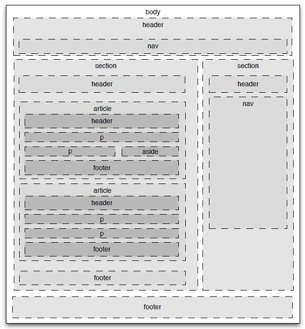

# Intro To Flexbox

## Let's Review

### The CSS Box Model

- Every html tag is surrounded by a box. The box consists of the content, padding, border and margin. Let's discuss each property individually.

### Block vs. Inline Display

- Certain tags have default display values. For example, an `h1` tag is a block-level tag and `img` is an inline tag. We can alter this by changing the CSS.

### Semantic Tags

- How do we group multiple tags together?
- Semantic tags can replace `div`s to provide more context than a general `div`.

- 

### Bootstrap vs Flexbox

- We can use the grid system (Bootstrap), which works fine but requires more digging into docs and base knowledge about how it works.
- Flexbox allows us to manipulate the position of tags without all the knowledge of a larger grid system.

## Using Flexbox

### Setup

- Clone down [this repo](https://github.com/icorson3/flexbox). Open the `index.html` file from your command line (For atom, `atom open index.html`).
- Check out the CSS and HTML files to see what is going on.

### Let's play

- display: flex;
- flex-direction: row, row-reverse, column, column-reverse
- order - displays in numerical order
- flex-wrap

### Make a Garbage Unicorn

- Most eye-burning website, wins!

## Resources

* [A Guide to Flexbox](https://css-tricks.com/snippets/css/a-guide-to-flexbox/)
* [Another challenge: flex calendar](https://github.com/tmikeschu/flexendar)
