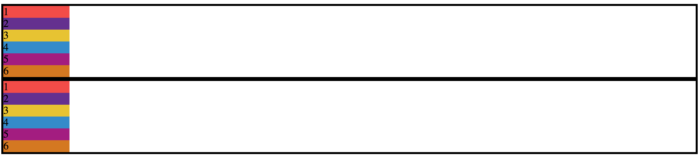
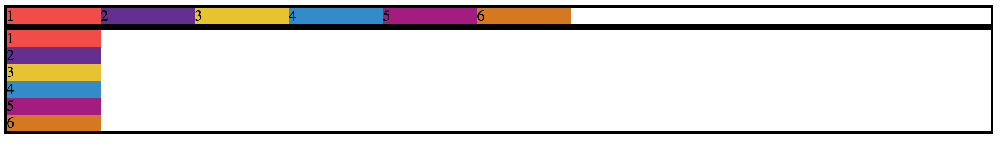
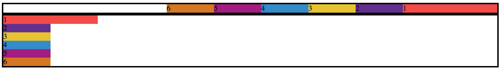

# Intro To Flexbox


## Vocab

- Flexbox
- Bootstrap
- `display: flex;`
- `justify-content`
- `flex-wrap`
- `flex-direction`
- `flex-flow`

## Warm Up
* What strategies have you used so far to position elements on the page? 
* How do you feel about positioning in CSS?
* Rate your abilities to position elements on the page

## Flexbox

- Introduced as syntax in 2015.
- Flexbox allows us to manipulate the position of tags without all the knowledge of a larger grid system.
- We can use a grid system ([Bootstrap](https://v4-alpha.getbootstrap.com/), [CSS Grid](https://css-tricks.com/snippets/css/complete-guide-grid/), etc), which works fine but requires more digging into docs and base knowledge about how it works.

### Using Flexbox

### Setup

- Clone down [this repo](https://github.com/turingschool-examples/flexbox_be2). Open the `index.html` file from your command line (For atom, `atom open index.html`).
- Check out the CSS and HTML files to see what is going on.

### Let's play

- Check out the `index.html` and `custom.css`
- Right now, we have two sections, each with 6 boxes (each 100px in width).
- We have not set the width on the `.boxes` sections so they are taking up the entire width of the page.



#### Display: flex;

- First things first, we want all of those boxes in the `section class="boxes-1` to be in a row, not a column but because of the default properties of a `div` being block, each one of these boxes is stacked on top of each other.

```css
.boxes-1 {
  display: flex;
}
```

- Each child of a flex container becomes a flex item. Text directly contained in a flex container is wrapped in an anonymous flex item.

- This tells our `boxes-1` to turn into a flex container that we can now play with
- By default, this property aligns elements inline within that container



- What happened?
- Our boxes are set to their width of 100px and now in a row.
- We can also adjust the width and height of the section that is containing the boxes and the boxes themselves.

#### Flex-wrap

- Let's change the size of our boxes to 500px and see what happens
- No matter how big the original boxes were, they will all fit into that section unless we change that option!

```css
.boxes {
  display: flex;
  flex-wrap: wrap;
}
```

#### Justify-Content

- We can play with where the contents sits within this section!
- We want to center the boxes in this section.

```css
.boxes-1 {
  display: flex;
  justify-content: center;
}
```

- Other options: `space-around`, `space-between`, `flex-start`(default), `flex-end`

#### Flex-direction

- By default, the direction is `row` but we can use other options such as `column` and both in reverse, `column-reverse` and `row-reverse`
- Let's reverse our row in `boxes-1`

  ```css
    .boxes-1 {
      flex-direction: row-reverse;
    }
  ```



- A shorthand for both `flex-wrap` and `flex-direction` is `flex-flow`

#### All Boxes Flex

- What about the other section of boxes?
- Let's flex `.all-boxes` and apply the some flexbox rules to it.

```css
.all-boxes {
  display: flex;
}
```

### Back to Dog Party

- With the time left, take another look at [Dog Party](https://github.com/icorson3/dog-party) and see if you can apply Flexbox to your layout.

## Wrap Up
* What are the 5 main properties to use with Flexbox which we learned today? (There are many more, check out the resources below)
  * What does each do?
  * What are the possible arguments you can pass each propery?

## Resources

* [A Guide to Flexbox](https://css-tricks.com/snippets/css/a-guide-to-flexbox/)
* [Another challenge: flex calendar](https://github.com/tmikeschu/flexendar)
* [A game to learn Flexbox](http://flexboxfroggy.com/)
