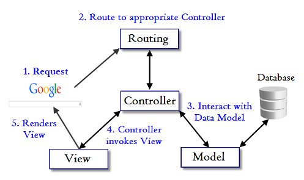

## Learning Goals

* Identify the elements of the MVC design pattern
* Describe the single responsibility of each of the Model, View, and Controller
* Describe how data is passed through the MVC pattern

## Vocabulary
* MVC
* Model
* View
* Controller
* DSL (Domain Specific Language)

## Warmup

* Open the Task Manager app you completed during intermission.  If you need a fresh copy of that application for any reason, a complete version can be found [here](https://github.com/turingschool-examples/task_manager_rails_complete).
* In your own words, what are the primary responsibilities of the models, views, and controllers in Task Manager?

## Lecture

### Overview

* **Models** - Interact with the database. Holds other methods related to a particular resource (e.g. a `task`)
* **Views** - Templates for pages that we will display to our user. Frequently contain placeholders for data, making them dynamic.
* **Controllers** - Coordinate the response to an HTTP request. In Task Manager, we just had one, but it is common to have multiple controllers.

### Controller

Look at your Task Manager `routes.rb`.

* Routes in Rails are defined as part of its DSL (Domain Specific Language).
* The first keyword, a predefined method, of these routes corresponds with the **HTTP verb** the request is making to the route.
* The argument this method takes is a string version of the **path** the request is being made to.
* The second argument specifies which controller action should handle the request. The DSL syntax is `<controller>#<action>`

Look at your `tasks_controller.rb`:

* Each route maps to a controller **action**
* A controller **action** is a **method** defined in a Controller class
* Controller **methods** and **actions** are synonymous
* Controllers send commands to models to perform database interactions
  * ex: the `index` action retrieves all the tasks
  * ex: the `create` action saves a new task
* Controllers pass data to views via instance variables
* Controllers can either render a view or redirect
  * by default, a controller will render a view file with the same name as the action. It will look for the file in a folder named the same as the resource (in this case "tasks") in the `views` folder.
  * You can redirect using the `redirect_to` method.
  * You can also manually say which view you want to render using the `render` method, but it's best to use the default convention when it applies.

### Model

Look at your Task model.

* Nothing! So where do we get the ability to call methods like `Task.all` and `Task.find`?
* Every controller within the controllers directory will have access to EVERY model in the database.
* The file naming conventions for models is singular.
* A model that inherits from `ApplicationRecord` should have a corresponding table in the Database.

### View

Look at a view from Task Manager

* By default, Rails looks for our views in a `/views` directory.
* Use ERB (embedded ruby) to describe how data should be used to create HTML
    * `<%= %>` renders the return value of the enclosed statement. Use this when you need something to be a part of the HTML document sent to the User.
      * ex: `
<%= task.description %>
`      
      **This piece of code will be extremely useful for assigning** `id` **attributes dynamically, which is important for testing. Bookmark this piece of code!**
      * ex: `
 >"`
    * `<% %>` does not render the return value. Use this when you don't want the return value to become part of the HTML. Typically, these are used for Ruby statements that control other statements.
      * ex: `<% tasks.each do |task| %>` ... `<% end %>`
      * ex: `<% if @tasks %>` ... `<% end %>`

### Putting it All Together

* Someone sends a request to your application. That request includes:
  * An HTTP verb (GET, POST, etc.)
  * A URI path (`/tasks`, `/`, `/tasks/2`)
* Rails inspects the verb/path combo and determines what controller action to call based on what routes you've defined in `routes.rb`
* Within that controller action, we:
    1. Perform any data manipulation we need using our model
    1. Collect any data we need to use in our view (using a model as a go-between)
    1. Render a view or redirect

Let's draw a diagram to represent this process.

MVC Diagram

### Logic "Responsibilities"

The MVC Design Pattern describes the primary responsibility of each portion of code that we'll describe a little bit deeper here.

#### Models -- Data Logic

We saw earlier that the Model is responsible for interaction with the database. In MVC, we say that the Model is responsible for "data logic". *Calculations, filtering of data, or other manipulation of data should happen at the Model level.* When fetching data from a Model, the Model should only return raw data in an appropriate data structure -- usually an array, but can also be a hash.

A Model generally does not alter data. For example, it would be appropriate for the Model to calculate the average age of all students, but it should NOT 'round' that data to, say, two decimal places. It can force the result to be a floating point number with `.to_f`, but it should return raw data as much as possible.

#### Views -- Presentation Logic

Views have very little logic in them, generally just if/else statements and perhaps doing some basic iteration over a dataset. *The primary goal of a View is to manipulate raw data given to it by a Controller to present that data* in a way that is useful to our users.

If a View has access to an instance variable, or a collection of instances in an array that it is iterating over, it's appropriate for the View to call "instance methods" from the Model class if needed. A View should not call *class* methods except in extremely rare cases where a data builder requires it, such as a drop-down select in a form for example.

#### Controllers -- Business Logic, or Application Logic

Our Controllers are the "traffic cop" between our Models and our Views. Based on the incoming request, each controller method knows precisely which Model(s) it needs to utilize to fetch or write data, and will generally hand that data off to a View for presentation.

Controllers should limit their database actions to very simple lookups, or creation of a resource. A controller should not do very much data manipulation, that "data logic" is the role of the Model. Likewise, the controller should pre-fetch as much data as possible so the View does not call Class methods from the Models.

### Experiment

* Add a new route and view so that the user can successfully visit `localhost:3000/easteregg` and see a new view of your choice.

*  Add a new route so that the user can go to `localhost:3000/showmethetasks` and be redirected to all of the tasks.

NOTE: For task 2, You should not have to create a new view.

**Let’s also quickly talk about why the 2nd path isn’t a good idea.**

### Recap
* What does MVC stand for?
* What are the "logic responsibilities" for each part of the MVC pattern?
* How is data passed through the MVC pattern?
* What is the difference between `<%= %>` and `<% %>`?
