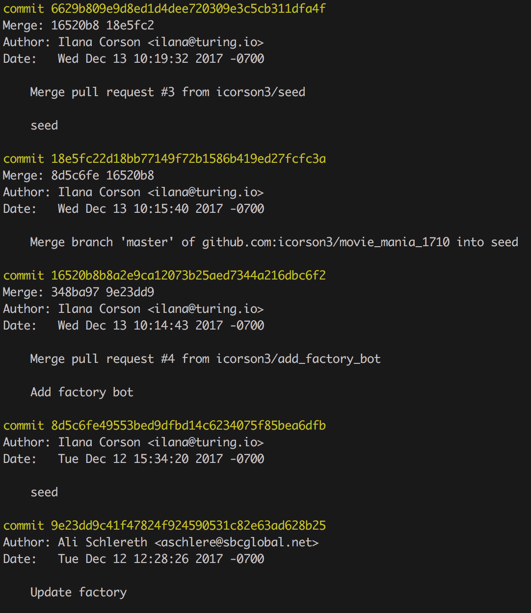
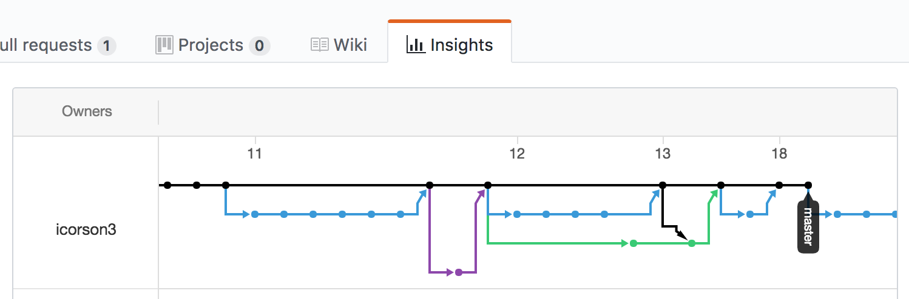
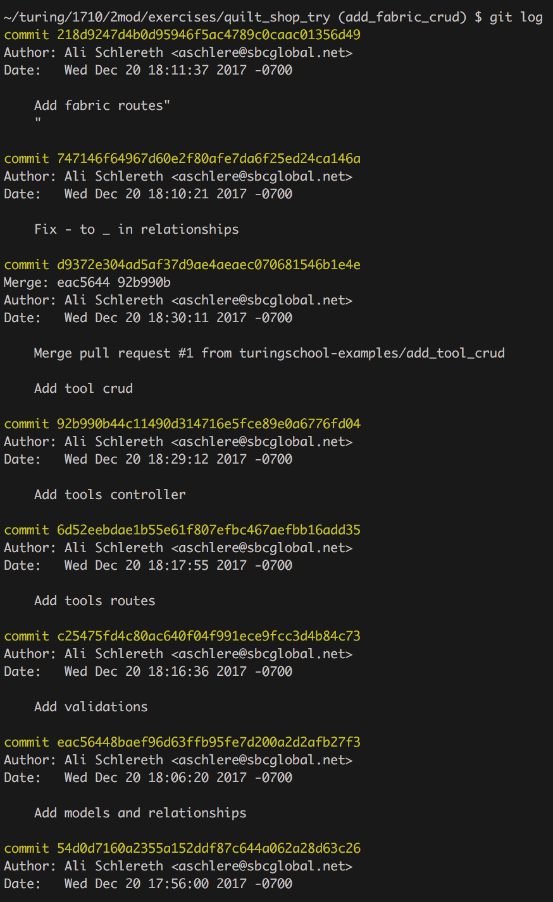
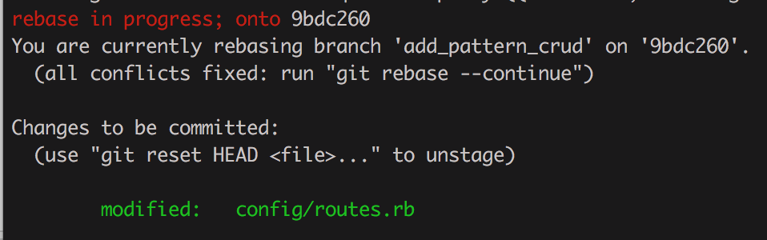

Some content shared from [the front-end program](https://github.com/turingschool/front-end-curriculum/blob/6b5b565c409c769e297fac720cc6aca92ee9f2d3/lessons/module-3/merge-vs-rebase.md)


## Learning Goals

* Understand the difference between merge and rebase workflows
* Explain when and when not to rebase
* Identify pros and cons of each method

## Vocabuarly 
* git log
* commit
* merge
* rebase

## WarmUp 
* What is the flow of commands to create a git repository locally and save your work?
* Assume you're working on a project with a group. You are finishing work on a feature branch. A partner has merged their branch into master on GitHub. What should be your work flow for getting your work into master?
* Draw a branching diagram to illustrate this process.

## The Git Merge Branch Workflow

We're all familiar with the most common git workflow: 

1. create a feature branch  
2. commit your work  
3. pull master into your branch
4. fix any merge conflicts
5. push your branch to GitHub
6. make a pull request 
7. partner merges your work into master
8. locally switch to master
9. pull updated master into your local master  

### Review

```bash
# find an awesome repo, fork it to your own GitHub user account, clone that repo:
$ git clone git@github.com:your_username/some-awesome-repo

$ git checkout -b new-branch
# do some work
$ git add new_file.rb
$ git commit -m "here is my new awesome work"
$ git pull origin master
$ git push origin new-branch

# visit github.com/your_username/some-awesome-repo
# create a pull request
# merge the code

$ git checkout master
# fetch master and download new changes
$ git pull master
```

## Whiteboard diagram

### Git Log

Your git log will look something like this:

- Merge pull request #76 from your_username/new-branch
- here is my new awesome work
- Merge pull request #75 from your_username/some-old-branch
- ...



### Advantages

- This is a great workflow if you want to see a branch history in your git log. You can view the "network" of your
git history on GitHub using a URL like this:
  - https://github.com/your-username/your-repo-name/**network**
 


- This method of merging works great in solo and pairing projects.

### Disadvantages

- A simple review of `git log` will be difficult to see what happened and when, commits will be all mashed together
across branches.
- You'll need to "pull" or "merge" master into your branch frequently to resolve merge conflicts as they come up.


## Git Workflow: Rebase

Some tech companies want a much cleaner commit log. Using `git rebase` allows us to see a more streamlined
history of the commits without the branching.

### Overview

Rebasing will effectively rebuild your branch's commit history with a new starting point from your master branch. You
should `git rebase` often to minimize merge conflicts along the way.

Doing a `git rebase` will have to step through every single commit you've made on your **feature** branch, one at a
time, and see if it's possible to apply it on top of the **master** branch. Squashing your commits may make this
process easier.

### Advantages

- Avoids auto-generated commits of pulling/merging master into your feature branch or merging your branch into master
- History appears cleaner. All of the new work you've done on your feature branch will be placed **after** the other
  commits on master. It's kind of like telling git, "pretend I didn't take 2 weeks to finish my feature, and make it
  seem like I started the work today and finished it all in a couple of minutes."
  


### Disadvantage

- Dealing with merge conflicts can be repetitive if your feature branch has lots of commits
- If teammates create a branch off of YOUR branch (and not master), rewriting your git history in this manner will
  cause problems combining their work later.

### Whiteboard diagram

### Workflow

```bash
# find an awesome repo, fork it to your own GitHub user account, clone that repo:
$ git clone git@github.com:your_username/some-awesome-repo

$ git checkout -b new-branch
# do some work
$ git add new_file.rb
$ git commit -m "here is my new awesome work"
# pull master from the origin fork and rebase our work
$ git pull --rebase origin master

# If you have a merge conflict
# fix any merge conflicts
$ git rebase --continue
$ git add file_name
# continue the cycle of fixing and continue until no more conflicts
# you might have to fix the same merge conflict multiple times

$ git push origin branch_name
# visit github.com/your_username/some-awesome-repo
# create a pull request
# merge the code

$ git checkout master
$ git pull origin master
```

**Important Notes**
* Once you run `git --rebase origin master` you are in a **rebasing session**. Be careful not to make changes beyond fixing merge conflicts while in this session. 
* You can exit a rebase session with `git rebase --abort`. This deletes all changes you made during your rebase session and exits the session. You are back to where you started. 

If you're not sure if you are in a rebasing session or not, you can run `git status`. It will tell you in red `rebase in progress; onto commit#`.  




### To Rebase or Not to Rebase?

As a general rule, it works best to rebase regularly while you are working on a feature branch locally and
individually. If anyone else is looking at or using your branch to base their work off of, rebasing is dangerous
because rebasing will rewrite the commit history and possibly create orphan branches. Avoiding complicated rebases means rebasing almost as frequently as you are committing.

### Workshop
Clone down [quilt_shop](https://github.com/turingschool-examples/quilt_shop)

#### Whole Group Practice  
This repo has four branches on it. 

```
$ git branch -a
  remotes/origin/add_fabric_crud
  remotes/origin/add_pattern_crud
  remotes/origin/add_tool_crud
  remotes/origin/master
```

`add_tool_crud` has already been merged in to `master`  
Let's rebase `master` into the `add_pattern_crud` branch 

#### Paired Practice  
Now your turn to rebase `master` into the `add_fabric_crud` branch

Follow the directions on the README to practice rebasing. 

### Merge vs Rebase

Not every tech company uses the rebase method. Depending on where you work you may use the merge workflow or the rebase workflow. Ultimately it is important to feel comfortable with both approaches.

## WrapUp
* Compare and contrast merge workflow and rebase workflow
  * what are the significant differences
  * what are the significant similarities
  * what are the pros of each
  * what are the cons of each
  * what can be tricky about each process

## Resources

* [Squashing Commits & Git Aliases](./git_like_a_pro)
* [Git Book: Merge vs Rebase](https://git-scm.com/book/en/v2/Git-Branching-Rebasing)
* [Atlassian: Merge vs Rebase](https://www.atlassian.com/git/tutorials/merging-vs-rebasing)
