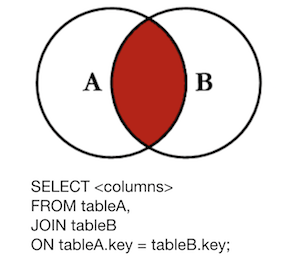
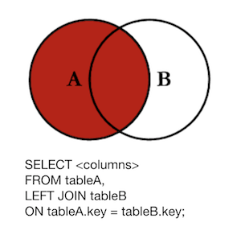
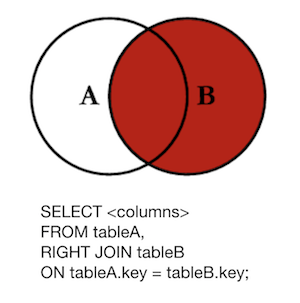

## Learning Goals

* Understand and Visualize a SQL join query
* Implement an active record query using join

## Warm Up

For each of the following, what are the SQL and ActiveRecord commands we would use to get this information (in our SetList app):  
    - Get all songs  
    - Get the lengths of all songs  
    - Get the songs with a play count greater than 0  
    - Get the titles of the songs with a play count greater than zero, sorted alphabetically  
    - Get the length of the song with the most plays


## Joining Tables

### The SQL Join Query

So far, we have looked at SQL and ActiveRecord queries that deal only with one table, or we have asked our database for information related to a single resource.  But you will sometimes need to run queries based on information from more than one table.  When we come up against this problem, we rely on `JOIN` queries to accomplish this goal.

At the highest level, a `JOIN` pulls information from multiple tables into one temporary table.  Let's use our SetList app to see how this works.

In your terminal, run the following command to open your set_list_development database `rails dbconsole`, and let's take a look at our `songs` and `artists` tables:

```
set_list_development=# SELECT * FROM songs;

id |      title      | length | play_count | artist_id
----+-----------------+--------+------------+-----------
 1 | And She Was     |    234 |         23 |         1
 2 | Wild Wild Life  |    456 |        894 |         1
 3 | Raspberry Beret |    340 |        434 |         2
(3 rows)
```

```
set_list_development=# SELECT * FROM artists;

id |      name      
----+----------------
 1 | Talking Heads
 2 | Prince
 3 | Zac Brown Band
(3 rows)
```

Above, we see our songs and artists table - what happens if we `JOIN` these tables together?

```
set_list_development=# SELECT artists.*, songs.* FROM songs JOIN artists ON artists.id = songs.artist_id;

id |     name      | id |      title      | play_count | length | artist_id
----+---------------+----+-----------------+------------+--------+-----------
 1 | Talking Heads |  1 | And She Was     |         23 |    234 |         1
 1 | Talking Heads |  2 | Wild Wild Life  |        894 |    456 |         1
 2 | Prince        |  3 | Raspberry Beret |        434 |    340 |         2
(3 rows)
```

**Turn and Talk** What did this query do? How might you describe the return value of this query?

When we run this `JOIN`, we are _joining_ the songs and artists tables together to form a return value that is a table that includes all the information from _both_ tables. For each artist, we see a row for each song that they have, with the information from both the artists table and the songs table.

When creating a `JOIN` query, there are three parts essential to the query:

  1. `SELECT` - this is what indicates which columns will be included in the resulting table
  2. `ON` - this tells the join _how_ to join this two tables together, or what is the relationship between the two tables (most often, primary key = foreign key)
  3. `JOIN` - the command to join to tables together!

Looking at our joined table, what information could seem to be missing? What happened to `Zac Brown Band`?

**Turn and Talk** Why are we not seeing _all_ our artists on this joined table?

### Types of Join Queries

When we create `JOIN` queries, there are a handful of different join types that we can declare that will affect the resulting table.  Today, we are going to cover 3 of those join types: **Left Join**, **Inner Join**, and **Right Join**

#### Inner Join

The default `JOIN` type in SQL is an **Inner JOIN**.  An inner join will grab only the information from the two tables where the information matches the `ON` condition - in our example above, it will grab only information for artists who have songs, and their song information.  This relationship is often visualized like this:



#### Left Join

The next most common `JOIN` type is a **Left Join**.  A left join will get all the records from one table, regardless of if they have corresponding rows in the joined table.  If we run a left join in our setlist app, it could look like this:

```
set_list_development=# SELECT artists.id, artists.name, songs.id, songs.title FROM artists LEFT JOIN songs ON songs.artist_id = artists.id;
 id |      name      | id |      title      
----+----------------+----+-----------------
  1 | Talking Heads  |  1 | And She Was
  1 | Talking Heads  |  2 | Wild Wild Life
  2 | Prince         |  3 | Raspberry Beret
  3 | Zac Brown Band |    |
(4 rows)
```

Now, we see 'Zac Brown Band' even though that artist has no songs.  We visualize this relationship like this:



### Right Join

The last of these join types is a **Right Join** which will get only records from one table if they match with records from the joined table and will get all records from the joined table regardless of if they have a corresponding record from the starting table. We can visualize the join like this:



### Joining in ActiveRecord

So what does all this look like in ActiveRecord?  Open a new tab in your terminal and open your console with `rails c`.

In ActiveRecord, similar to how we can create a SQL `WHERE` with `.where`, we can use `.joins` to create a SQL `JOIN` query!

```
irb(main):001:0> Artist.joins(:songs)
  Artist Load (3.4ms)  SELECT  "artists".* FROM "artists" INNER JOIN "songs" ON "songs"."artist_id" = "artists"."id" LIMIT $1  [["LIMIT", 11]]

=> #<ActiveRecord::Relation [#<Artist id: 1, name: "Talking Heads", created_at: "2019-05-02 14:51:17", updated_at: "2019-05-02 14:51:17">,
                             #<Artist id: 1, name: "Talking Heads", created_at: "2019-05-02 14:51:17", updated_at: "2019-05-02 14:51:17">,
                             #<Artist id: 2, name: "Prince", created_at: "2019-05-02 14:51:18", updated_at: "2019-05-02 14:51:18">]>
```

**Turn and Talk** Why are we not seeing any song information in this ActiveRecord::Relation?

Take a look at the SQL query that is generated with the ActiveRecord method call:

```
SELECT  "artists".* FROM "artists" INNER JOIN "songs" ON "songs"."artist_id" = "artists"."id" LIMIT $1  [["LIMIT", 11]]
```

This is only SELECTing from our artists table.  If we want to change what is being SELECTed, we need to manually override the select like this:

```
irb(main):014:0> Artist.select('artists.*, songs.*').joins(:songs)
  Artist Load (1.3ms)  SELECT  artists.*, songs.* FROM "artists" INNER JOIN "songs" ON "songs"."artist_id" = "artists"."id" LIMIT $1  [["LIMIT", 11]]
```

Now, we are SELECTing from artists _and_ songs, but has our return value changed? Unfortunately, no. Because we are starting our ActiveRecord query from our Artist model, ActiveRecord will try to create Artist objects from the resulting data; so, we don't see the song information, but it is actually there!  We can access it on each of the resulting 'artist' objects:

```
irb(main):015:0> first_record = Artist.select('artists.*, songs.*').joins(:songs).first
  Artist Load (1.8ms)  SELECT  artists.*, songs.* FROM "artists" INNER JOIN "songs" ON "songs"."artist_id" = "artists"."id" ORDER BY "artists"."id" ASC LIMIT $1  [["LIMIT", 1]]
=> #<Artist id: 2, name: "Talking Heads", created_at: "2019-05-02 14:51:18", updated_at: "2019-05-02 14:51:18">

irb(main):016:0> first_record.title
=> "Wild Wild Life"

irb(main):017:0> first_record.length
=> 456

irb(main):018:0> first_record.play_count
=> 894
```

## Practice

Let's see this in action by imagining that we might want to be able to get a list of artists who have songs longer than '400'.  Work with a partner to get this information using both SQL and ActiveRecord.  

#### SQL
```
set_list_development=# SELECT artists.name FROM artists JOIN songs ON artists.id = songs.artist_id WHERE songs.length > 400;

     name      
---------------
 Talking Heads
(1 row)
```


#### ActiveRecord
```
irb(main):021:0> Artist.joins(:songs).where('songs.length > ?', 400)
  Artist Load (1.1ms)  SELECT  "artists".* FROM "artists" INNER JOIN "songs" ON "songs"."artist_id" = "artists"."id" WHERE (songs.length > 400) LIMIT $1  [["LIMIT", 11]]
=> #<ActiveRecord::Relation [#<Artist id: 1, name: "Talking Heads", created_at: "2019-05-02 14:51:17", updated_at: "2019-05-02 14:51:17">]>
```

## Checks for Understanding

1. What are the three types of joins covered today? And, what do they return?
1. What is the SQL query to get a list of Artists who have songs that have been played more than 20 times?
1. What is the ActiveRecord query to get a list of Artists who have songs that have been played more than 20 times?
1. Looking back at your LaughTracks project, what would be the SQL and ActiveRecord queries to get a count of specials for comedians of a certain age?
