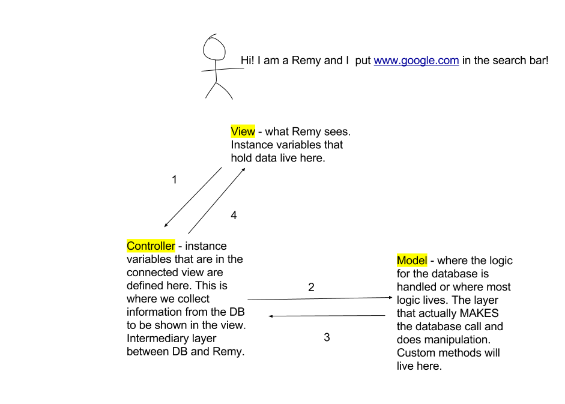

## Learning Goals

  - Identify the elements of the MVC pattern
  - Describe the single responsibility of the each of the Model, View, and Controller
  - Describe how data is passed from the browser/a request through the MVC pattern

### Elements

  - Models Directory - holds the logic behind your application. The database layer.

  - Controllers Directory - where the application configurations, routes, and controller actions are implemented. As we move into Rails, we will have multiple controllers within this folder. In Task Manager, we only utilized one controller.

  - Views Directory - holds the code that will be displayed in the browser.

#### Model

  - The model represents the data, and does nothing else.
  - The model does NOT depend on the controller or the view.
  - Every controller within the controllers directory will have access to EVERY model in the database.
  - The file naming conventions for models is singular.

#### View

  - The view displays the model data but not directly.
  - The view sends user actions (e.g. button/link clicks, navigation controls) to the controller.
  - The view is usually independent of both the model and the controller.

#### Controller

  - The controller provides model data to the view, and interprets user actions such as button clicks. The controller depends on the view and the model. In some cases, the controller and the view are the same object.
  - The purpose of the controller is to remove the view dependency from the model.

#### Passing Data

##### What happens in our app when we hit a certain URL?

### Recap

- The MVC design pattern creates a controller class between the view and the model to remove the model-view dependencies. With the dependencies removed, the model, and possibly the view, can be made reusable without having to change it.
