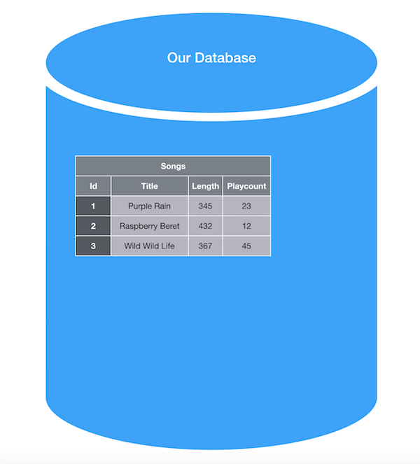
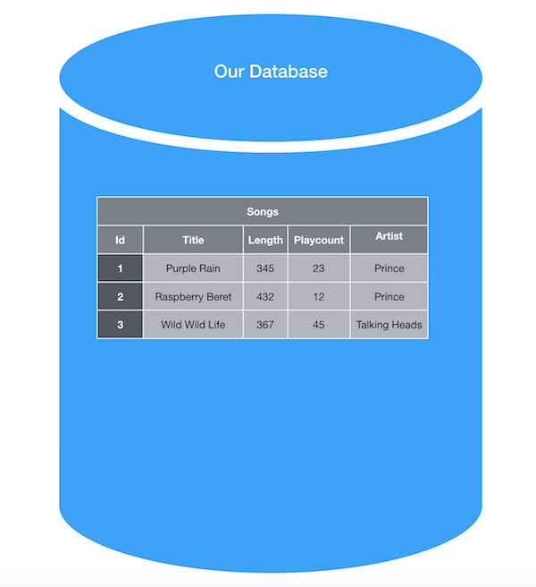
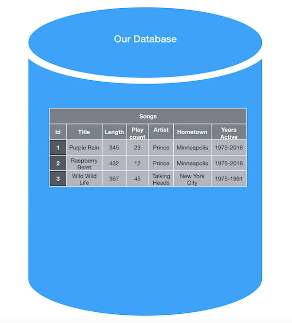
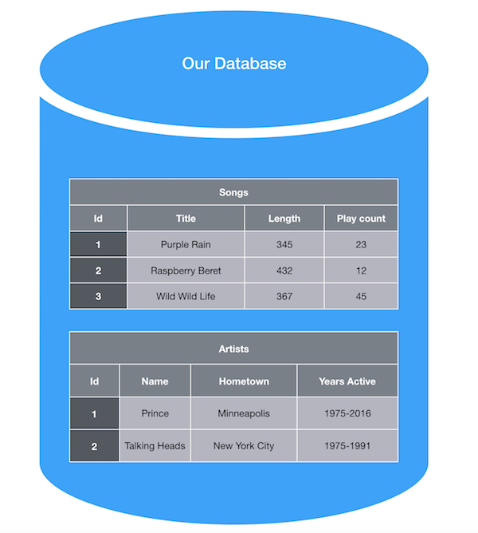
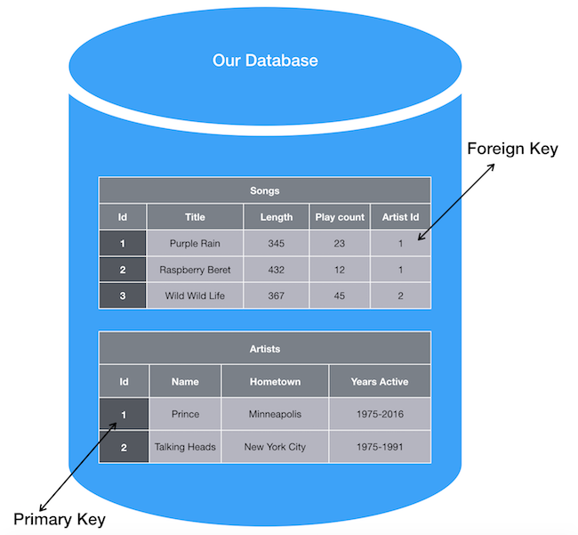

There are many ways that objects can relate to each other.  There can be a *one to one* relatioship as in a person and their social security number, or a *one to many* relationship as in an author and their books, or even a *many to many* relationship is in instructors and their students.  In this lesson, we will be focusing on the **one to many** relationship and how that relationship is set up in a normalized database.

## Learning Goals
* Define Primary Key and Foreign Key
* Visualize One to many relationships
* Define ORM

## Vocab
* One to Many
* Normalization
* Primary Key
* Foreign Key
* ORM

## Warmup

* In our in-class rails app, where are we storing songs? In your notebooks, diagram or sketch what that song storage looks like.
* Turn and Talk to your neighbor - If we wanted to store and relate songs to an artist (for example, the artist Prince has two songs in our app: 'Purple Rain' and 'Raspberry Beret') how might that change the diagram or sketch you created above?

## What is a database?

Before we jump into how we might relate a song to a specific artist, let's take a step back to review what a database _is_.  At the highest level, a database is a location where we can store information and allow that information to persist in our application.  Right now, in our app, we have a database that is storing song information.  More specifically, we have a `database` that has a songs `table` and that table has columns that store each song's `attributes`; we could visualize this configuration like this:

  

In our database, we have a table that looks similar to an excel sheet where each row of this table is one song entry or record in our database. So far, this is a fairly simple database, holding on to only a few attributes.  Without much difficulty, we could update our database to hold additional song attributes by adding additional columns to our songs table.

But, what if we want to keep track of the artist that wrote each song?  We _could_ add a column to our database called `artist` and store the artist directly on a song, like this:

  

Seems like it works, right? Well... not exactly.  What if we wanted to also store information about specific artists, like their hometown or years active.  If we imagine what that might look like, we would see more columns on our `songs` table and many of those columns would be storing the exact same information - every Prince song would be storing 'Minneapolis' and '1975-2016':

  

This is very repetitive!

Let's explore a better way to store this information using **database normalization**.

## Normalizing our Database

In order to cut down on redundant data on a specific table in our database, we can rely on **normalization**.  Normalization is a process by which we break down tables in our database so that each table relates only to one resource.  In the example we are working with, when we look at our songs table, we are storing information about songs and about artists. Really, we are trying to store information about two resources on one table - let's fix that.

In a normalized database, we can break this one table into two: songs and artists.  Then we can separate the attributes of each resource to their appropriate table:

  

Great! Now, our database has tables that relate to only one resource each, and we have eliminated redundant data. But, we have lost something - we no longer know which artist wrote each song.

When we normalize our database, we need to include some sort of marker for ourselves to know how to relate the tables to one another.  We do this with **primary keys** and **foreign keys**.  As our database exists now, every record has an `id`.  We can use these ids to relate information in one table, to information in the other (or give each of our songs an artist).  For each song in our database, we will add an attribute `artist_id` that will hold the `id` of the artist that song belongs to.

  

This `artist_id` is the **foreign key** on our songs table that relates a song back to the `id` of an artist on the artists table - also referred to as the **primary key** of the artists table.

As we build out our databases, we will want them to be as normalized as possible - only storing information from a single resource per table.

## Describing these Relationships

There are a lot of words we could use to describe this relationship between songs and artists, but to stay consistent and follow rails conventions, we will describe this as a **One to Many Relationship**, where a **song belongs to an artist** and an **artist has many songs**. Every database relationship has two sides and it is important to describe both sides of the relationship.

It may seem like a small thing, but having consistency with how we describe these relationships will help us as we build our rails apps, and as we describe our database design to other developers.

Whenever we have a **one to many** relationship, Resource A will always **belong to** Resource B, with the use of a **foreign key**; and, Resource B **has many** Resource A.

## Using Resource Records in our Applications

While databases are great at storing information, they are not so great at giving our applications information that is easily manipulated or passed around - Because the database is storing raw data, not Objects as we are used to seeing in Ruby. What we would like, is to be able to work with each record in our database as if it were a smart ruby object - that way we could give each record additional behaviors through ruby methods.  This is where an **ORM** comes in.  

**ORMs** or **Object Relational Mappers** are a tool that sits between our application and our database and turns each record in our database into an object.  There are many **ORMs** for many different webframeworks.  The most common **ORM** for Ruby is [ActiveRecord](https://guides.rubyonrails.org/active_record_basics.html), and that is the one that we will be using. In fact, ActiveRecord is so standard that it is included in the base configuration of Rails.

## Checks for Understanding

1. What is database normalization?
1. Define primary and foreign keys.
1. How would you describe the one to many relationship between an author and their books?
