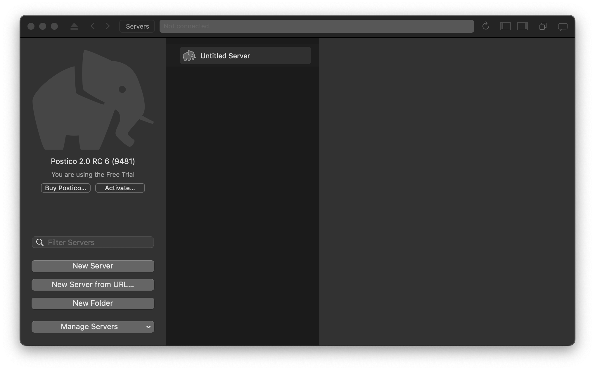
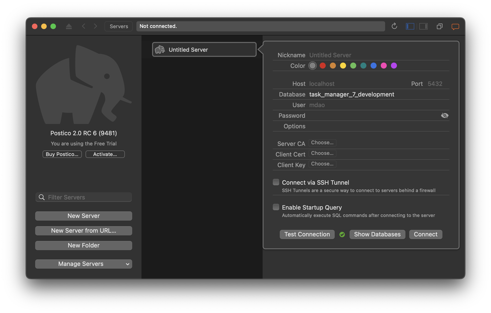

After you download and install Postico, when run it for the first time you will see a screen like this:

Click on **Untitled Server**:

Make sure that the database field says `task_manager_7_development` if you cloned down the completed repo, otherwise it will be whatever you named it with a `_development` added to the end, most likely `task_manager_development`. 

You can click `Test Connection` to see if the connection will work. If so, it will display a green check mark next to the button. If it won't work, it will display a warning message. Follow that message to fix your connection.

Finally, when you have selected the database you'd like to connect to, click `Connect`. 