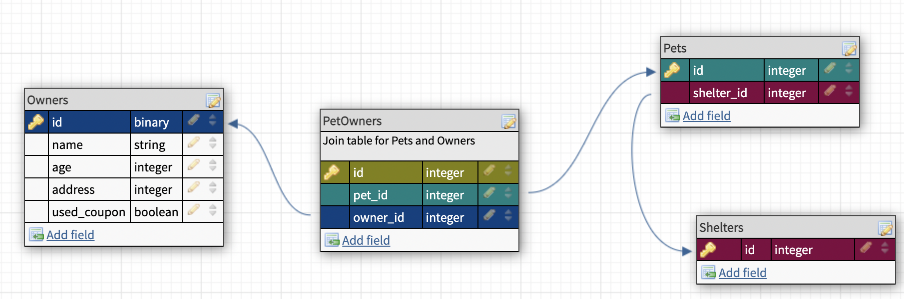

## Learning Goals

* Refactor an existing codebase and bring all existing features & tests up to quality expectations for the end of module 2. 
* Design a one-to-many relationship using a schema designer.
* Write migrations to create tables with columns of varying data types and foreign keys.
* Implement CRUD functionality for a resource using forms & any applicable View Helpers (`form_with`, `button_to`, etc.)
* Use MVC to organize code effectively, restricting logic to its respective responsibility areas (view logic in views, data logic in models, etc)
* Use querying skills (SQL & AR) effectively to join multiple tables of data, make calculations, and group data based on one or more attributes. 

## Requirements

- Must use Rails 5.2.x
- Must use PostgreSQL
- Must deploy completed application to Heroku
- Must have 100% coverage in both feature & mdoel tests, including model validations and sad path testing. 
- Must include a README with the project, including a description of the base app and high-level details of the refactoring process (a "change log"). 

## Permission

- If there is a specific gem you'd like to use in this project that is not mentioned on this project page, you must get permission from your instructors first.

## Setup
Students should retain their original **Relational Rails** application, but **fork** their old repository for work in this project. Inside that fork, students should create a new README file that details the changes they make as per the requirements of this project. 

## Evaluation
Rubric and evaluation instructions can be found [here](./evaluation).

---
 

## Refactoring
To begin, explore your first version of Relational Rails. You've learned a lot since then! Make a list of what needs updating or changing in order to reflect the knowledge that you have now, including but not limited to: 
* Routes should be using `resources` syntax, no hand-rolled routes
* Forms should be using `form_with @model` syntax
* Any MVC violations (data logic in views or controllers, Ruby in querying methods, etc.)
* Testing should be at 100% for both features and models before starting any new user stories. 

As each refactor is made, document the changes in your README file as part of your changelog. 

## Database Setup 
Looking at your original Parent-Child relationship, design an additional 3rd Model that can relate to your Parent-Child in a `many_to_many` fashion. 

<section class="call-to-action">
   <h3>Example</h3>
   <p><strong>Shelters</strong> have many <strong>Pets</strong>, and <strong>Pets</strong> belong to a <strong>Shelter</strong>.</p>
   <p><strong>Owners</strong> have many <strong>Pets</strong>, and <strong>Pets</strong> have many <strong>Owners</strong>.</p>
</section>



Your additional Model should include the following datatypes:
  - Primary key (ID, integer)
  - Name (string)
  - Number, integer or float (primary key does not count)
  - Boolean
  - You can include additional columns if needed, but should include these at minimum.


Reminder: *You should not create columns that duplicate data.* For example, in Pets/Shelters, a Shelter should not store a "pet_count" column since the count of Pets can also be found by counting the number of associated pets.

Before continuing, ensure your new Model is 100% tested, including validations and relationships to existing models. 


--------

## User Stories
Note: `Tertiary` in these user stories refers to the new 3rd model you created above. 

```
1. Tertiary Index

When I visit my Parent Show Page
Then I see a link to view all my Tertiary instances
When I click this link, then I am taken to my Tertiary Index Page (/parents/:id/tertiaries) 
Where I see all of my Tertiaries including all their attributes 
And each object listed includes a link to its show page.

Example: 
URL: /shelters/:id/owners
- John Smith (link to /owners/:id)
   Address: 123 Main St. 
   Age: 52
   Used coupon: false

- Jane Doe (link to /owners/:id)
   Address: 321 Naim St. 
   Age: 35
   Used coupon: true
```

```
[ ] done

User Story 2, Parent Show 

As a visitor
When I visit '/parents/:id'
Then I see the parent with that id including the parent's attributes
(data from each column that is on the parent table)
```

```
[ ] done

User Story 3, Child Index 
`
As a visitor
When I visit '/child_table_name'
Then I see each Child in the system including the Child's attributes
(data from each column that is on the child table)
```

```
[ ] done

User Story 4, Child Show 

As a visitor
When I visit '/child_table_name/:id'
Then I see the child with that id including the child's attributes
(data from each column that is on the child table)
```

```
[ ] done

User Story 5, Parent Children Index 

As a visitor
When I visit '/parents/:parent_id/child_table_name'
Then I see each Child that is associated with that Parent with each Child's attributes
(data from each column that is on the child table)
```

##### ActiveRecord

```
[ ] done

User Story 6, Parent Index sorted by Most Recently Created 

As a visitor
When I visit the parent index,
I see that records are ordered by most recently created first
And next to each of the records I see when it was created
```

```
[ ] done

User Story 7, Parent Child Count

As a visitor
When I visit a parent's show page
I see a count of the number of children associated with this parent
```

##### Usability

```
[ ] done

User Story 8, Child Index Link

As a visitor
When I visit any page on the site
Then I see a link at the top of the page that takes me to the Child Index
```

```
[ ] done

User Story 9, Parent Index Link

As a visitor
When I visit any page on the site
Then I see a link at the top of the page that takes me to the Parent Index
```

```
[ ] done

User Story 10, Parent Child Index Link

As a visitor
When I visit a parent show page ('/parents/:id')
Then I see a link to take me to that parent's `child_table_name` page ('/parents/:id/child_table_name')
```

**Iteration 1 will be reviewed at your second check-in**

---

## Iteration 2

##### CRUD

```
[ ] done

User Story 11, Parent Creation 

As a visitor
When I visit the Parent Index page
Then I see a link to create a new Parent record, "New Parent"
When I click this link
Then I am taken to '/parents/new' where I  see a form for a new parent record
When I fill out the form with a new parent's attributes:
And I click the button "Create Parent" to submit the form
Then a `POST` request is sent to the '/parents' route,
a new parent record is created,
and I am redirected to the Parent Index page where I see the new Parent displayed.
```


```
[ ] done

User Story 12, Parent Update 

As a visitor
When I visit a parent show page
Then I see a link to update the parent "Update Parent"
When I click the link "Update Parent"
Then I am taken to '/parents/:id/edit' where I  see a form to edit the parent's attributes:
When I fill out the form with updated information
And I click the button to submit the form
Then a `PATCH` request is sent to '/parents/:id',
the parent's info is updated,
and I am redirected to the Parent's Show page where I see the parent's updated info
```

```
[ ] done

User Story 13, Parent Child Creation 

As a visitor
When I visit a Parent Children Index page
Then I see a link to add a new adoptable child for that parent "Create Child"
When I click the link
I am taken to '/parents/:parent_id/child_table_name/new' where I see a form to add a new adoptable child
When I fill in the form with the child's attributes:
And I click the button "Create Child"
Then a `POST` request is sent to '/parents/:parent_id/child_table_name',
a new child object/row is created for that parent,
and I am redirected to the Parent Childs Index page where I can see the new child listed
```

```
[ ] done

User Story 14, Child Update 

As a visitor
When I visit a Child Show page
Then I see a link to update that Child "Update Child"
When I click the link
I am taken to '/child_table_name/:id/edit' where I see a form to edit the child's attributes:
When I click the button to submit the form "Update Child"
Then a `PATCH` request is sent to '/child_table_name/:id',
the child's data is updated,
and I am redirected to the Child Show page where I see the Child's updated information
```

##### ActiveRecord

```
[ ] done

User Story 15, Child Index only shows `true` Records 

As a visitor
When I visit the child index
Then I only see records where the boolean column is `true`
```

```
[ ] done

User Story 16, Sort Parent's Children in Alphabetical Order by name 

As a visitor
When I visit the Parent's children Index Page
Then I see a link to sort children in alphabetical order
When I click on the link
I'm taken back to the Parent's children Index Page where I see all of the parent's children in alphabetical order
```

##### Usability

```
[ ] done

User Story 17, Parent Update From Parent Index Page 

As a visitor
When I visit the parent index page
Next to every parent, I see a link to edit that parent's info
When I click the link
I should be taken to that parent's edit page where I can update its information just like in User Story 12
```

```
[ ] done

User Story 18, Child Update From Childs Index Page 

As a visitor
When I visit the `child_table_name` index page or a parent `child_table_name` index page
Next to every child, I see a link to edit that child's info
When I click the link
I should be taken to that `child_table_name` edit page where I can update its information just like in User Story 14
```

---

## Iteration 3

##### CRUD

```
[ ] done

User Story 19, Parent Delete 

As a visitor
When I visit a parent show page
Then I see a link to delete the parent
When I click the link "Delete Parent"
Then a 'DELETE' request is sent to '/parents/:id',
the parent is deleted, and all child records are deleted
and I am redirected to the parent index page where I no longer see this parent
```

```
[ ] done

User Story 20, Child Delete 

As a visitor
When I visit a child show page
Then I see a link to delete the child "Delete Child"
When I click the link
Then a 'DELETE' request is sent to '/child_table_name/:id',
the child is deleted,
and I am redirected to the child index page where I no longer see this child
```

##### ActiveRecord

```
[ ] done

User Story 21, Display Records Over a Given Threshold 

As a visitor
When I visit the Parent's children Index Page
I see a form that allows me to input a number value
When I input a number value and click the submit button that reads 'Only return records with more than `number` of `column_name`'
Then I am brought back to the current index page with only the records that meet that threshold shown.
```

##### Usability

```
[ ] done

User Story 22, Parent Delete From Parent Index Page 

As a visitor
When I visit the parent index page
Next to every parent, I see a link to delete that parent
When I click the link
I am returned to the Parent Index Page where I no longer see that parent
```

```
[ ] done

User Story 23, Child Delete From Childs Index Page 

As a visitor
When I visit the `child_table_name` index page or a parent `child_table_name` index page
Next to every child, I see a link to delete that child
When I click the link
I should be taken to the `child_table_name` index page where I no longer see that child
```
---

## Extensions

```
[ ] done

Extension 1: Sort Parents by Number of Children 

As a visitor
When I visit the Parents Index Page
Then I see a link to sort parents by the number of `child_table_name` they have
When I click on the link
I'm taken back to the Parent Index Page where I see all of the parents in order of their count of `child_table_name` (highest to lowest) And, I see the number of children next to each parent name
```

```
[ ] done

Extension 2: Search by name (exact match)

As a visitor
When I visit an index page ('/parents') or ('/child_table_name')
Then I see a text box to filter results by keyword
When I type in a keyword that is an exact match of one or more of my records and press the Search button
Then I only see records that are an exact match returned on the page
```

```
[ ] done

Extension 3: Search by name (partial match)

As a visitor
When I visit an index page ('/parents') or ('/child_table_name')
Then I see a text box to filter results by keyword
When I type in a keyword that is an partial match of one or more of my records and press the Search button
Then I only see records that are an partial match returned on the page

This functionality should be separate from your exact match functionality.
```
