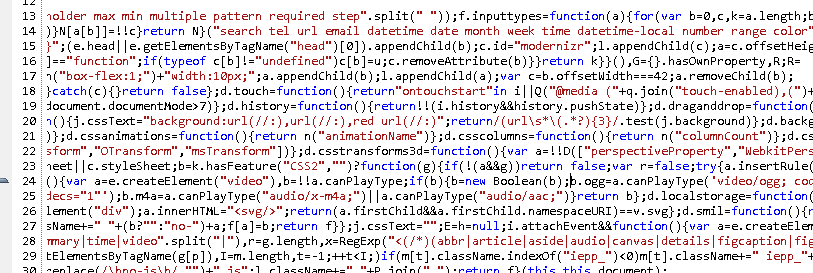

# Intro to the Asset Pipeline

---

# Warmup

* What do you already know about the asset pipeline?
* What have you heard?
* What computer languages does your browser understand?

---

# Overview

* *Asset Exploration:* Explore how assets are loaded in the browser.
* *Enter the Asset Pipeline:* Provide a high level descripiion of the responsibilities of the asset pipeline.
* *Putting it Together:* Descrbie how assets are stored/accessed in a Rails application.

---

# What? Why?

Assets include:

* JavaScript Files
* CSS Files
* Images

The assset pipeline is an attempt to try to serve these assets more quickly.

---

# Asset Exploration

* Visit Turing's [Back-End Curriculum](http://backend.turing.io/) site.
* With a neighbor, estimate how many requests were made to load that site.
* In Chrome, open the developer tools (cmd-opt-i).
* Click on the Network tab, and hit reload.
* Count the number of assets loaded.

Answer the questions included in the lesson.

---

# Enter the Asset Pipeline

* *Concatenating/Minifying:* Makes the assets we serve more compact.
* *Precompiling:* Allows us to write in languages related to CSS/JavaScript.
* *Fingerprinting:* Provides a means to invalidate cached assets.

---

# Concatenating/Minifying

See if you can find answers to the following questions on the internet:

* What does minified CSS look like?
* What does minified JavaScript look like?
* What does it mean that the asset pipeline concatenates our assets?

---

# Minified CSS


---

# Minified JS



---

# Concatenation

Concatenation creates a single file from multiple

---

# Precompiling: Browser Languages

* HTML
* CSS
* JavaScript

---

# Precompiling: Other Languages

* Sass/Less
* CoffeeScript

---

# Precompiling: the Asset Pipeline

Translates languages

* Sass/Less => CSS
* CoffeeScript => Javascript

---

# Fingerprinting

* Asset Pipeline adds a fingerprint to the end of our file names.
* If the file changes, the fingerprint also changes.
* If the fingerprint changes *our browser will view it as a different file.*
* The browser will then not rely on any cached version of the file that it has.

---

# Putting it Together

---

# Where Do Assets Live?

* `app/assets`: assets owned by the application; includes custom CSS, JS files, and images
* `lib/assets`: assets you created, but aren't necessarily specific to your application
* `vendor/assets`: assets created by third-parties.

note: the files in app/assets are never served directly in production.
note: assets in lib/assets and vendor/assets will not automatically be included in the precompile process

---

# Manifest Files

Within each of those directories is a manifest file.

* `app/assets/javascripts/application.js`
* `app/assets/stylesheets/application.css`

---

# Manifest Files (continued)

These manifest files provide instructions on how to find our assets.

* These instructions are processed top-to-bottom
* `require_tree .` recursively requires all files within app/assets
* Files required in the manifest can live in app/assets, lib/assets, or vendor/assets

---

# Manifest Files (sample)


---

# Views

```erb
<%= stylesheet_link_tag "application", media: "all" %>
<%= javascript_include_tag "application" %>
```

---

# Accessing Our Assets

* `asset_path()`
* `image_path()`

---

# Heroku

* Precompiles your assets automatically
* Other services will require you to run `rake assets:precompile`

---

# Review

* What does the asset pipeline do?
* How does it benefit our applications?
* What does Heroku do for you with regards to the asset pipeline?
* What is one step you might take if your application seems to be working locally, but broken in production?
