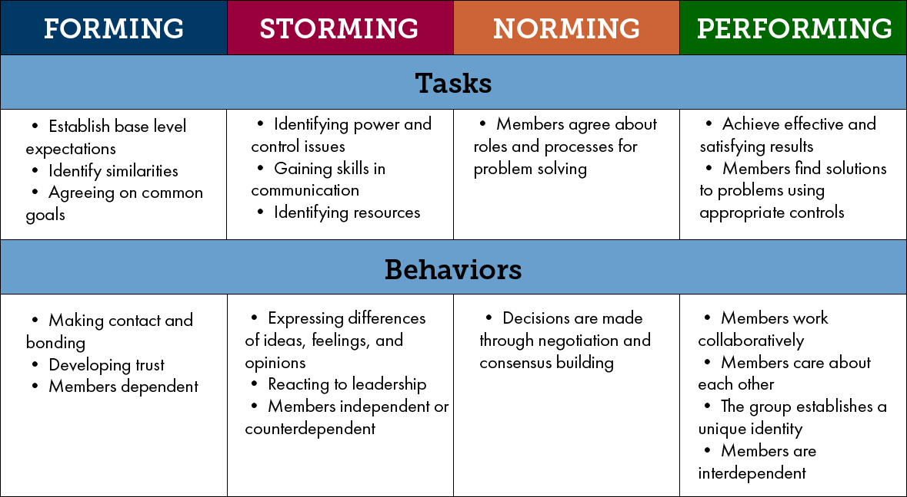

# Intro to Project Management

---

# Warmup

* What has made your previous teams successful? What has made them difficult?
* When working together for the first time, what can you do/have you done to make sure your team is productive?

---

# Tuckman's Group Lifecycle

---

---

# Tuckman's Group Lifecycle

---

# Strategies

Think about the successful teams that you described in your warmup...

* What did you do to get you through the early stages to become successful?

---

# Tools & Workflow

---

# Waterfall vs. Agile

---

# Waterfall vs. Agile

* How would this apply to a project you’ve completed here at Turing?
* How might this apply to a Sinatra project?

---

# Waffle

* Convert the requirements of the project to stories/issues on Waffle
* Let the stories drive development, even copy and paste the story into the tests
* Use waffle to track tasks to be completed
* Use waffle to keep you focused (i.e. avoid rabbit holes)

---

# Git Workflow

* Casey's [Git Workflow for Teams](https://gist.github.com/case-eee/22906249d7a2acead8a897813b7a9675)
