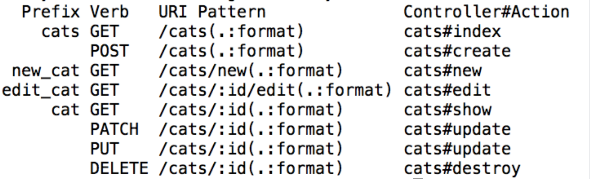
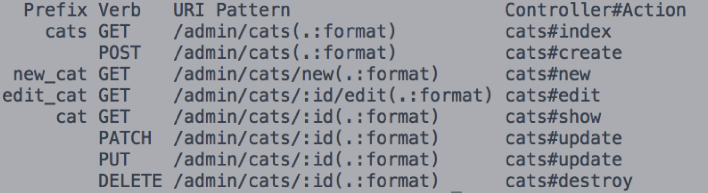
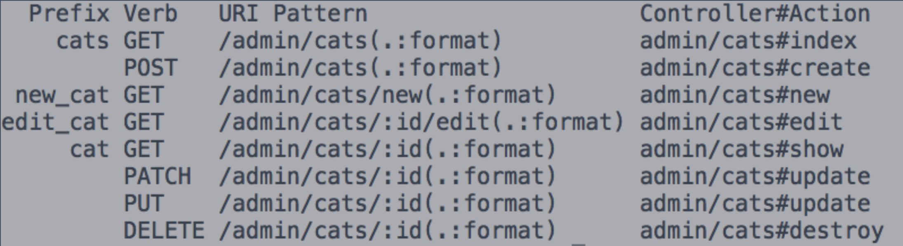
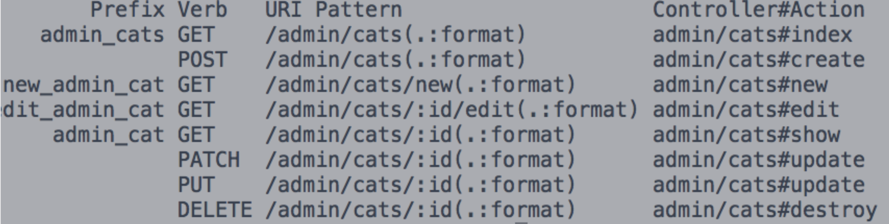
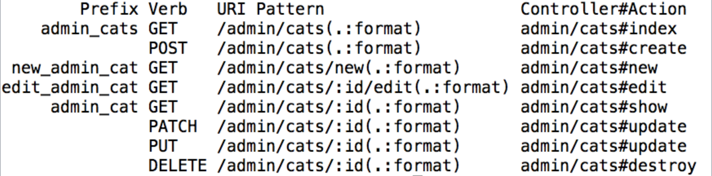

# [fit] Advanced Routing in **Rails**

---

## warm up

How confident are you that you could create all 8 prefixes/http-verbs/uri-patterns/controller&actions that Rails gives you when you have the following?

```ruby
# config/routes.rb

resources :cats
```

---

# 

---

## our goal for the next hour..

- Why/when do we use namespace routes?
- What is the difference between Namespacing and Scoping?
- When would we use one over the other?
- In what case should you use Nested Resources?

---


## what do you **know**?

---

## what do you _know_ you __don't__ know?

---

### hypothetical (but also very real) situation:

let's say you have:
- cats
- admin

## you want a way to distinguish your routes so an admin has additional functionality/control over your app

---

`http://localhost:3000/admin/cats`
<br>
shows edit/delete buttons

<----------------->
`http://localhost:3000/cats`
<br>
shows a list of cats

---

## what can we do?!

---

# **scope**

---

## scope

```ruby
# config/routes.rb

scope :admin do
	resources :cats
end
```

---

# scope

<br>



---

## scope

##### `http://localhost:3000/admin/cats`

```ruby
# app/controllers/cats_controller

class CatsController < ApplicationController
	def index
	end
end
```

Rails will look for `app/views/cats/index.erb`

---

## Workshop

https://github.com/case-eee/horse-example

- Add a route so a user can hit `/admin/horses` and see all the horses


---

### Recap

* What did you add to your `routes.rb`?
* Can anyone spot potential problems?

---

### Problems with `scope`

We're going to need a way to **differentiate** our controllers. We want what we already have (the url prefix) **AND** a separate controller to encapsulate the different functionality.

We want both `/admin/cats` and `/cats` to be handled by our controllers in different ways.


---

# scope + module

```ruby
scope :admin, module: :admin do
	resources :cats
end
```

---

# scope + module

```ruby
# http://localhost3000/admin/cats

# app/controllers/admin/cats_controller.rb
class Admin::CatsController < ApplicationController
	def index
		@cats = Cat.all
	end
end

```

### where does Rails look for this view template?

---

# scope + module

<br>



---


## Workshop

- Add a route so a user can hit `/admin/horses` and see all the horses with links on each horse to edit and delete the specific horse (these links don't need to be functional)
- Add a route so a user can hit `/horses` and see all the horses

---

### as you may have noticed, we don't have any path helpers that are specific to this "special" `admin` prefix

#### again, Rails can help us out with this...


---

# scope + module + as

```ruby
scope :admin, module: :admin, as: :admin do
	resources :cats
end
```

---
# scope + module + as

<br>




---

# **scope** + **module** +  **as**
- url prefix for user's to see in their browser (`http://localhost:3000/admin/cats`)
- controller prefix (`Admin::CatsController`) for more organization
- path helpers via the prefix (`admin_cats_path`)

---

# **BUT**

## Rails actually makes this even easier for us...

---

# namespace

---

## namespace **=** scope + module + as

```ruby
namespace :admin do
	resources :cats
end


scope :admin, module: :admin, as: :admin do
	resources :cats
end
```


---

# namespace

```ruby
# config/routes.rb
namespace :admin do
	resources :cats
end

# app/controllers/admin/cats_controller.rb
class Admin::CatsController < AdminController
…
end
```

---

# namespace

```ruby
# http://localhost3000/admin/cats

# app/controllers/admin/cats_controller.rb
class Admin::CatsController < ApplicationController
	def index
		@cats = Cat.all
	end
end

```

### where does Rails look for this view template?

---



---

### why use **namespace**?

### or **scope**?

### or **module**?

### or **as**?

---

- readability
- organization
- specificity

<br>

#### can you imagine what happens when you have 400 lines in your routes file?!

---

# Nested Resources

---

```ruby
class Cat < ActiveRecord::Base
	has_many :votes
end

class Vote < ActiveRecord::Base
	belongs_to :cat
end

```

---

```ruby
resources :cats do
	resources :votes
end
```

---

### what's the difference between using **namespace** and **nested resources**?

---

### Rails is picky about where things are (convention over configuration), so be mindful of this!

---

# member

if you only want one route with a specific ending, you can use `member`:

```ruby
resources :cats do
	member do
	  post :votes
	end
end

# post '/cats/:id/votes'

```

---

# questions?

---

## let's practice

https://github.com/case-eee/lesson-example

---

# wrap up: can you answer these questions?

- Why do we namespace things?
- What is the difference between Namespacing and Scoping?
- When would we use one over the other?
- In what case should you use Nested Resources?

