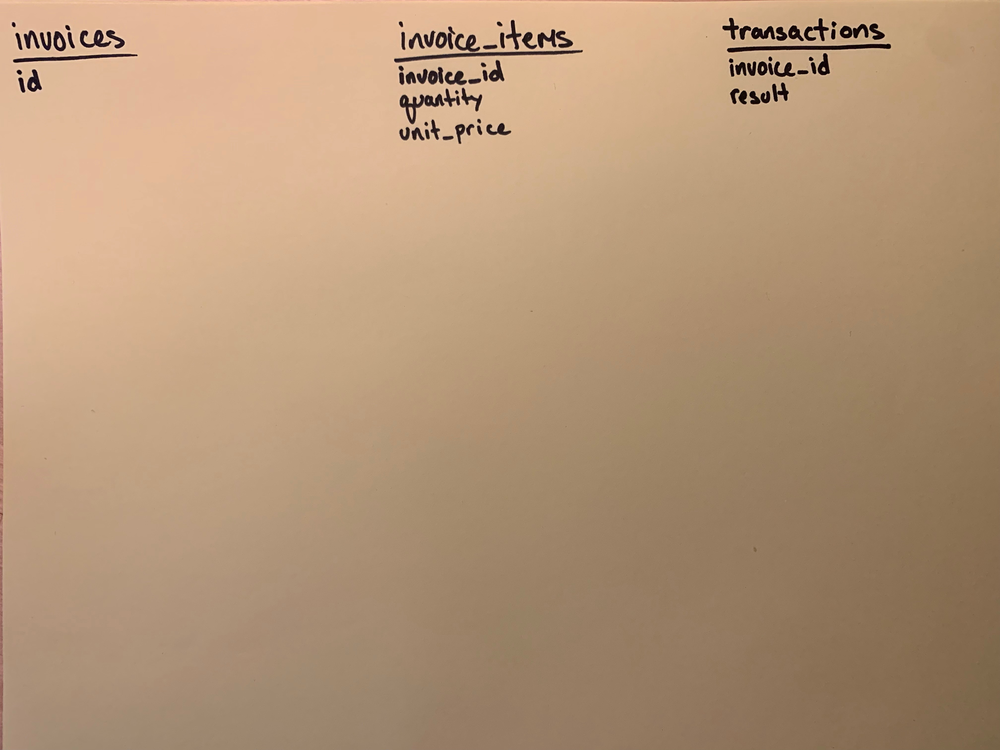
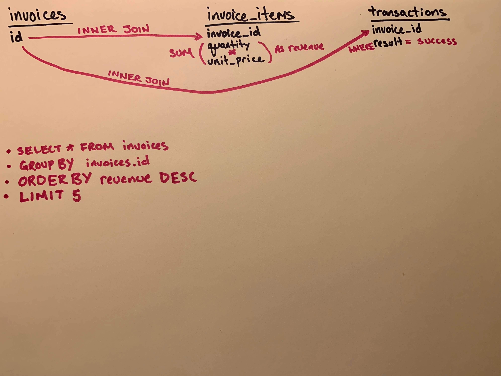
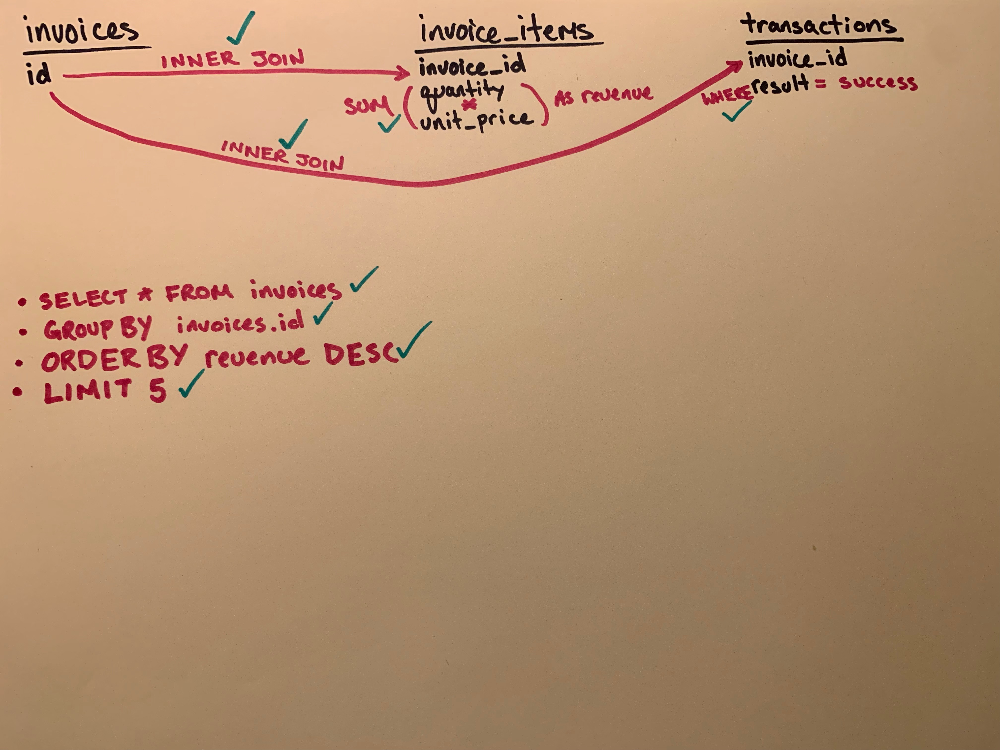

## Learning Goals

* Diagram database relationships.
* Identify the tables in a database that hold information required to complete complex queries.
* Generate complex ActiveRecord queries using joins, group, order, select, and merge.
* Use the rails dbconsole  and rails console to generate ActiveRecord queries.

## Resources

* [Video](https://www.youtube.com/watch?v=OccKyvGvLKE&t=1329s) from a past class and the core ideas

## Objective

```
Find the 5 most expensive invoices with successful transactions.
```

## Warmup (5 mins)

* What tables would we need to query?
* What information would we need from each table?
* What calculations would we need to perform?
* What SQL would we be able to use to create a table with this information?

## Lecture

*WARNING:* This lesson is most beneficial if you don't follow along in class.

### Creating a Visual Representation

Have you ever attempted to build a complex ActiveRecord query by throwing spaghetti at the wall? Eventually something will stick. But there's a better way.

As you start to dive into more difficult problems, problems that have many moving parts, it will become increasingly difficult to hold all of the relevant information in your head at one time. Additionally, the more complex the problem, the easier it is to slowly drift away from the goal and building the wrong thing. Starting with a clear goal and a plan will increase the likelihood of you hitting your target in a timely fashion.

There are official ways of diagramming SQL queries but we're going to do something a little different. This technique isn't an official technique so feel free to tweak or find something that works for you. If you're interested in diving deeper into a more official strategy check out this blog post on [Introductory SQL Diagramming](http://www.davidclement.org/tipsntrx/tnt10.6.html).

We'll start by sketching out all of the columns we need including the table the column is located in.



Next up, let's make a note about all of the things we think need to happen with each of these columns.



### Converting to ActiveRecord

As we work through the next section we should update the diagram if our understanding changes or if we successfully accomplish one of our goals. We can do something simple like adding a checkmark when we successfully account for each item we documented. When complete we could have a board that looks like this:



To start through this process let's fire up a Rails console. We'll start by building our query slowly, piece by piece. Figuring out where to start is often a struggle. When we are writing a query that needs to return specific rows, invoices in this case, we should _start by writing our query from the Model representing those rows_. Sometimes, there will be a temptation to start with a join table since they are similar to a hub with spokes that branch out to the tables we need. Avoid this temptation. This will usually result in needing to make more queries than is necessary.

The next thing that is usually good to try is to tack on the easiest portions of the query first and read the output in the console to make sure it matches our expectations. One way to make this easier to read is to use the `.to_sql` method.

```
irb(main)> puts Invoice.joins(:invoice_items).to_sql
```

We added the `puts` to make it easier to read which remove escape characters.

The output should look something like this:

```sql
SELECT "invoices".* FROM "invoices" INNER JOIN "invoice_items" ON "invoice_items"."invoice_id" = "invoices"."id"
```

This looks the way we would expect. Another great tool to use as we're trying to solve these issues is the `rails db` command line tool which will connect us to the database specified in our `database.yml` file. Let's fire that up in another tab in our terminal. It's worth noting that this is going to have access to any SQL commands in a similar way to using something like `psql` but it does not have access to the Rails environment so we won't be able to write any Ruby. This can be a nice place to run your queries and have a table based representation of the output. This can be especially handy when you start adding aliases and things like that. If we paste that query, add on a semi-colon, and run it we should see something like this.

```sql
rales_engine_development=# SELECT "invoices".* FROM "invoices" INNER JOIN "invoice_items" ON "invoice_items"."invoice_id" = "invoices"."id";
  id  | customer_id | merchant_id | status  |     created_at      |     updated_at
------+-------------+-------------+---------+---------------------+---------------------
    1 |           1 |          26 | shipped | 2012-03-25 09:54:09 | 2012-03-25 09:54:09
    1 |           1 |          26 | shipped | 2012-03-25 09:54:09 | 2012-03-25 09:54:09
    1 |           1 |          26 | shipped | 2012-03-25 09:54:09 | 2012-03-25 09:54:09
    1 |           1 |          26 | shipped | 2012-03-25 09:54:09 | 2012-03-25 09:54:09
    1 |           1 |          26 | shipped | 2012-03-25 09:54:09 | 2012-03-25 09:54:09
    1 |           1 |          26 | shipped | 2012-03-25 09:54:09 | 2012-03-25 09:54:09
    1 |           1 |          26 | shipped | 2012-03-25 09:54:09 | 2012-03-25 09:54:09
    1 |           1 |          26 | shipped | 2012-03-25 09:54:09 | 2012-03-25 09:54:09
    2 |           1 |          75 | shipped | 2012-03-12 05:54:09 | 2012-03-12 05:54:09
```

It's important to make sure we are seeing what we would expect. Why do we see multiples of the same record?

This looks the way that we would expect. Mark it off on the diagram. Then, let's get to the next part of the query.

```ruby
Invoice.joins(:invoice_items, :transactions)
```

1. Confirm the SQL looks the way it should.
2. Mark it off on our diagram.

Now we'll tack on the `where` method to filter by transactions that have a `result` of `success`. There's two ways we can do this. Let's take a look at each option.

Option 1. We can specify the table (`transactions`) and column (`result`) as well as the value we want to filter by (`success`).

### Adding `where`

```ruby
Invoice.joins(:invoice_items, :transactions).where("transactions.result = ?", "success")
```

Option 2: Recall that every ActiveRecord method we chain here is executed from the perspective of starting at the Invoice model. That being the case, we can leverage the relationships set up in that model for queries like this. Before we dive in, understand that `Invoice.where(status: "shipped")` is the same as `Invoice.where({status: "shipped"})`. We don't need the curly braces in the first example because we are only referencing one table. When traversing across multiple tables however, we will need to include the curly braces like so...

```ruby
Invoice.joins(:invoice_items, :transactions).where(transactions: {result: "success"})
```

### Adding `select`

Our next steps get more complex since we need to run an aggregate function on the `quantity` and `unit_price` from the `invoice_items` table. Let's first add the select statement to return exactly the same thing as it currently is.

```ruby
# Broken onto multiple lines for readability
Invoice.select("invoices.*")
  .joins(:invoice_items, :transactions)
  .where(transactions: {result: "success"})
```

And now for the aggregate function.

```ruby
# Broken onto multiple lines for readability
Invoice.select("invoices.*, SUM(invoice_items.quantity * invoice_items.unit_price) AS revenue")
  .joins(:invoice_items, :transactions)
  .where(transactions: {result: "success"})
```

When we run this code we get an error. Let's take the SQL that's generated from calling `to_sql` and paste it into `rails db`.

Sure enough, we see the same-ish error:

```
column "invoices.id" must appear in the GROUP BY clause or be used in an aggregate function
```

What's happening? Well, since the result of the aggregate function, `revenue`, isn't part of the table that `invoices.*` comes from, Postgres isn't sure what to do with it. Telling it to group by `invoices.id` let's it know how to squish things down into corresponding rows.

```ruby
Invoice.select("invoices.*, SUM(invoice_items.quantity * invoice_items.unit_price) AS revenue")
  .joins(:invoice_items, :transactions)
  .where(transactions: {result: "success"})
  .group(:id)
```

Again, the query is starting at `Invoice` so when we say `group(:id)` it infers that we mean `invoices.id`. Unfortunately, we don't see the `revenue` appear in our output. But it is there as a virtual attribute. Virtual attributes get created when we have aliases in our select statements. We can access these virtual attributes the same as other columns in the table.

```ruby
invoices = Invoice.select("invoices.*, SUM(invoice_items.quantity * invoice_items.unit_price) AS revenue")
  .joins(:invoice_items, :transactions)
  .where(transactions: {result: "success"})
  .group(:id)

invoices.first.revenue
# => 2106777
```

Noice. Sometimes it can be difficult to see whether you are getting back what you want or whether the query is doing what you think it should. This is a great time to call `to_sql` and paste the result into our `rails db` console. You should see output that looks like this:

```sql
 id  | customer_id | merchant_id | status  |     created_at      |     updated_at      | revenue
------+-------------+-------------+---------+---------------------+---------------------+---------
1489 |         289 |          46 | shipped | 2012-03-26 22:55:20 | 2012-03-26 22:55:20 |  944894
4790 |         988 |          78 | shipped | 2012-03-24 15:58:12 | 2012-03-24 15:58:12 |   48718
273  |          59 |          72 | shipped | 2012-03-08 21:54:23 | 2012-03-08 21:54:23 |  861533
3936 |         802 |          94 | shipped | 2012-03-20 08:57:27 | 2012-03-20 08:57:27 | 1085352
2574 |         521 |          79 | shipped | 2012-03-11 19:56:13 | 2012-03-11 19:56:13 |  975672
951  |         184 |          87 | shipped | 2012-03-19 15:54:55 | 2012-03-19 15:54:55 | 1832399
4326 |         881 |          21 | shipped | 2012-03-14 18:57:48 | 2012-03-14 18:57:48 |  536897
2614 |         526 |           1 | shipped | 2012-03-23 09:56:15 | 2012-03-23 09:56:15 | 1379489
```

Notice the `revenue` column. Looks like we need to order these. But before we do that don't forget to update our diagram with our progress.

### `ORDER BY` and `LIMIT`

Next, we'll tack on `order`.

```ruby
Invoice.select("invoices.*, SUM(invoice_items.quantity * invoice_items.unit_price) AS revenue")
  .joins(:invoice_items, :transactions)
  .where(transactions: {result: "success"})
  .group(:id)
  .order("revenue DESC")
```

We can't pass in `:revenue` since it's not a column in the database and therefore we'll need to send it in as a string and tell it we want to go in descending order. Now we can tack on our `limit(5)`.

```ruby
Invoice.select("invoices.*, SUM(invoice_items.quantity * invoice_items.unit_price) AS revenue")
  .joins(:invoice_items, :transactions)
  .where(transactions: {result: "success"})
  .group(:id)
  .order("revenue DESC")
  .limit(5)
```

We should be good. Use `to_sql` in your Rails console and paste the results in your db console. You should see something like this:

```sql
id  | customer_id | merchant_id | status  |     created_at      |     updated_at      | revenue
------+-------------+-------------+---------+---------------------+---------------------+---------
1560 |         300 |          10 | shipped | 2012-03-14 02:55:24 | 2012-03-14 02:55:24 | 4896887
3394 |         697 |          64 | shipped | 2012-03-20 16:56:57 | 2012-03-20 16:56:57 | 4787797
4377 |         893 |          68 | shipped | 2012-03-14 18:57:51 | 2012-03-14 18:57:51 | 4722254
3584 |         729 |          15 | shipped | 2012-03-19 11:57:08 | 2012-03-19 11:57:08 | 4695214
2711 |         543 |          14 | shipped | 2012-03-09 18:56:20 | 2012-03-09 18:56:20 | 4692545
```

Now we should move this to our `Invoice` model.

```ruby
# models/invoice.rb

def self.most_expensive(limit = 5, sorting = "DESC")
  select("invoices.*, SUM(invoice_items.quantity * invoice_items.unit_price) AS revenue")
    .joins(:invoice_items, :transactions)
    .where(transactions: {result: "success"})
    .group(:id)
    .order("revenue #{sorting}")
    .limit(limit)
```

Notice that we removed `Invoice` from this query. A wise person once said "If you want to master Ruby, always know what `self` is." We're in a class method in `Invoice` which means `self` is `Invoice` so we can remove that reference. We also set two default parameters for `limit` and `sorting`. We do this to make the method more flexible and reusable.

Houston, we have a problem. The idea of the `Invoice` model tracking what it means for a transaction to be successful is a violation of SRP. We should extract `.where(transactions: {result: "success"})` and move it over to the `Transaction` model. Enter `.merge`...

### Merging Scopes

It's common to want to share model logic and concepts, such as "a successful transaction", across multiple models. `.merge` allows us to pull logic from predefined methods called scopes into different portions of our codebase.

Let's define a scope to capture this idea of a successful transaction in the `Transaction` model.

```ruby
# models/transaction.rb

class Transaction < ApplicationRecord
  scope :successful, -> { where(result: "success") }
end
```

That arrow looking thing is what we in the Ruby community refer to as a stabby lambda. Explaining lambdas is outside the scope of this lesson but [here's more info](https://www.honeybadger.io/blog/using-lambdas-in-ruby/) if you're interested.

Reload your Rails console to be able to use this scope (`reload!`). Now run `Transaction.successful` and take a look at the SQL output. You should see a `WHERE` clause filtering by what we specified in our lambda.

Now let's replace `where` with `merge` to reuse this bit of logic in `Invoice.most_expensive`.

```ruby
# models/invoice.rb

def self.most_expensive(limit = 5, sorting = "DESC")
  select("invoices.*, SUM(invoice_items.quantity * invoice_items.unit_price) AS revenue")
    .joins(:invoice_items, :transactions)
    .merge(Transaction.successful)
    .group(:id)
    .order("revenue #{sorting}")
    .limit(limit)
end
```

One of the big advantages here is if the concept of what it means to be a successful transaction ever changes we hopefully only need to update that in one place. The original way we wrote this was vulnerable to changes not associated with this particular table or model.

As you can imagine, scopes are widely used on Rails projects and learning to wield their power is important. Be sure to create a `successful` scope on `Transaction` and merge it in for your other BI challenges.

But what if you want to have a scope applied to _every_ query called on a model?

### `default_scope`

What order does Postgres return its rows in? Read the first paragraph in this (Sorting Rows)[https://www.postgresql.org/docs/9.1/queries-order.html] documentation.

So then, what order will our results come back in if we call `Transaction.all`? What about `Transaction.limit(10)`?

Enter `default_scope`. This will allow us to apply a scope to every `ActiveRecord` query. For example:

```ruby
# models/transaction.rb

class Transaction < ApplicationRecord
  default_scope { order(id: :asc) }

  scope :successful, -> { where(result: "success") }
end
```

Reload your console and run `Transaction.all`. You should now see an `ORDER BY` clause.

### A Word of Caution about `default_scope`

Because most of our business intelligence is running analytics on only the successful transactions you might have had an idea to try something like this:

```ruby
class Transaction < ApplicationRecord
  default_scope { where(result: "success") }
end
```

Whoa! It works!? Ship it!

NOT SO FAST. Reload your console if you haven't already and run `Transaction.new`. What's the value of `result`? Surely you didn't intend for every new transaction to be set to `success`. This sort of thing can cause big problems in production apps where it becomes nearly impossible to remember every model with a `default_scope` set. Some prefer not to use `default_scope` at all. My personal preference is to limit its use to ordering but even this can have some unintended consequences. Let's change our code back to what it was.

```ruby
# models/transaction.rb

class Transaction < ApplicationRecord
  default_scope { order(id: :asc) }

  scope :successful, -> { where(result: "success") }
end

# models/invoice.rb
def self.most_expensive(limit = 5, sorting = "DESC")
  select("invoices.*, SUM(invoice_items.quantity * invoice_items.unit_price) AS revenue")
    .joins(:invoice_items, :transactions)
    .merge(Transaction.successful)
    .group(:id)
    .order("revenue #{sorting}")
    .limit(limit)
end
```

Reload your console and call `Invoice.most_expensive`. You should see an error that looks something like this:

```
ActiveRecord::StatementInvalid: PG::GroupingError: ERROR:  column "transactions.id" must appear in the GROUP BY clause or be used in an aggregate function
```

When we `merge` the `successful` scope in `Invoice.most_expensive` we now get the `default_scope` from the `Transaction` model as well. Sometimes this is good and sometimes this is bad. Right now it's bad since our query is now attempting to order by the id from the transactions table which we haven't selected so it blows up. The fix is simple: `unscoped`.

```ruby
# models/invoice.rb
def self.most_expensive(limit = 5, sorting = "DESC")
  select("invoices.*, SUM(invoice_items.quantity * invoice_items.unit_price) AS revenue")
    .joins(:invoice_items, :transactions)
    .merge(Transaction.unscoped.successful)
    .group(:id)
    .order("revenue #{sorting}")
    .limit(limit)
end
```

`unscoped` removes all scopes that occur before it is called but leaves the scopes that occur after it is intact. This applies to both `default_scope` and `scope`. A tradeoff with this approach is if we were merging `Transaction.successful` in many queries adding `default_scope` might break them. That said, calling `Transaction.order(id: :asc)` all over our codebase might be equally bad. YMMV but be aware of the tradeoffs.

### When You Need to Run Raw SQL

Sometimes it's not possible to use `ActiveRecord` to build the query you need and instead you need to run raw SQL. There are two ways to do this using `ActiveRecord`, `find_by_sql` and `ActiveRecord.connection.execute`.

If you want to get an array of objects instantiated from rows in a table you can use `find_by_sql`. Let's see how this works...

```ruby
sql = Invoice.most_expensive.to_sql
# => "SELECT  invoices.*, SUM(invoice_items.quantity*invoice_items.unit_price) AS revenue FROM \"invoices\" INNER JOIN \"invoice_items\" ON \"invoice_items\".\"invoice_id\" = \"invoices\".\"id\" INNER JOIN \"transactions\" ON \"transactions\".\"invoice_id\" = \"invoices\".\"id\" WHERE \"transactions\".\"result\" = 'success' GROUP BY \"invoices\".\"id\" ORDER BY revenue DESC LIMIT 5"

# sql is simply a string of our query
sql.class
# => String

# Now we run it
Invoice.find_by_sql(sql)
```

It's worth noting that this returns as array and not an `ActiveRecord_Relation` object which means we cannot chain additional `ActiveRecord` methods on it. As a word of caution, make sure you call `find_by_sql` on the model that matches the table in your `SELECT` statement. Try this out and play around: `Merchant.find_by_sql(sql)`. Does it work? Which table's attributes do you have access to?

One last way we can run this query is to use `ActiveRecord.connection.execute`. This can be useful when the data you are building doesn't correspond to a model and might be a temporary table built in memory as a result of other filtering and calculations.

```ruby
invoices = ActiveRecord::Base.connection.execute(sql)

invoices.class
# => PG::Result
# (if you're using postgres)

invoices.to_a
```

As you can see, we don't get model objects. Instead we see an array of hashes. What might you do if you wanted to turn each of these hashes into an object?

Both `find_by_sql` and `ActiveRecord::Base.connection.execute` have their uses. If you can get by with `find_by_sql` that's probably the better choice but there are times where `ActiveRecord::Base.connection.execute` is necessary.
