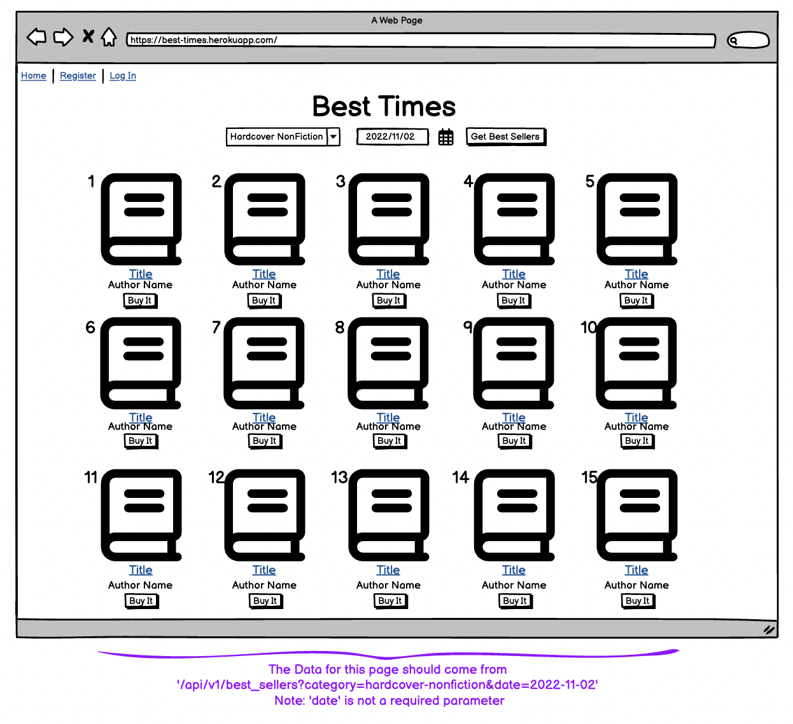
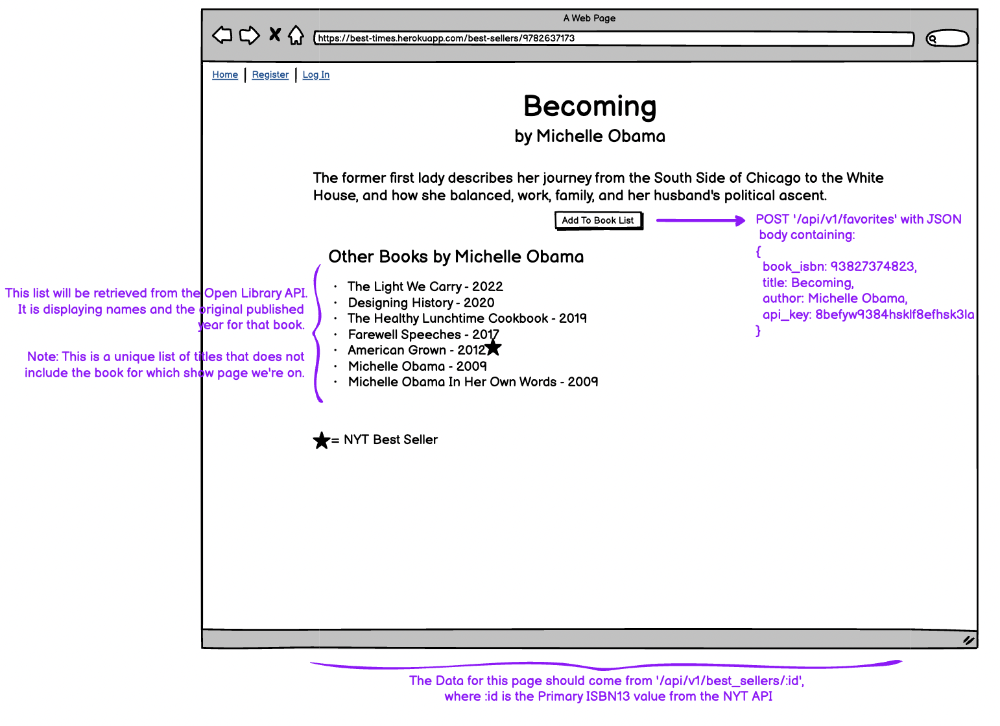
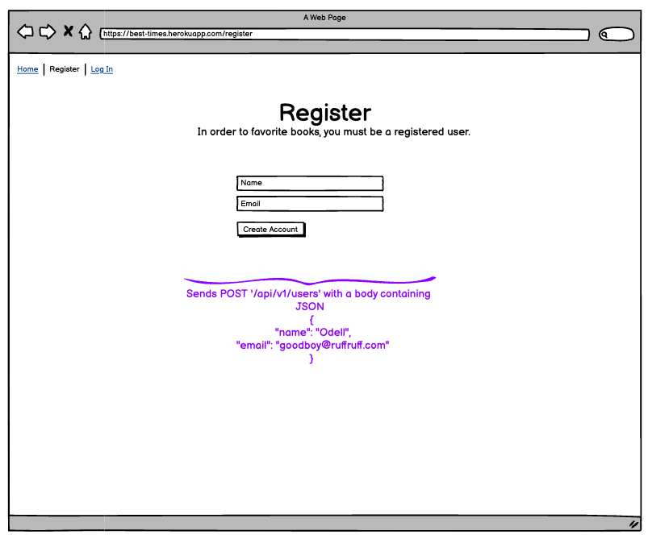
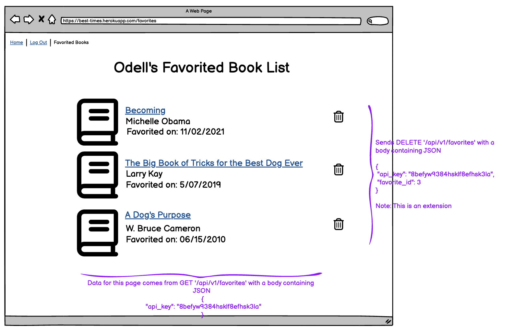

# Important Note about Getting Started

1. This project is an API based application. __Use__ the `rails new --api and other flags` when creating your application. _Doing `rails new` which includes views, etc is NOT a correct project structure._

2. We would like to see a README file included in your project that outlines the learning goals, how someone can clone and set up your application and where they can get their own API keys, and happy path endpoint use.

3. It is __optional__ to use a gem for serializing.


## 1. Application Landing Page

The front-end team has drawn up this wireframe for the application's landing page:



They need your API to expose one API endpoint in order to populate this page with the necessary data.

---

### 1. Retrieve Best Sellers by Category and an optional Date

**Request:**

```
GET /api/v1/best_sellers?category=hardcover-fiction&date=2022-11-02
Content-Type: application/json
Accept: application/json
```

**Response:**

The response data should contain exactly these elements and nothing more:

- a data attribute, under which all other attributes are present:
  - id, always set to null
  - type, always set to "best_seller"
  - attributes, an object containing book information:
    - title
    - author
    - current rank
    - link for book image
    - link to buy on amazon
    - isbn, use isbn13 

Example:
```json
{
  "data": [
      {
          "id": null,
          "type": "best_seller",
          "attributes": {
              "title": "THE BODY KEEPS THE SCORE",
              "author": "Bessel van der Kolk",
              "rank": 1,
              "image_link": "https://storage.googleapis.com/du-prd/books/images/9780670785933.jpg",
              "amazon_link": "http://www.amazon.com/The-Body-Keeps-Score-Healing/dp/0670785938?tag=NYTBSREV-20",
              "isbn": "9780143127741"
          }
      },
      {
          "id": null,
          "type": "best_seller",
          "attributes": {
              "title": "BRAIDING SWEETGRASS",
              "author": "Robin Wall Kimmerer",
              "rank": 2,
              "image_link": "https://storage.googleapis.com/du-prd/books/images/9781571313560.jpg",
              "amazon_link": "https://www.amazon.com/Braiding-Sweetgrass-Indigenous-Scientific-Knowledge/dp/1571313567?tag=NYTBSREV-20",
              "isbn": "9781571313560"
          }
      },
      {
          "id": null,
          "type": "best_seller",
          "attributes": {
              "title": "ALL ABOUT LOVE",
              "author": "bell hooks",
              "rank": 3,
              "image_link": "https://storage.googleapis.com/du-prd/books/images/9780060959470.jpg",
              "amazon_link": "https://www.amazon.com/dp/0060959479?tag=NYTBSREV-20",
              "isbn": "9780060959470"
          }
      },
      {...},
      {...},
      {...},
      {etc},
    ]
}
```


**Requirements:**

* Endpoint needs to use the category and date from the GET request's query parameter and send it to [NYT Best Seller API](https://developer.nytimes.com/docs/books-product/1/routes/lists/%7Bdate%7D/%7Blist%7D.json/get) to retrieve the best sellers on that date for that category.
* The ISBN that is being sent back should be isbn13. 
* If a date is not send in through the query parameters, then you should get the best sellers for the category passed in for the CURRENT date.
* Testing should look for more than just the presence of attribute fields in the response. Testing should also determine which fields should NOT be present. (don't send back unnecessary data in the response)

---

## 2. Best Selling Book Show Page

The front-end team has drawn up this wireframe for the Best Selling Book Show Page:



They need your API to expose one API endpoint in order to populate this page with the necessary data. 

---

### 1. Retrieve Best Selling Book and other books by that author

**Request:**

```
GET /api/v1/best_sellers/:id 
Content-Type: application/json
Accept: application/json
```

**Response:**

The response data should contain exactly these elements and nothing more:

- a data attribute, under which all other attributes are present:
  - id, always set to null
  - type, always set to "best_seller"
  - attributes, an object containing book information:
    - title
    - author
    - description
    - other books by that author
      - title of that book
      - original publication of that book
      - boolean to show if that book was a NYT Best Seller in the past

Example:
```json
{
    "data": {
        "id": null,
        "type": "best_seller",
        "attributes": {
            "title": "THE PASSENGER",
            "author": "Cormac McCarthy",
            "description": "The first of a two-volume story. Bobby Western discovers things have gone missing from a jet in an underwater crash site, including the 10th passenger.",
            "other_books": [
                {
                    "title": "The Road",
                    "publication_year": 2004,
                    "nyt_best_seller": true
                },
                {
                    "title": "No country for old men",
                    "publication_year": 1900,
                    "nyt_best_seller": false
                },
                {
                    "title": "All the Pretty Horses",
                    "publication_year": 1992,
                    "nyt_best_seller": false
                },
                {
                    "title": "Cities of the Plain",
                    "publication_year": 1998,
                    "nyt_best_seller": false
                },
                {
                    "title": "Blood Meridian, or the Evening Redness in the West",
                    "publication_year": 1985,
                    "nyt_best_seller": false
                },
                {...},
                {...},
                {...},
                {etc},
              ]
        }
    }
}
```

**Requirements:**

* Endpoint needs to use the isbn from the URI, and get information about that book from the [NYT Best Seller API](https://developer.nytimes.com/docs/books-product/1/routes/lists/best-sellers/history.json/get). Then, use the [Open Library API]() to get a list of other books from that author.
* The list of other books by that author should not contain the book that this request is for. 
* The list of other books should be as unique as possible. The Open Library API has multiples of the same book that's titles are formatted differently. For example, "Crossing" and "The Crossing". It is not expected that this edge case is handled.
* If there are no other books written by that author, then other_books should be an empty array. (`"other_books": []`)
* Testing should look for more than just the presence of attribute fields in the response. Testing should also determine which fields should NOT be present. (don't send back unnecessary data in the response)


## 3. User Registration

The front-end team has drawn up this wireframe for registration:



Your api should expose this endpoint:

**Request:**

```
POST /api/v1/users
Content-Type: application/json
Accept: application/json

{
  "name": "Beyoncé Knowles"
  "email": "bey@renaissance.com",
}
```

**Response:**

```
status: 201
body:

{
  "data": {
    "type": "user",
    "id": "1",
    "attributes": {
      "email": "bey@renaissance.com",
      "api_key": "jgn983hy48thw9begh98h4539h4"
    }
  }
}
```

**Requirements:**

* This POST endpoint should NOT call your endpoint like `/api/v1/users?email=person@woohoo.com&password=abc123&password_confirmation=abc123`. You must send a **JSON payload** in the **body** of the request
  - in Postman, under the address bar, click on "Body", select "raw", which will show a dropdown that probably says "Text" in it, choose "JSON" from the list
  - this is a **hard requirement** to pass this endpoint!
* A successful request creates a user in your database, and generates a unique api key associated with that user, with a 201 status code. 
* THIS IS NOT REAL AUTHENTICATION -- Real authentication using bcrypt is an extension. The expectations for this endpoint is that upon creation of this user, a randomly generated code should be stored in the database for that user. This code will be used to add favorites to a particular user's favorite list.
* Email addresses must be unique. If a unique email address is not used for registration, an appropriate error message should be returned in the response.

---

## 4. Add Favorites

Functionality to add books to a favorited list for a particular user can be done with the following request.

**Request:**

```
POST /api/v1/favorites
Content-Type: application/json
Accept: application/json

{
    "book_isbn": "9781982117351",
    "title": "THE SONG OF THE CELL",
    "author": "Siddhartha Mukherjee",
    "api_key": "jgn983hy48thw9begh98h4539h4"
}
```

**Response:**

```
status: 201
body:

{
    "success": "Favorite added successfully"
}
```

**Requirements:**

* This POST endpoint should NOT call your endpoint like `/api/v1/favorites?book_isbn=9781982117351&title=THE SONG OF THE CELL&author=Siddhartha Mukherjee&api_key=jgn983hy48thw9begh98h4539h4p`. You must send a **JSON payload** in the **body** of the request
  - in Postman, under the address bar, click on "Body", select "raw", which will show a dropdown that probably says "Text" in it, choose "JSON" from the list
  - this is a **hard requirement** to pass this endpoint!
* If the `api_key` is invalid (no user with that api key), an appropriate [400-level status code](https://en.wikipedia.org/wiki/List_of_HTTP_status_codes#4xx_Client_errors) should be returned, as well as a message explaining what went wrong.
* If the `api_key` is valid, create a favorite for the user with that api key.
* A successful request creates a Favorite for that user in the database, and returns a 201 status code.
* Your Favorites Table can store `book_isbn`, `title` and `author`, as well as a foreign key for `user`. (One to many relationship between User and Favorites)

---

## 5. Get a User's Favorites

The front-end team has drawn up this wireframe for registration:



Your api should expose this endpoint:

**Request:**

```
GET /api/v1/favorites
Content-Type: application/json
Accept: application/json

{
    "api_key": "jgn983hy48thw9begh98h4539h4"
}
```

**Response:**

The response data should contain exactly these elements and nothing more:

- a data attribute, under which all other attributes are present:
  - id, from the database
  - type, always set to "favorite"
  - attributes, an object containing favorited book information:
    - title
    - author
    - book isbn
    - created at date/time

```
status: 200
body:

{
    "data": [
        {
            "id": "1",
            "type": "favorite",
            "attributes": {
                "title": "THE SONG OF THE CELL",
                "author": "Siddhartha Mukherjee",
                "book_isbn": "9781982117351",
                "created_at": "2022-11-07T02:17:54.111Z"
            }
        },
        {
            "id": "2",
            "type": "favorite",
            "attributes": {
                "title": "THE BOYS FROM BILOXI",
                "author": "John Grisham",
                "book_isbn": "9780385548922",
                "created_at": "2022-11-02T03:44:08.917Z"
            }
        }
    ]
```

**Requirements:**

* Like the previous two endpoings, this `api_key` will be sent in the body of the request.
* If the `api_key` is invalid, an appropriate [400-level status code](https://en.wikipedia.org/wiki/List_of_HTTP_status_codes#4xx_Client_errors) should be returned, as well as a message explaining what went wrong.
* If the `api_key` is valid, this response will return all books that the user has favorited.


## Extensions

Coming Soon
