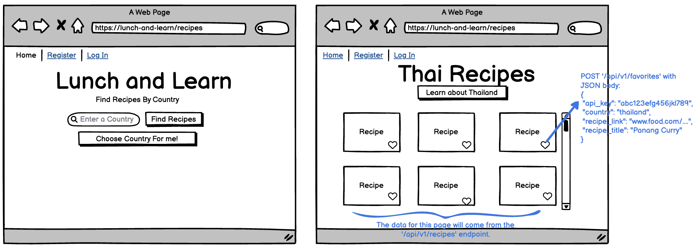
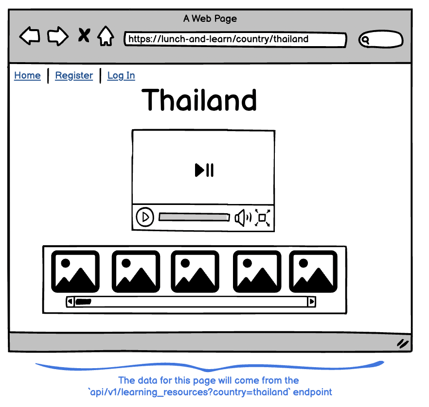
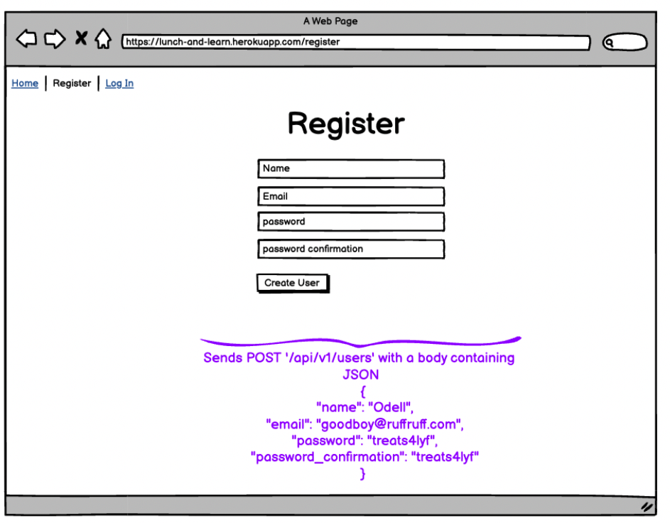
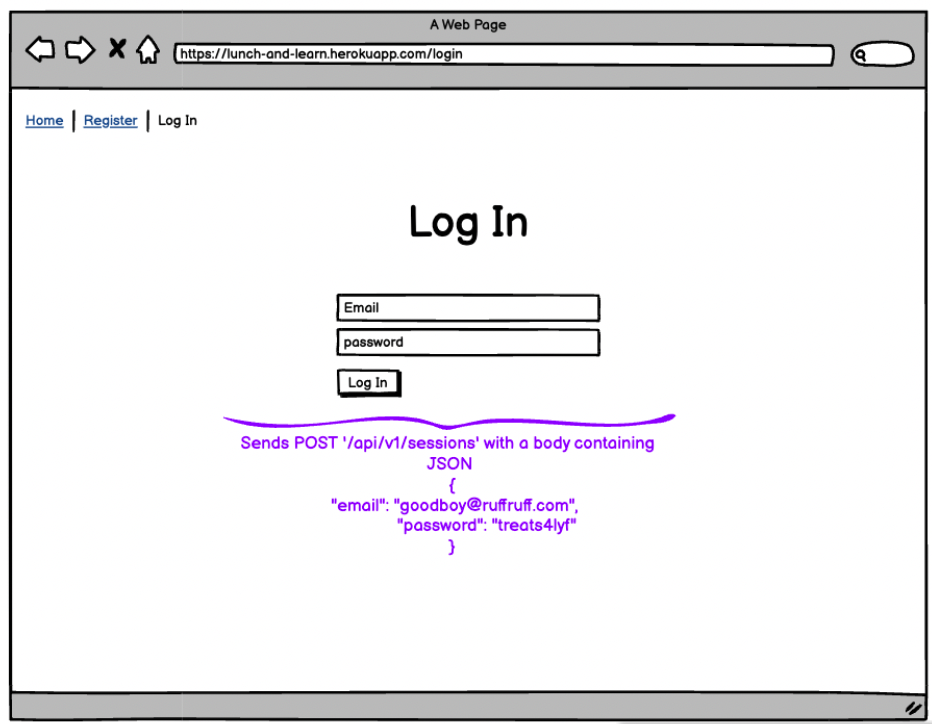
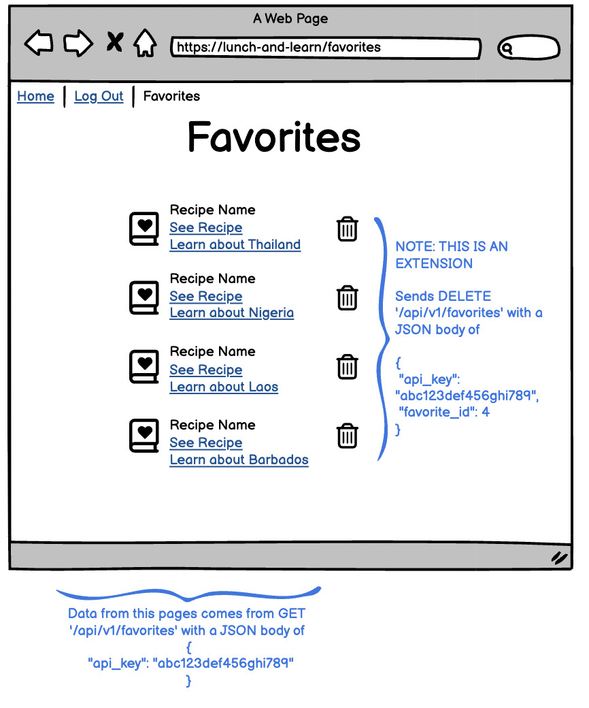

# Important Note about Getting Started

1. This project is an API based application. __Use__ the `rails new --api and other flags` when creating your application. _Doing `rails new` which includes views, etc is NOT a correct project structure._

2. We would like to see a README file included in your project that outlines the learning goals, how someone can clone and set up your application and where they can get their own API keys, and happy path endpoint use.

3. It is __optional__ to use a gem for serializing.


## 1. Get Recipes For A Particular Country

The front-end team has drawn up these wireframe for the application's functionality of searching for cuisines by country:



They need your API to expose one API endpoint in order to populate this page with the necessary data.

---

**Request:**

```
GET /api/v1/recipes?country=thailand
Content-Type: application/json
Accept: application/json
```

**Response:**

The response data should contain exactly these elements and nothing more:

- a data attribute, under which all other attributes are present:
    - collection, each containing the following:
        - id, always set to null
        - type, always set to recipe
        - attributes, containing the following:
            - title
            - url
            - country used for search
            - image url

Example:
```json
{
    "data": [
        {
            "id": null,
            "type": "recipe",
            "attributes": {
                "title": "Andy Ricker's Naam Cheuam Naam Taan Piip (Palm Sugar Simple Syrup)",
                "url": "https://www.seriouseats.com/recipes/2013/11/andy-rickers-naam-cheuam-naam-taan-piip-palm-sugar-simple-syrup.html",
                "country": "thailand",
                "image": "https://edamam-product-images.s3.amazonaws.com..."
            }
        },
        {
            "id": null,
            "type": "recipe",
            "attributes": {
                "title": "Sriracha",
                "url": "http://www.jamieoliver.com/recipes/vegetables-recipes/sriracha/",
                "country": "thailand",
                "image": "https://edamam-product-images.s3.amazonaws.com/."
            }
        },
        {...},
        {...},
        {...},
        {etc},
    ]
}
```


**Requirements:**

* If country is not sent in by the user, you will need to use the [REST Countries API](https://restcountries.com/#api-endpoints-v3-all) to randomly choose one country's name.
* For whichever country is either passed in or chosen at random, find recipes using the [Edamam Recipe API](https://developer.edamam.com/edamam-recipe-api)
    - Note: use the `q` parameter to search for recipes related to that country
* If the country parameter is either an empty string, or a value that doesn't return any recipes, return an empty array:
```json
{
    "data": []
}
```
* Testing should look for more than just the presence of attribute fields in the response. Testing should also determine which fields should NOT be present. (don't send back unnecessary data in the response)


---

## 2. Get Learning Resources for a Particular Country

The front-end team has drawn up this wireframe for their country show page.



They need your API to expose one API endpoint in order to populate this page with the necessary data. 

---

**Request:**

```
GET /api/v1/learning_resources?country=laos
Content-Type: application/json
Accept: application/json
```

**Response:**

The response data should contain exactly these elements and nothing more:

- a data attribute, under which all other attributes are present:
  - id, always set to null
  - type, set to "learning_resource"
  - attributes, under which the following is present:
    - country name
    - video, an object containing:
        - title of video 
        - video id from youtube
    - images, a collection holding elements that have information about that image, for example:
        - alternative description (for alt tags)
        - url for image

Example:
```json
{
    "data": {
        "id": null,
        "type": "learning_resource",
        "attributes": {
            "country": "laos",
            "video": {
                "title": "A Super Quick History of Laos",
                "youtube_video_id": "uw8hjVqxMXw"
            },
            "images": [
                {
                    "alt_tag": "standing statue and temples landmark during daytime",
                    "url": "https://images.unsplash.com/photo-1528181304800-259b08848526?ixid=MnwzNzg2NzV8MHwxfHNlYXJjaHwxfHx0aGFpbGFuZHxlbnwwfHx8fDE2Njc4Njk1NTA&ixlib=rb-4.0.3"
                },
                {
                    "alt_tag": "five brown wooden boats",
                    "url": "https://images.unsplash.com/photo-1552465011-b4e21bf6e79a?ixid=MnwzNzg2NzV8MHwxfHNlYXJjaHwyfHx0aGFpbGFuZHxlbnwwfHx8fDE2Njc4Njk1NTA&ixlib=rb-4.0.3"
                },
                {
                    "alt_tag": "orange temples during daytime",
                    "url": "https://images.unsplash.com/photo-1563492065599-3520f775eeed?ixid=MnwzNzg2NzV8MHwxfHNlYXJjaHwzfHx0aGFpbGFuZHxlbnwwfHx8fDE2Njc4Njk1NTA&ixlib=rb-4.0.3"
                },
                {...},
                {...},
                {...},
                {etc},
              ]
        }
    }
}
```

**Requirements:**

* Endpoint needs to use the [search lists](https://developers.google.com/youtube/v3/docs/search/list) endpoint from the [YouTube API](https://developers.google.com/youtube/v3/getting-started). We suggest pulling videos from the [Mr. History YouTube Channel](https://www.youtube.com/channel/UCluQ5yInbeAkkeCndNnUhpw), but if there's another educational channel you'd like to pull from instead, you can. You only need to return one video.
    - Note: You'll need to use `snippet` to get more data on your search.
* Implement a new API service (Unsplash, Pexels, Microsoft Bing Image search, Wikimedia image search, Flickr and more) to use the name of the country to get the URL of up to 10 images for that country search. 
* If no videos or images are found, those keys should point to an empty object:
```json
{
    "data": {
        "id": null,
        "type": "learning_resource",
        "attributes": {
            "country": "Nameofcountry", # this value is the value used to search for learning resources
            "video": {},
            "images": []
        }
    }
}
```


## 3. User Registration

The front-end team has drawn up this wireframe for registration:



Your api should expose this endpoint:

**Request:**

```
POST /api/v1/users
Content-Type: application/json
Accept: application/json

{
  "name": "Odell",
  "email": "goodboy@ruffruff.com",
  "password": "treats4lyf",
  "password_confirmation": "treats4lyf"
}
```

**Response:**

```json
{
  "data": {
    "type": "user",
    "id": "1",
    "attributes": {
      "name": "Odell",
      "email": "goodboy@ruffruff.com",
      "api_key": "jgn983hy48thw9begh98h4539h4"
    }
  }
}
```

**Requirements:**

* This POST endpoint should NOT call your endpoint like `/api/v1/users?name=Odell&email=goodboy@ruffruff.com&password=treats4lyf&password_confirmation=treats4lyf`. You must send a **JSON payload** in the **body** of the request
  - in Postman, under the address bar, click on "Body", select "raw", which will show a dropdown that probably says "Text" in it, choose "JSON" from the list
  - this is a **hard requirement** to pass this endpoint!
* A successful request creates a user in your database, creates a password digest, and generates a unique api key associated with that user, with a 201 status code. 
* Use bcrypt to authenticate and create a password digest for a new user.
* Email addresses must be unique. If a unique email address is not used for registration, an appropriate error message should be returned in the response.
* If passwords do not match, an appropriate error message should be returned in the response.

---

## 4. Log In User

The front-end team has drawn up this wireframe for registration:



Your api should expose this endpoint:

**Request:**

```
POST /api/v1/sessions
Content-Type: application/json
Accept: application/json

{
  "email": "goodboy@ruffruff.com",
  "password": "treats4lyf"
}
```

**Response:**

```json
{
  "data": {
    "type": "user",
    "id": "1",
    "attributes": {
      "name": "Odell",
      "email": "goodboy@ruffruff.com",
      "api_key": "jgn983hy48thw9begh98h4539h4"
    }
  }
}
```

**Requirements:**

* This POST endpoint should NOT call your endpoint like `/api/v1/sessions?name=Odell&email=goodboy@ruffruff.com&password=treats4lyf&password_confirmation=treats4lyf`. You must send a **JSON payload** in the **body** of the request
  - in Postman, under the address bar, click on "Body", select "raw", which will show a dropdown that probably says "Text" in it, choose "JSON" from the list
  - this is a **hard requirement** to pass this endpoint!
* A successful request returns that user's name, email, and api key. 
* An unsuccessful request returns an appropriate [400-level status code](https://en.wikipedia.org/wiki/List_of_HTTP_status_codes#4xx_Client_errors) and body with a description of why the request wasn't successful.
* Use bcrypt to authenticate and encrypt a password for a new user.
  * Potential reasons a request would fail: credentials are bad, etc
  * **Security tip:** never tell a user which field (email/password) is incorrect, as this alerts malicious users how to attack your site (eg, if they've guessed a correct email address, and you tell them the password is bad, then they don't need to keep guessing email addresses, and can just try to crack the password)


---

## 5. Add Favorites

Functionality to add recipes to a favorited list for a particular user can be done with the following request.

**Request:**

```
POST /api/v1/favorites
Content-Type: application/json
Accept: application/json

{
    "api_key": "jgn983hy48thw9begh98h4539h4",
    "country": "thailand",
    "recipe_link": "https://www.tastingtable.com/.....",
    "recipe_title": "Crab Fried Rice (Khaao Pad Bpu)"
}
```

**Response:**

```json
{
    "success": "Favorite added successfully"
}
```

**Requirements:**

* This POST endpoint should NOT call your endpoint like `/api/v1/favorites?country=thailand,recipe_link="https://www.tastingtable.com/....."&recipe_title="Crab Fried Rice (Khaao Pad Bpu)"&api_key=jgn983hy48thw9begh98h4539h4p`. You must send a **JSON payload** in the **body** of the request
  - in Postman, under the address bar, click on "Body", select "raw", which will show a dropdown that probably says "Text" in it, choose "JSON" from the list
  - this is a **hard requirement** to pass this endpoint!
* If the `api_key` is invalid (no user with that api key), an appropriate [400-level status code](https://en.wikipedia.org/wiki/List_of_HTTP_status_codes#4xx_Client_errors) should be returned, as well as a message explaining what went wrong.
* If the `api_key` is valid, create a favorite for the user with that api key.
* A successful request creates a Favorite for that user in the database, and returns a 201 status code.
* Your Favorites Table can store `country`, `recipe_link` and `recipe_title`, as well as a foreign key for `user`. (One to many relationship between User and Favorites)

---

## 6. Get a User's Favorites

The front-end team has drawn up this wireframe for registration:



Your api should expose this endpoint:

**Request:**

```
GET /api/v1/favorites?api_key=jgn983hy48thw9begh98h4539h4
Content-Type: application/json
Accept: application/json
```

**Response:**

The response data should contain exactly these elements and nothing more:

- a data attribute, under which all other attributes are present:
  - id, from the database
  - type, always set to "favorite"
  - attributes, an object containing favorited book information:
    - recipe title
    - recipe link
    - country
    - created at date/time

```json
{
    "data": [
        {
            "id": "1",
            "type": "favorite",
            "attributes": {
                "recipe_title": "Recipe: Egyptian Tomato Soup",
                "recipe_link": "http://www.thekitchn.com/recipe-egyptian-tomato-soup-weeknight....",
                "country": "egypt",
                "created_at": "2022-11-02T02:17:54.111Z"
            }
        },
        {
            "id": "2",
            "type": "favorite",
            "attributes": {
                "recipe_title": "Crab Fried Rice (Khaao Pad Bpu)",
                "recipe_link": "https://www.tastingtable.com/.....",
                "country": "thailand",
                "created_at": "2022-11-07T03:44:08.917Z"
            }
        }
    ]
 }    
```

**Requirements:**

* For this `get` request, `api_key` can be sent as a query parameter.
* If the `api_key` is invalid, an appropriate [400-level status code](https://en.wikipedia.org/wiki/List_of_HTTP_status_codes#4xx_Client_errors) should be returned, as well as a message explaining what went wrong.
* If the `api_key` is valid, this response will return all recipes that the user has favorited.
* If the user has not favorited any recipes, the data object should point to an empty array. 


## Extensions

Note: We've come up with 3 extensions. If you have an idea of a different feature/technology you'd like to implement as an alternate extension, run it by your instructors to get confirmation that you can use that idea in place of an extension below. 

1. For the recipes and learning resources endpoints, use the REST Countries API to validate that the country parameter passed in is in fact a valid country. If it isn't, return an appropriate [400-level status code](https://en.wikipedia.org/wiki/List_of_HTTP_status_codes#4xx_Client_errors).
2. Add an endpoint to DELETE a favorite ( DELETE '/api/v1/favorites')
3. Utilize caching OR background workers to optimize API calls.
