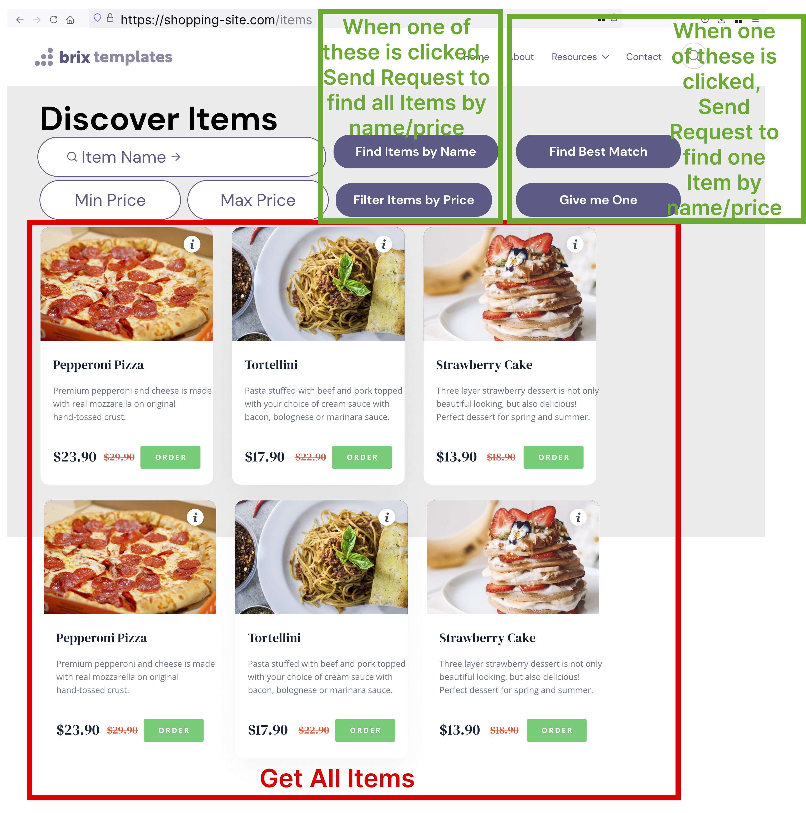
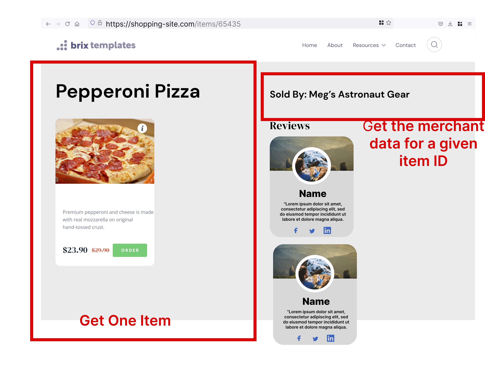
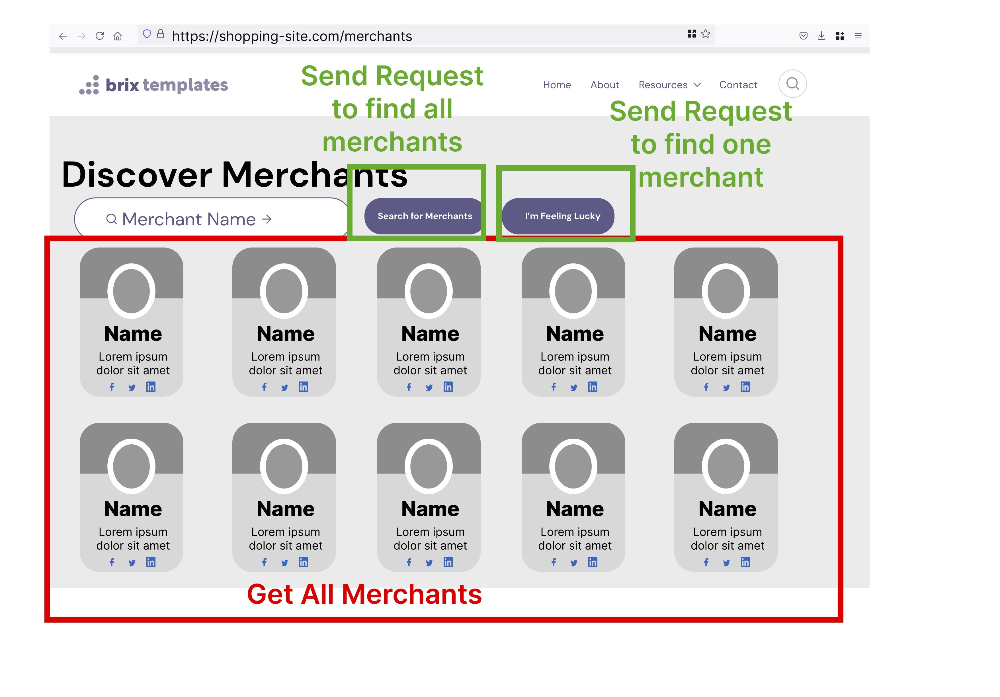
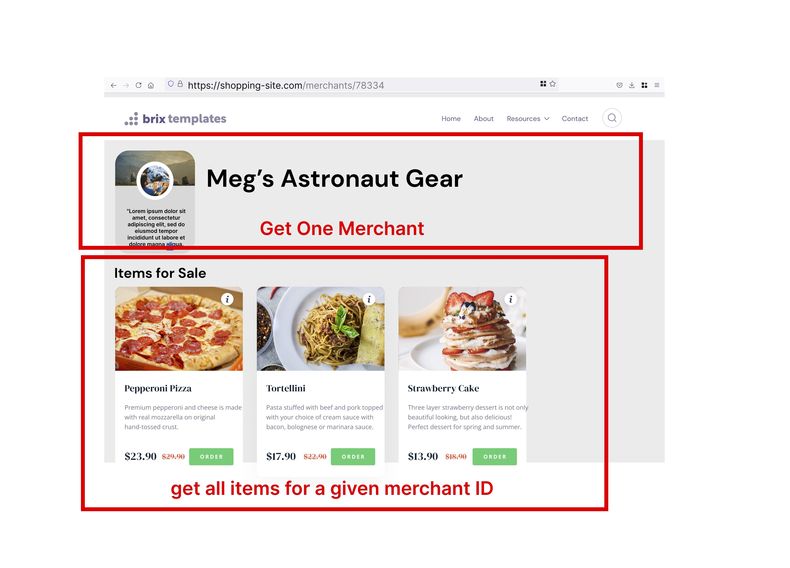
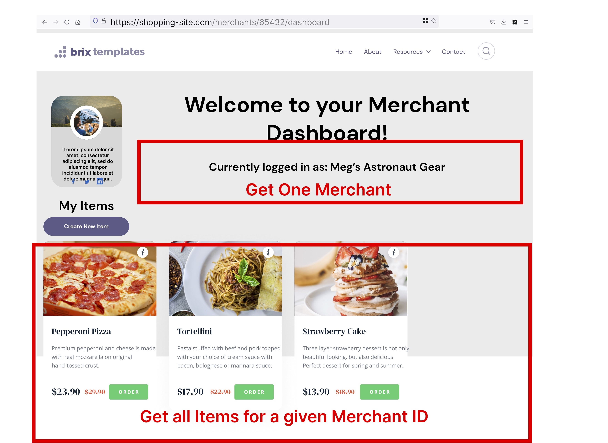
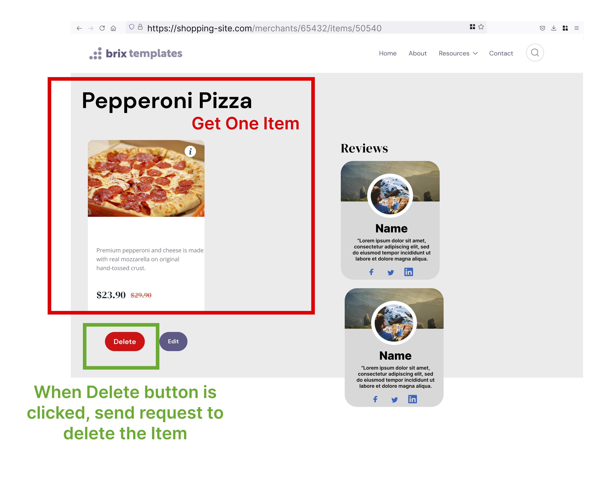
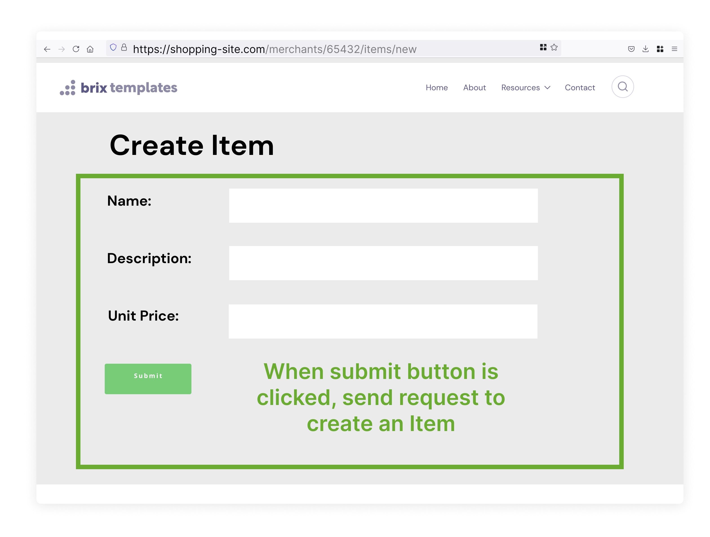
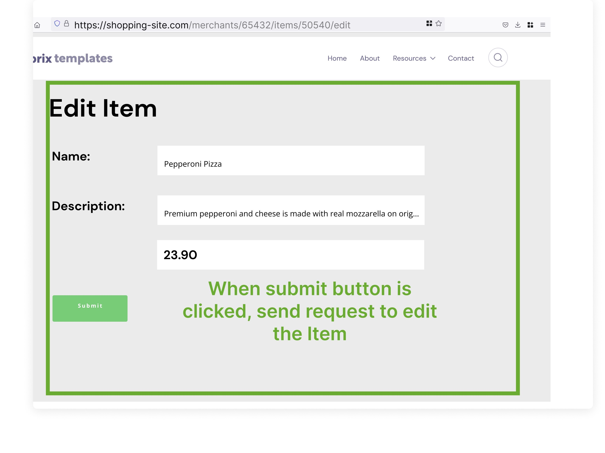

These wireframes are intended to give you idea of what the frontend of this application will look like. You will not be building out any of the UI elements shown in these wireframes. Highlights in RED indicate data that the frontend has requested from your backend. Highlights in GREEN indicate data that the frontend will send to your backend.

