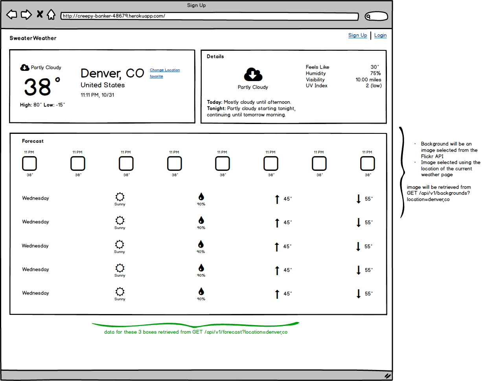

### 1. Weather for a City

The functionality for this page should be split into multiple user stories.

```
GET /api/v1/forecast?location=denver,co
Content-Type: application/json
Accept: application/json
```

**Response:**

There is room for personal preference for this response body. Use the mock ups to see what data is required on the front end to decide what you would like to include in your response. If you'd like more of a challenge, you might consider using [Fast JSON API](https://github.com/Netflix/fast_jsonapi) and consider trying to stick to the [JSON 1.0 spec](https://jsonapi.org/).

**Requirements:**

- Needs to pull out the city and state from the GET request and send it to Google's Geocoding API to retrieve the lat and long for the city (this can be it's own story)
- Retrieve forecast data from the Darksky API using the lat and long



### 2. Retrieve Background Image Based on Location

```
GET /api/v1/backgrounds?location=denver,co
Content-Type: application/json
Accept: application/json
```

**Response:**

Room for personal preference on how you structure this response.

**Requirements:**

- Returns a random image from a collection of images.
- The collection of images must be limited to the city being viewed.
- Must use an external API to retrieve these images.

**Possibilities:**

- Use Flickr:
  - [search](https://www.flickr.com/services/api/flickr.photos.search.html)
    - Returns a collection of photos for a location.
    - Feel free to tweak this call but this is a good base: `lat`, `lon`, `api_key`, `method`, `format`, `nojsoncallback`, and `extras=url_o`
  - [photos.getInfo](https://www.flickr.com/services/api/explore/flickr.photos.getInfo)
    - Probably not necessary to hit this endpoint but wanted to include it in case you needed more info for a specific photo. Check out the documentation for `extras` in the API call above.
- Stretch goal:
  - Write a rake task that caches photos for the 50 largest U.S. cities to improve page load times (this should be a separate user story)


### 3. Account Creation

```
POST /api/v1/users
Content-Type: application/json
Accept: application/json

{
  "email": "whatever@example.com",
  "password": "password"
  "password_confirmation": "password"
}
```
**Response:**

```
status: 201
body:

{
  "api_key": "jgn983hy48thw9begh98h4539h4",
}
```


### 4. Login

```
POST /api/v1/sessions
Content-Type: application/json
Accept: application/json

{
  "email": "whatever@example.com",
  "password": "password"
}
```

**Response:**

```
status: 200
body:

{
  "api_key": "jgn983hy48thw9begh98h4539h4",
}
```


### 5. Favoriting Locations

```
POST /api/v1/favorites
Content-Type: application/json
Accept: application/json

body:

{
  "location": "Denver, CO", # If you decide to store cities in your database you can send an id if you prefer
  "api_key": "jgn983hy48thw9begh98h4539h4"
}
```

**Requirements:**

- API key must be sent
- If no API key or an incorrect key is provided return 401 (Unauthorized)

### 6. Listing Favorite Locations

```
GET /api/v1/favorites
Content-Type: application/json
Accept: application/json

body:

{
  "api_key": "jgn983hy48thw9begh98h4539h4"
}
```

**Requirements:**

- API key must be sent
- If no API key or an incorrect key is provided return 401 (Unauthorized)

**Response:**

```
status: 200
body:
[
  {
    "location": "Denver, CO",
    "current_weather": {
      # This can vary but try to keep it consistent with the
      # structure of the response from the /forecast endpoint
    },
    "location": "Golden, CO",
    "current_weather": {
       {...}
    }
  }
]
```

### 6. Removing Favorite Locations

```
DELETE /api/v1/favorites
Content-Type: application/json
Accept: application/json

body:

{
  "location": "Denver, CO", # If you decide to store cities in your database you can send an id if you prefer
  "api_key": "jgn983hy48thw9begh98h4539h4"
}
```

**Requirements:**

- API key must be sent
- If no API key or an incorrect key is provided return 401 (Unauthorized)

**Response:**

```
status: 200
body:
[
  {
    "location": "Denver, CO",
    "current_weather": {
      # This can vary but try to keep it consistent with the
      # structure of the response from the /forecast endpoint
    },
    "location": "Golden, CO",
    "current_weather": {
       {...}
    }
  }
]
```
