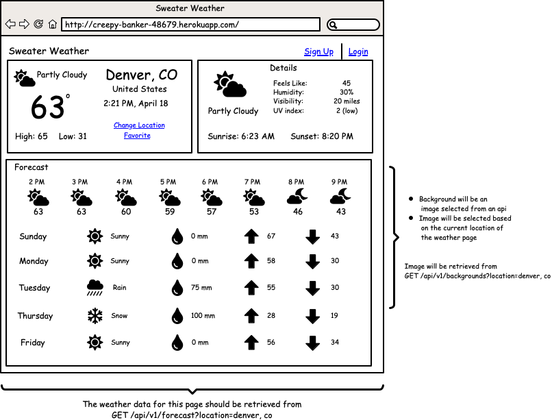
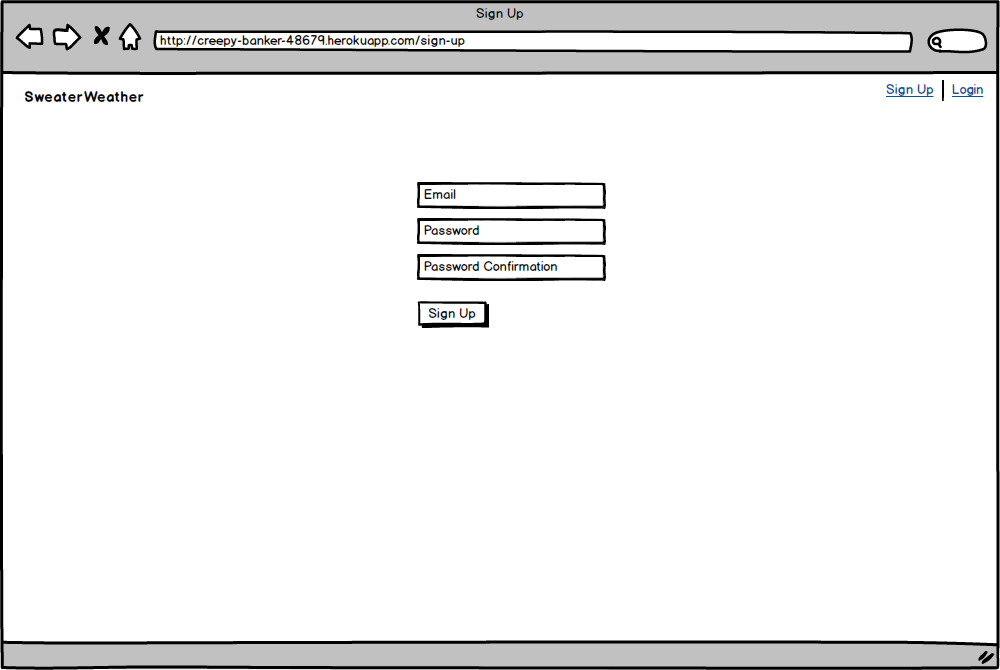
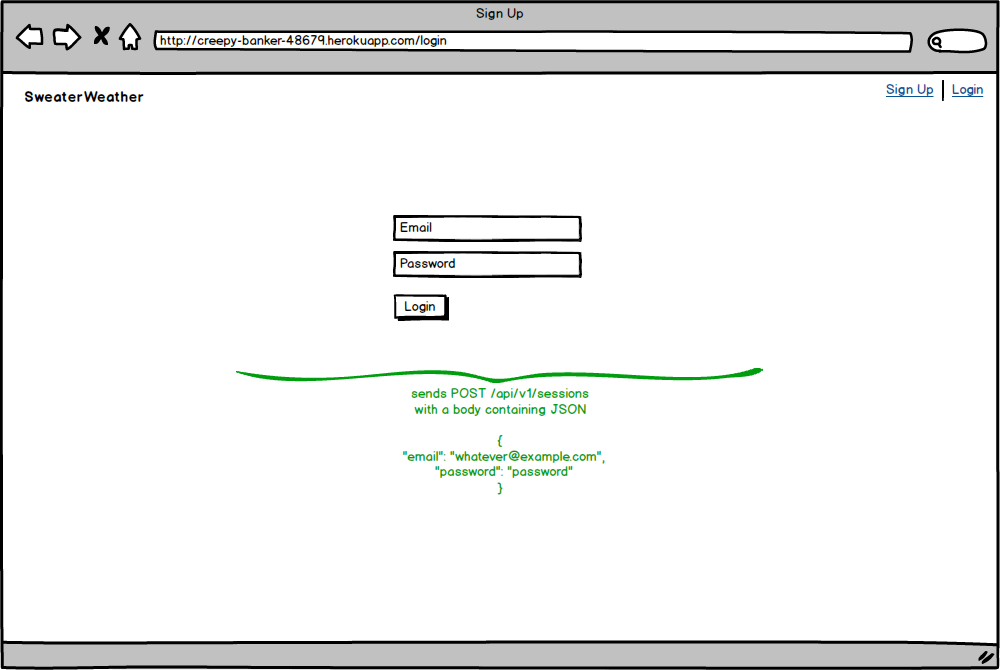
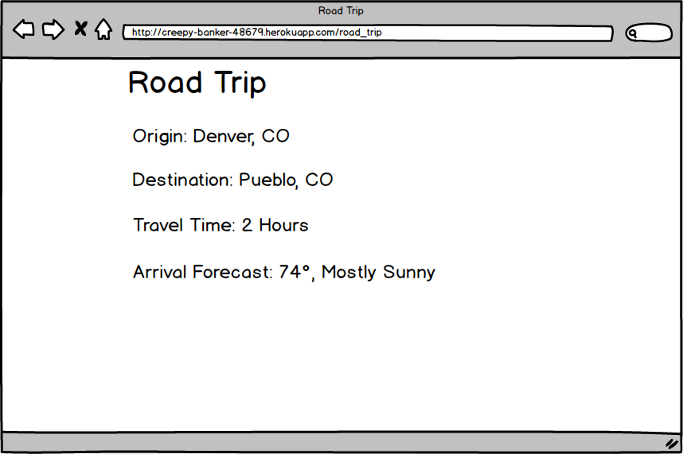

## 1. Application Landing Page

The front-end team has drawn up this wireframe for the application's landing page:



They need your API to expose two endpoints in order to populate this page with the necessary data.

### 1a. Retrieve weather for a city

**Request:**

```
GET /api/v1/forecast?location=denver,co
Content-Type: application/json
Accept: application/json
```

**Response:**

Use the wireframes to see what data is required on the front-end to decide what data should be included in your response. Use the [Fast JSON API](https://github.com/Netflix/fast_jsonapi) and the response should adhere to the [JSON 1.0 spec](https://jsonapi.org/).

**Requirements:**

- Needs to pull out the city and state from the GET request and send it to Google's Geocoding API to retrieve the lat and long for the city (this can be its own story). Use of the Google Geocoding API is a hard requirement.
- Retrieve forecast data from the [OpenWeather One Call API](https://openweathermap.org/api/one-call-api) using the lat and long

### 1b. Background Image for a City

**Request:**

```
GET /api/v1/backgrounds?location=denver,co
Content-Type: application/json
Accept: application/json
```

**Response:**

This will return the url to an appropriate background image for a location.

## 2. Registration

The front-end team has drawn up this wireframe for registration:



Your api should expose this endpoint:

**Request:**

```
POST /api/v1/users
Content-Type: application/json
Accept: application/json

{
  "email": "whatever@example.com",
  "password": "password"
  "password_confirmation": "password"
}
```

**Response:**

```
status: 201
body:

{
  "data": {
    "type": "users",
    "id": 1,
    "attributes": {
      "email": "whatever@example.com",
      "api_key": "jgn983hy48thw9begh98h4539h4"
    }
  }
}
```

**Requirements:**

* A successful request creates a user and generates a unique api key associated with that user.
* An unsuccessful request returns a 400 level status code and body with a description of why the request wasn't successful. Potential reasons a request would fail: passwords don't match, email has already been taken, missing a field, etc.

## 3. Login

The front-end team has drawn up this wireframe for log in:



Your api should expose this endpoint:

**Request:**

```
POST /api/v1/sessions
Content-Type: application/json
Accept: application/json

{
  "email": "whatever@example.com",
  "password": "password"
}
```

**Response:**

```
status: 200
body:

{
  "data": {
    "type": "users",
    "id": 1,
    "attributes": {
      "email": "whatever@example.com",
      "api_key": "jgn983hy48thw9begh98h4539h4"
    }
  }
}
```

**Requirements:**

* A successful request returns the user's api key.
* An unsuccessful request returns a 400 level status code and body with a description of why the request wasn't successful. Potential reasons a request would fail: credentials are bad.

## 4. Road Trip

The front-end team has drawn up these wireframes for a feature where users can plan road trips:



**Request:**

```
POST /api/v1/road_trip
Content-Type: application/json
Accept: application/json

body:

{
  "origin": "Denver,CO",
  "destination": "Pueblo,CO",
  "api_key": "jgn983hy48thw9begh98h4539h4"
}
```

**Response:**

Use the wireframes to see what data is required on the front-end to decide what you would like to include in your response.

**Requirements:**

- API key must be sent
- If no API key or an incorrect key is provided return 401 (Unauthorized)
- You will use the Google Directions API:  https://developers.google.com/maps/documentation/directions/start
- The structure of the response should be JSON API 1.0 Compliant.
