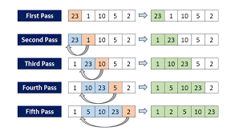
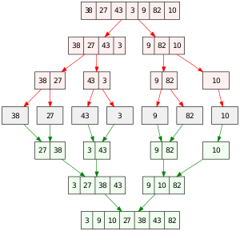
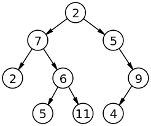

# Data Structures and Algorithms
---

## Learning Goals

* Introduce you to a few programming algorithms & data structures
* Spark your curiosity to further explore these concepts

---

## Sorting Algorithms

* Bubble Sort
* Insertion Sort
* Merge Sort

_There are more out there to explore_

---

### Bubble Sort

* Compares adjacent elements

* Swaps elements if in the wrong order

* Repeats process by iterating over the array until the process is complete

---

### Visualizing Bubble Sort

---

### Insertion Sort

* Split into a sorted and unsorted section

* Elements are taken from the unsorted section and inserted into the correct position in the sorted section

* Compare the current element to the previous element and shift the greater value forward to make room for the smaller element

---

### Visualizing Insertion Sort

---

### Merge Sort

* Divide and Conquer

* Divides the array in half until only single elements exist

* Then begins comparing elements and merging until a single sorted array exists

---

### Visualizing Merge Sort

---

## Data Structures

* Binary Trie
* Linked List

_There are more out there to explore_

---

### Binary Trie

* Type of data structure for storing data such as numbers in an organized way
thanks wikipedia

* Storing data in this way allows for faster look-ups when searching through the data

* 3 Main Operations: Insert, Delete, and Search

* When searching for an element you are comparing nodes of the trie and determining if the element you are searching for is greater than, less than or equal to the  current node

---

### Visualizing Binary Trie

---

### Linked List

* Linear collection of data elements whose order is not given by their physical placement in memory

* A collection of nodes, where each node points to the next node

* Types of Linked Lists include
    * Singly Linked
    * Doubly Linked
    * Circular linked
---

### Visualizing Linked List

---

Looking to continue your exploration? Checkout this repo: 
https://github.com/turingschool/data_structures_and_algorithms
