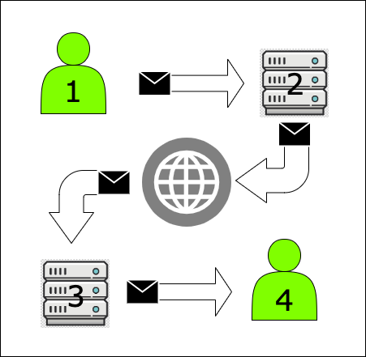

# Sending Email

---

# Agenda

- Warm Up
- Overview of how email works
- Exercise to set-up email in Rails
- Q&A

---

# Learning Goals

- High level understanding of how emails work
- How to use ActionMailer in Rails
- Sending email in development environment with Mailcatcher
- How to test that a mailer is working

---

## Warm Up

- How do you personally use email?
- How might you use emails in an application?

---

###  Why is Email Important?

- User Interaction!!!
  - Mailing Lists
  - Notifications
  - Order Updates
  - Account Management

---

### How does email work?

- Handled by mail servers
  - Outgoing mail servers
  - Incoming mail servers

---

### Email Protocols

- SMTP
- IMAP
- POP

---

## SMTP

- Simple Mail Transfer Protocol
- Outgoing mail protocol
- "Store and Forward"

---

## IMAP

- Internet Message Access Protocol
- Retrieval protocol
- Reads email from the server
  - Synchronizes computer emails with the server

---

## POP

- Post Office Protocol
- Retrieval protocol
- Downloads email from server

---

## Visualizing Sending Email

---

## Steps to Sending Email

1. Compose the Email and Send
  - Email client sends to the SMTP Server
2. SMTP Server checks if the domain is valid and gets the recipient's IP address
  - Using the IP address it sends the message to the internet
3. The recipient's SMTP server receives the email and if it recognizes the domain and user name it forwards to the POP or IMAP server
4. Recipient then connects to the POP of IMAP server to read the email

---

## Let's Try it in Rails
- Using the friendly-advice repo follow the walk-through to send an email locally
- We will come back together to answer any questions and wrap-up
