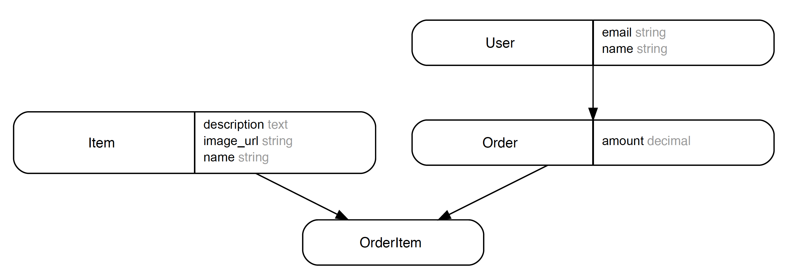

# Understanding Multitenancy

---

# Warmup

* Write a description of the store you built for Little Shop.
* How is this different from a place like Etsy or eBay?
* What about sites that aren't stores? What about Reddit, GitHub, or Airbnb?

---

# Multitenancy

* Store vs. Mall
* Peer/Sharing/Gig Economy
* Crowdfunding

---

# Examples

* Brainstorm
* What distinguishes a store that sells its own goods from one that lets other people sell goods?
* What value does the platform owner provide?

---

# Complications

* How does multitenancy complicate authentication and authorization?
* What might we need to protect in an application with multitenancy?
* How do we keep one store from interacting with data from another store?

---

# Storedom



---

# Goals

* Persist stores to the database
* View stores in the app (index and show)
* Associate item with a store
* View an item with info about its store
* Prevent accessing items in the wrong store

---

# Code Along

* Find a partner
* Implement the following functionality and walk me through it

---

# Database Updates

* Add `stores` table
* Add relationship between `items` and `stores`

---

# Model Updates

* Add Store model
* Add uniqueness validations for name and slug
* Add relationships between Store and Item

---

# Route and Controller Updates

* Add route to view store
* Add `StoresController`
* Add `index` and `show` actions to `StoresController`

---

# Views

* Add show
* Add index

---

# Create a Store

* `rails c`
* `rails s`

---

# Save a Store's Slug

* Use a callback to set the store's slug

---

# Update Controller

* Change the controller to find a store using its slug

---

# Add Items

* How would we refactor if we wanted a view to show items only for a particular store?
* What would the route look like?
* What if we wanted to keep our view for all items, but also have a view for only items associated with a store?

---

# Change Route

* What if we wanted to have the same functionality, but delete the `/stores` part of our route?

---

# Revised Routes

```rb
namespace :store, path: ':store', as: :store do
  resources :items, only: [:index, :show]
end
```

```rb
# Stores::ItemsController
def index
  @store = Store.find(params[:store])
  @items = @store.items
end
```

---

# Takeaways

* Multitenancy will generally lead to new relationships between resources
* Nested routes can help us work with related resources
