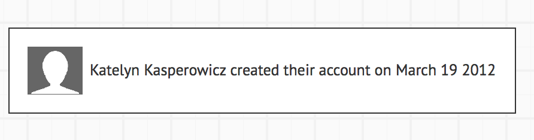

## Learning Goals

- Explain what GraphQL is and 1 benefit of using it over REST
- Create a GraphQL query to access Github data
- Explain the difference between a GraphQL Server and Client

## Warmup

Take 5 mins to discuss with a partner about the following:
- Why do we use APIs?
- What makes an API RESTful?
- What problems have you encountered while using REST APIs?

## Reasons behind GraphQL

So first what is GraphQL?

> GraphQL is an API standard that enables declarative data fetching where a client can specify exactly what it needs from an API
server.

Before diving into what that means let's discuss the why's. When learning about a new technology, it can be helpful to understand first the reasons behind why it was built. This helps us understand how and why it works along with its intricacies.

Reasons for GraphQL Development:

1. Increased mobile usage creates need for efficient data loading - slow loading on mobile causes need for less data to be fetched from the server, minimizes the amount of data that needs to be transferred over the network
2. Variety of different frontend frameworks and platforms on the client side (mobile, iOS, android, web) - makes it difficult to develop an api for each - each client can access exactly the data it needs
3. Fast development speed and expectation for rapid feature development - features are developed faster than they ever were before. The way REST apis are build requires manipulation of the data exposed be the server to accommodate new requirements and designs changes of the client side - this hinders fast development changes

For more information, check out [How to GraphQL](https://www.howtographql.com/basics/0-introduction/)

## But really what is GraphQL

Take 15 minutes to read - [So what’s this GraphQL thing I keep hearing about?](https://medium.freecodecamp.org/so-whats-this-graphql-thing-i-keep-hearing-about-baf4d36c20cf)

Discuss with your partner:
- What is GraphQL?
- What is a GraphQL query?
- What is a GraphQL resolver?
- What is the difference between a GraphQL Server and Client?

## Putting into practice

Many API providers are already making use of GraphQL over REST including Github. You may have noticed this already in their API docs.

Github allows us to make in browser queries to their API using their [GitHub GraphQL Explorer](https://developer.github.com/v4/explorer/).

With a partner complete the following exercises:

*Be sure to open up the Documentation Explorer to view the queryable [fields](http://graphql.github.io/learn/queries/#fields) and [arguments](http://graphql.github.io/learn/queries/#arguments)*

1. We want to display the following information in our UI about our current viewer using the [GitHub GraphQL Explorer](https://developer.github.com/v4/explorer/). Edit the default starting query to query for the necessary information.



*hint hint Look at the valid fields for User*

2. That was fun, but now we want some more information about this so called "Turing School" Organization on Github. Let's change our query to get the `email` and the total number of `repositories` of the `turningschool` organization.

3. BONUS: These have been more simplified queries up until now. Can you get the `name`, `email`, and `bio` of 10 users that belong to the `turningschool` organization?


## Rails Integration

By now you are probably thinking to yourself, "Hot damn, this is so cool! Does it work with Rails? How can I add it?" Yes my friends, it does! You can implement a GraphQL server in Rails, Express/Node, Phoenix/Elixir, Django/Python and more. Let's get started!

### Setup

Let's use our Rails QS repo to create a GraphQL server that enablges us to query our Foods. Add the following gems to you Gemfile:
``` ruby
gem 'graphql'
gem 'graphiql-rails', group: :development
```

Now run
``` bash
bundle
rails generate graphql:install
```

In order to use [GraphiQL](https://github.com/rmosolgo/graphiql-rails), the pretty in-browser GraphQL IDE that we used when exploring GitHub's GraphQL server, We need to add the engine to our `routes.rb`.

``` ruby
# config/routes.rb
if Rails.env.development?
  mount GraphiQL::Rails::Engine, at: "/graphiql", graphql_path: "graphql#execute"
end
```

To make sure everything is working go to:

[localhost:3000/graphiql](localhost:3000/graphiql)

If your Rails app is an API only app you may be encountering this error `ActionController::RoutingError (No route matches [GET] "/stylesheets/graphiql/rails/application.css")` Update your `application.rb` file to include `sprockets/railtie`.

``` ruby
#config/application.rb

require "sprockets/railtie"
```

### Query for Returning Foods

First we need to set up our [GraphQL Object Type](https://graphql.org/learn/schema/#object-types-and-fields) for foods, which just represent a kind of object you can fetch from your service, and what fields it has.

``` ruby
# app/graphql/types/food_type.rb

# defines a new GraphQL type
Types::FoodType = GraphQL::ObjectType.define do
  # this type is named `Food`
  name 'Food'

  # it has the following fields
  field :id, !types.ID
  field :name, !types.String
  field :calories, !types.Int
end
```

You can read more about ruby specific types [here](http://graphql-ruby.org/guides#types-guides).

### Query Resolver

We have defined our type, but our server doesn't know how to handle it yet. To do this we have to write our a resolver, function that the GraphQL server uses to fetch for a specific query.

Each field of our GraphQL types needs a corresponding resolver function. When a query arrives at the backend, the server will call those resolver functions that correspond to the fields that are specified in the query.

Let's update `app/graphql/types/query_type.rb` which was created when we ran `rails generate graphql:install`.

``` ruby
# app/graphql/types/query_type.rb

Types::QueryType = GraphQL::ObjectType.define do
  name 'Query'

  # queries are just represented as fields
  field :allFoods, !types[Types::FoodType] do
    # resolve would be called in order to fetch data for that field
    resolve -> (obj, args, ctx) { Food.all }
  end
end
```

### Querying Foods

Let's go back to [localhost:3000/graphiql](localhost:3000/graphiql).

Are you able to query for your foods? Woo! You just set up your first GraphQL server! Pretty neat huh?

BONUS: If we didn't want to use GraphiQL and wanted to sent our request over HTTP, what would our request look like?

*hint look back at your `routes.rb` file, what would our request body need to look like?*
