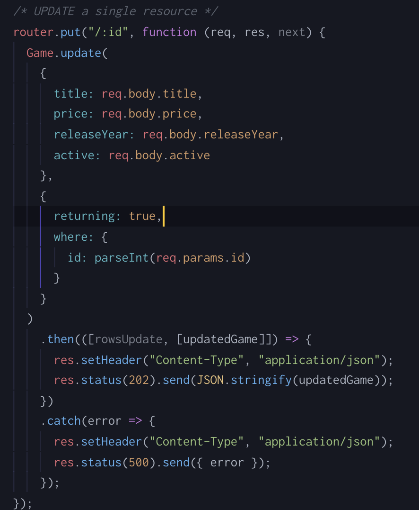
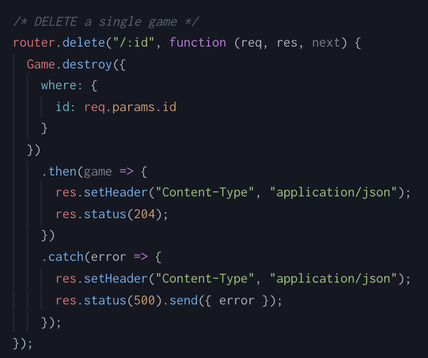

## Let's Talk about JavaScript

Traditionally JavaScript is executed client-side, or in the browser on the consumer's own computer. This is made possible by a browsers JavaScript Engine. Firefox's engine is called SpiderMonkey, and Chrome's is called V8.

### What is node.js?

According to [nodejs.org](https://nodejs.org) node, in it's most basic form, "is a JavaScript runtime built on Chrome's V8 JavaScript engine."

### Installing Node:

* Jump over to [node](https://nodejs.org/en/) and download the _Recommended for Most Users_ version of node.
* Pat yourself on the back you've completed installation :smile:

Also, when you download node - you also get npm

##### A Side Note about NPM

NPM (Node Package Manger) allows for organization of outside packages much like Ruby Gems. We'll cover it in more depth later on.

### A little about Express

Express is a small framework built on top of the web server functionality provided by Node.js. It helps to simplify and organize the server-side functionality of your application by providing abstractions over the more confusing parts of node.js, and adding helpful utilities and features.

### Sequelize: What is it good for?

Sequelize is a "Promise" based ORM that we will be using in our Express app.
If you would like to explore the documentation for Sequelize, it can be found [here](http://docs.sequelizejs.com/)

## Moving on to building an Express App

Alright, now that you have been introduced at a high level to node.js, Express, and Sequelize, let's use them to build out a simple CRUD app. _Don't worry we are going to dive deeper into these topics in class._ The intros above are just meant to give you some context.


### Where to begin

First, let's talk about what we are going to do and our goals. Today we are going to build a simple Express API that can CRUD a single resource. Let's call our project `arcade` and our resource will be games.

#### Learning Goals

- command to generate our Express app
- use Sequelize to create our database
- use Sequelize to generate and run migrations
- set-up the `create`, `read`, `update`, and `delete` routes
- interact with the database to `create`, `read`, `update`, and `delete` resources
- create a seed file

#### Installing Express Generator

Now let's install the express-generator. In the command line type:

  `npm install express-generator -g`

This will allow us to quickly create the start to an Express app. Now, similar to how we could use `rails create`, we can use `express --no-view appName` to start our project. First navigate to the directory you want your project to be in and then type:

`express --no-view arcade`

The `--no-view` is an option that is used so that there isn't a `views` folder within our app.

Now `cd arcade` and open the app in your text editor. Run `npm install` and then take a moment and look around.

:tada:We have successfully started our Express app!:tada:

#### Making Some Changes and Setup

Currently the structure of our app should look like this:


We won't need `users.js` so go ahead and delete it.

Next open up the `app.js` file and remove these two lines:

```javascript
//line 7
var usersRouter = require('./routes/users');
//line 17
app.use('/users', usersRouter);
```

Okay, now we can start adding to our app. To do some run the following commands.
```bash
npm install --save sequelize sequelize-cli pg

# yes that should be npx, it is not a typo
npx sequelize init
```

The first command is installing the necessary dependencies for our app so that our app can use sequelize and interact with a postgres database. After you run it, you should see a `package-lock.json` file and if you open `package.json` it should look similar to this:


The second command will add some folders and files so that our file structure should look similar to this:


Next open up `config/config.json`. We are going to update `username`, `database` and `dialect` in the development, test and production sections.

Change:
- username to your postgres username
- database to be `arcade_`environment name
- dialect to `"postgres"`

_If you do not know what your postgres username is, in the command line type `psql`. Likely the name that shows up before the `=#`is your username or you can type `\du` to get a list of users. To exit type `\q`._

If you get an error that a "role" is not known with your laptop username, if you installed PostgreSQL using Homebrew, it's possible that the username you use below will be `null` like the password.

When you are done making changes `config.js` should look like:
```javascript
//config/config.js
{
	"development": {
		"username": "your_postgres_username",
		"password": null,
		"database": "arcade_development",
		"host": "127.0.0.1",
		"dialect": "postgres"
	},
	"test": {
		"username": "your_postgres_username",
		"password": null,
		"database": "arcade_test",
		"host": "127.0.0.1",
		"dialect": "postgres"
	},
	"production": {
		"username": "your_postgres_username",
		"password": null,
		"database": "arcade_production",
		"host": "127.0.0.1",
		"dialect": "postgres"
	}
}
```

The last piece of our set-up is going to be including git in our app. Run `git init`. Add `node_modules` to your `.gitignore`. Stage your changes and complete your initial commit.

**If you have not taken a break since you've started, now is a great opportunity for a POM**

#### Creating our Game Model

Welcome back from you break! :sunglasses: We've gotten our setup out of the way and now we can get to some of the good stuff.

First, create and checkout a branch named `game_model`.

Next, we are going to actually create our database by running
```bash
npx sequelize db:create
```
After that is done, generate your model by running
```bash
npx sequelize model:generate --name Game --attributes title:string,price:integer,releaseYear:integer,active:boolean
```

This has created two new files for us. In the `models` folder we now have a `game.js` file and in the `migrations` folder we `timestamp-create-game.js` file. Go ahead and take a look at both of these to see if you can guess what is going on. _We will talk about these during week 1 for now keep moving forward._

We have generated our first migration, so let's celebrate by actually applying it to our database. To do so use the following command:

```bash
npx sequelize db:migrate
```

What if we made a typo or need to undo this migration?!? Fortunately, Sequelize has this covered and you can revert the migration with
```bash
npx sequelize db:migrate:undo
```
If you don't believe me, give it a try. Be sure to run the `db:migrate` command again to re-apply the changes.

Alright that completes our `game_model` branch. Merge into master and then we will move on to the next step.

#### Seeds

Continuing with the good git workflow, checkout a new branch `seeds`.

We need to have some data to work with when we start creating end-points, so we are going make up some seeds for our games table.

```bash
npx sequelize seed:generate --name game_seed
```

In the `seeders` folder you should now have a new file with a bare bones structure like this:

```javascript
'use strict';

module.exports = {
  up: (queryInterface, Sequelize) => {
    /*
      Add altering commands here.
      Return a promise to correctly handle asynchronicity.

      Example:
      return queryInterface.bulkInsert('People', [{
        name: 'John Doe',
        isBetaMember: false
      }], {});
    */
  },

  down: (queryInterface, Sequelize) => {
    /*
      Add reverting commands here.
      Return a promise to correctly handle asynchronicity.

      Example:
      return queryInterface.bulkDelete('People', null, {});
    */
  }
};
```

In the "up" section, we are going to provide information to insert into our games table. The "down" section is where we will write the code necessary to delete all our game seeds from the table. Up and down should balance one another by being equal and opposite of one another.

Within up we are going to do the following:

```javascript
return queryInterface.bulkInsert('Games', [{...}])
```
We are calling the function `bulkInsert` on `queryInterface`.

`bulkInsert` is expecting two arguments. The first is the table that we are inserting into and the second is an array with objects containing the information that we are adding.

To balance our up, our down will be
```javascript
return queryInterface.bulkDelete('Games', null, {})
```

Below is a completed up and down example.

```javascript
'use strict';

module.exports = {
  up: (queryInterface, Sequelize) => {

    return queryInterface.bulkInsert('Games', [{
      title: 'Fix it Felix Jr.',
      price: 50,
      releaseYear: 1982,
      active: true,
      createdAt: new Date(),
      updatedAt: new Date()
    },
    {
      title: 'Ms. Pac Man',
      price: 100,
      releaseYear: 1981,
      active: true,
      createdAt: new Date(),
      updatedAt: new Date()
    },
    {
      title: 'Dig Dug',
      price: 75,
      releaseYear: 1982,
      active: false,
      createdAt: new Date(),
      updatedAt: new Date()
    },
    {
      title: 'Galaga',
      price: 125,
      releaseYear: 1981,
      active: true,
      createdAt: new Date(),
      updatedAt: new Date()
    }
    ], {});
  },

  down: (queryInterface, Sequelize) => {
    return queryInterface.bulkDelete('Games', null, {});
  }
};
```

*Go find some documentation on how to seed the data!*

Awesome job! The `seeds` branch is complete. Merge it into `master`.


#### Games Routes

##### Read Routes

Alright it's time to code our CRUD routes. We are going to start by creating our read routes first.

Create a new branch `read_routes`.

---

*Pop Quiz*

Take a moment and think about what our paths should look like for retrieving all games and retrieving one game.

<details><summary>Answer</summary>
  <ul>
    <li> /api/v1/games </li>
    <li> /api/v1/games/:id </li>
  </ul>
</details>

---

Knowing how we want our paths, structure the directories within the `routes` folder to match and create a `games.js` file.


Open up `app.js` and add the following
```javascript
// add on line 7
var gamesRouter = require('./routes/api/v1/games');
// add on line 18
app.use('/api/v1/games', gamesRouter);
```

The first line is setting the variable `gamesRouter` as a connection to the new `games.js` file.
The second is directing any requests that have `/api/v1/games` as it's path to use the gamesRouter.

Next, open up `routes/api/v1/games.js`
At the top of the file add:

```javascript
var express = require("express");
var router = express.Router();
var Game = require('../../../models').Game;
```
This makes all the necessary connections we will need so we can talk to the database and receive and respond to requests appropriately.

Now we can write a function to handle a request to retrieve all games. That function should look like
```javascript
/* GET all games */
router.get("/", function(req, res, next) {
  Game.findAll()
    .then(games => {
      res.setHeader("Content-Type", "application/json");
      res.status(200).send(JSON.stringify(games));
    })
    .catch(error => {
      res.setHeader("Content-Type", "application/json");
      res.status(500).send({error})
    });
});

module.exports = router; //this should stay at the bottom of the file
```

Take a minute and see if you can read the code and figure out what is going on here.

<details><summary>Breakdown</summary>
  <p>
 <i>get</i> is a function that is being called on router and takes two arguments. The first is the path that it is "handling" and the second is a function which tells it what to do once it has received a request. <i>get</i> handles an HTTP <b>GET</b> request. Notice the first argument is <i>/</i>. This does not mean the "root" path though, it is actually any path that is <i>/api/v1/games</i>. Why? If you look back at <i>app.js</i> you see that the base path that you are telling <i>app.use</i> to use is <i>/api/v1/games</i>, so the <i>/</i> is really referencing the base path that was defined in <i>app.js</i>.

 <i>Game</i> is the variable that we defined at the top of the file that is accessing our model. <i>findAll</i> is the function that Sequelize has defined for us to retrieve all instance in our games table.

What's with then and catch? These are related to promises. Will talk abou that during week one. For now, then is the code that will execute if the database successfully returned the information that we want. We are calling that information <i>games</i> here and formatting our response. The catch is what will happen if it fails. Calling the information error and formatting that error response.
  </p>
</details>

Spin up the server with `npm start`

Using Postman visit `http://localhost:3000/api/v1/games` and you should see the games from our seed file.

See if you can write the function to handle a request to retrieve a single games.

<details><summary>Answer</summary>
 
	
You can also substitute `findOne` instead of `findAll` to avoid having an array of only one element.
</details>

Awesome job! You've finished the read routes. Merge that branch into master. **Now might be another good opportunity to let that sink in and take a POM.**

##### Create Route

By now you know the deal, create a new branch `create_route`. Our post route is where we will be able to add a new game to our arcade. We are still working in the `routes/api/v1/games.js` file.

Add the following code:
```javascript
/*POST new game*/
router.post("/", function(req, res, next) {
  Game.create({
          title: req.body.title,
          price: req.body.price,
          releaseYear: req.body.releaseYear,
          active: req.body.active
    })
    .then(game => {
      res.setHeader("Content-Type", "application/json");
      res.status(201).send(JSON.stringify(game));
    })
    .catch(error => {
      res.setHeader("Content-Type", "application/json");
      res.status(500).send({ error });
    });
});
```

Run `npm start` to start your server and use Postman to make a POST request. Feel free to come up with your own info or you can use:
```javascript
  title: 'Frogger',
  price: 150,
  releaseYear: 1981,
  active: true
```

__Be sure to pass this information in the body and to have x-www-form-urlencoded selected before you hit send on your request.__

The `create_route` is complete! Merge it into `master`.


##### Remaining Routes

There are two final routes to think about, Update and Delete. See if you can implement these on your own. [Here](http://docs.sequelizejs.com/) is the Sequelize docs. If you get stuck don't struggle for too long. The answers can be found below.

<details><summary>Update Route Answer</summary>
  
</details>

<details><summary>Delete Route Answer</summary>
  *Warning* if you're viewing this and you type this out, there's an intentional bug in the code that you'll need to fix before this will work correctly.
	
  
</details>
