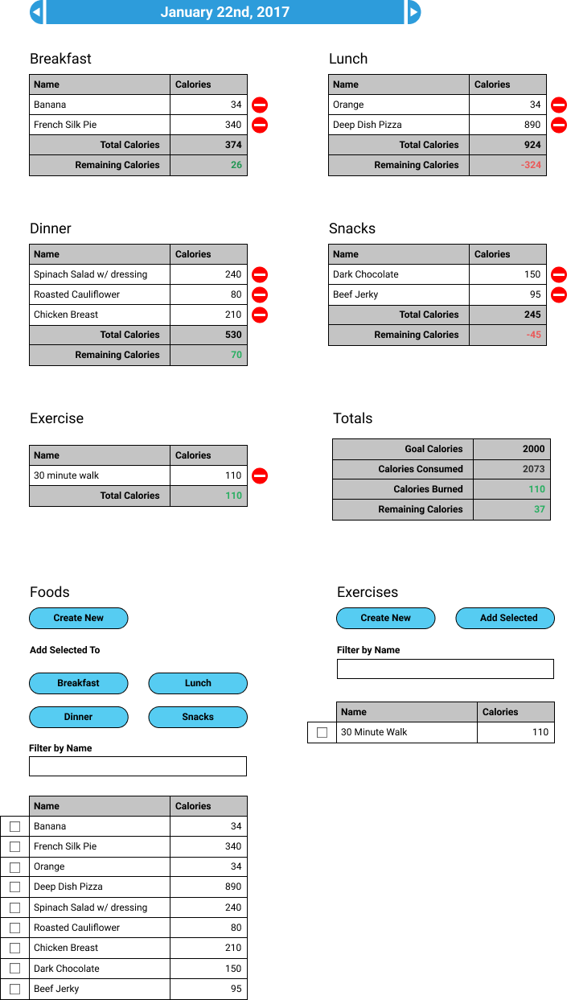

## Intro

Pearson's Law:

> "That which is measured improves. That which is measured and reported improves exponentially." - Karl Pearson

Technology has enabled us to measure more, and shorten the period between measurement and reporting. Sensors are cheaper and smaller, computers are everywhere, and we can access data from anywhere. People who have recognized this, and applied it to themselves are part of a movement called "Quantified Self."

You are going to build a simple calorie tracker.

## Learning Goals

- Walk in a Front-End Engineer's shoes
- Basics of Javascript
- jQuery based DOM traversal
- jQuery based Event handling
- jQuery based State management
- Using pivotal tracker to manage a project with multiple developers
- Using a production git workflow

## Challenges

- Be able to organize your JS across different files
- Store stuff in local storage, without any kind of database
- Handle events
- Handle events on DOM elements that didn't exist at load
- Manage state via jQuery
  - Handle multiple changes on single event
  - Render local storage to DOM
- Write unit and integration tests in Javascript

### Requirements overview

Your requirements for the application are detailed in the cards you've imported to pivotal, but here's an overview of what you're doing.

#### Layouts

**Manage Foods**

**Main Diary**

#### Broad features

- CRUD foods
- Add a food to Diary (meal/day combo)
- Compare calories to goals (meal and daily)
- View calorie calculations in diary
- View different days
- Data persists across refreshes

### Getting your project started

- Follow the instructions on the [Quantified Self Starter Kit](https://github.com/turingschool-examples/quantified-self-starter-kit) to get your codebase going
- Create a new project, or have one created for you. Not sure yet.
- Import [this CSV](quantified-self-tracker-stories.csv) to your project to get all the cards in there. Import is found under settings.

### Important notes about expectations

- Allowed libraries are jQuery, lodash/underscore, and moment.
- Logic like sorting, filtering, local storage and validation should be done without using another library
- `<table>`s are ok for the actual tables. Try not to use them for the layout.
- All elements from the mockup should be represented in your app, even if the styling or layout is different.  Unless it is mentioned specifically in the user stories, colors and other styling are up to you. I'll be just fine if it looks exactly like the mockup though.
- Details, Details, Details!!! If it's in the user stories, I'm looking for it in your app. And ask before you add any functionality. Additional functionality in the evaluation is usually just grounds for a stern look, but if you "improve" functionality and don't ask about it, it's considered incorrect.

### Tips for success

- Try to uses HTML/CSS classes when changing styling, instead of changing the styling of an element directly.
- Experiment with ES6, but try to be consistent in each file whether you're using ES6 or ES5. Probably the most useful thing in ES6 is string interpolation and multi-line strings, neither of which are supported in ES5
- There is similar functionality across elements in the app. Make your code DRY, but don't over do it. Sometimes the functionality differs slightly.
- Plan, diagram and break down the problem, but don't try to get it right the first time. Don't write too much code without refactoring. Maybe stop and refactor every so many minutes, or so many cards.
- A lot of this is new, and you'll probably have to be pairing more often, or at least be available to each other remotely.
- Materialize is just a headache, but I can't stop you from using it.

## Rubric

You will be subjectively graded by an instructor on the following criteria:

### Specification Adherence

- 4: Application implements all functionality as defined, with no bugs, and one extension
- 3: Application implements all functionality as defined, but some bugs or strange behavior where features intersect
- 2: Application is missing required functionality, deviates significantly from the spec, or serious bugs prevent features from being usable
- 1: Application is missing a significant portion of functionality

### Testing

- 4: All functionality is covered by tests. Appropriate mix of unit and integration tests. Sad path testing in both unit and integration tests.
- 3: All functionality is covered by tests. Appropriate mix of unit and integration tests.
- 2: More functionality implemented than tested or only uses one test type
- 1: Team fails to effectively test the application.

### HTML/CSS/UI

- 4: Team used CSS preprocessor and put some effort into styling. HTML features unique IDs, classes for DOM traversal, and data namespace attributes
- 3: Application is not confusing to use. HTML classes and IDs are kebab case.
- 2: HTML is greatly lacking in standards compliance. UI is confusing or very buggy.
- 1: Application is unusable

### JS syntax and Style

- 4: Javascript features explicit DOM traversal (not using closest), demonstrates great OOP concepts, and uses named and anonymous functions when appropriate
- 3: Uses classes as modules. DRY code where appropriate. Attention payed to indentation and naming.
- 2: Javascript is noticeably lacking in the above concepts.
- 1: Team has not applied any style concepts from class or from Ruby background

### Git Workflow

- 4: Team uses master for production, and creates a feature branch for each card worked on. Team is using pull requests with good context and conversation
- 3: Team is using the feature branches for small groups of cards, and has a pull request for each feature. Developers that aren't on the team have commented on PRs.
- 2: Team fails to use feature branches, or isn't using pull requests
- 1: All code is committed to master

### Project Management

- 4: Team is using a project management tool and updating their progress daily. User stories are clearly written.
- 3: Team is using a project management tool to keep their project organized. Nearly every card has been turned into user stories.
- 2: Team is using a project management tool but didn't update the progress frequently. Many cards have no changes made to them
- 1: Team failed to use a project management tool to track its progress.

### Risk Taking

Adhering to any of these additional specifications will allow you to increase one score above:

- All functionality is part of a class, written using ES6
- No Libraries (except for testing). All JavaScript functionality is your own.
