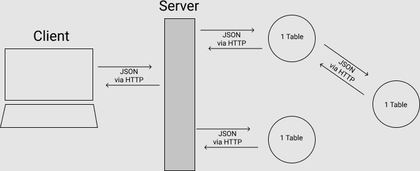

## Intro

Pearson's Law:

> "That which is measured improves. That which is measured and reported improves exponentially." - Karl Pearson

Technology has enabled us to measure more, and shorten the period between measurement and reporting. Sensors are cheaper and smaller, computers are everywhere, and we can access data from anywhere. People who have recognized this, and applied it to themselves are part of a movement called "Quantified Self."

You are going to build a simple calorie tracker.

## Learning Goals

* Students apply knowledge of Ruby collections to JavaScript arrays
* Students create and use functions with parameters
* Students apply SOLID patterns to JavaScript functions
* Students organize functions into classes and objects
* Students make effective use of this in multiple contexts
* Students unit test JavaScript
* Students use event listeners to attach code to event-element combinations including document-ready and element-click
* Students write precise CSS-style selectors in multiple contexts like DOM manipulation and integration testing
* Students read form content and manipulate DOM via JavaScript
* Students integrate outside data sources in the browser (AJAX, local storage)
* Students use integration testing to verify JavaScript functionality
* Students implement a stand-alone web service with Node and Express
* Students interact with SQL databases by writing raw SQL
* Students use pull requests to organize discussion about features
* Students implement feedback from a code review to improve quality
* Students use an agile process to turn acceptance requirements into deployed software

## Challenges

- Create a full-stack JS application
- Be able to organize your JS across different files
- Make AJAX calls to connect your frontend with your backend
- Handle events
- Handle events on DOM elements that didn't exist at load
- Manage state via jQuery
  - Handle multiple changes on single event
  - Render local storage to DOM
- Write unit and integration tests in Javascript

### Requirements overview

Your requirements for the application are detailed in the cards you're going to import to Pivotal Tracker (you can also find them [here](https://github.com/turingschool/backend-curriculum-site/blob/gh-pages/module4/projects/quantified-self/quantified-self-tracker-stories.csv)), but here's an visual of what you're doing.

#### Layouts

### **Manage Foods**

### **Main Diary**

#### Broad Front End features

- CRUD foods
- Add a food to Diary (meal/day combo)
- Compare calories to goals (meal and daily)
- View calorie calculations in diary
- View different days
- Data persists across refreshes
- EXTENSION: Build an admin panel to manage data

#### Broad Back End features
- Build a service in Node that will store all of the Quantified Self data
- The service will serve and consume JSON
- Use SQL for all database communication
- Document a plan in the form of a schema, API docs and user stories.

### Getting your project started

- You're going to create to separate code bases to complete this project. You'll have a code base for your front end and a separate code base for your back end. You may run into some errors when trying to communicate between the two code bases (most likely CORS problems), but we'll address this in class.
- We're going to start with building the back end. For this code base, you'll be starting a new repository from scratch.
- Accept your email invitation from Pivotal Tracker and use this as your Project Management tool.
- Import [this CSV](./quantified-self-tracker-stories.csv) to your project to get all the cards in there. Import is found under settings.
- If you'd like to attempt the extensions, import [this other CSV](./quantified-self-extension-stories.csv).
- When you start to work on the front end, you'll want to follow the instructions on the [Quantified Self Starter Kit](https://github.com/turingschool-examples/quantified-self-starter-kit) to get your codebase going.

### Expectations

- Use whatever you've used in the past for schema, documentation and user stories. Or something new you've been wanting to try out. These things are graded on completion. Probably want to agree on format in your DTR.
- Allowed libraries are jQuery, lodash/underscore, and moment.
- Logic like sorting, filtering, local storage and validation should be done without using another library
- `<table>`s are ok for the actual tables. Try not to use them for the layout.
- All elements from the mockup should be represented in your app, even if the styling or layout is different.  Unless it is mentioned specifically in the user stories, colors and other styling are up to you. I'll be just fine if it looks exactly like the mockup though.
- Details, Details, Details!!! If it's in the user stories, we're looking for it in your app. And ask before you add any additional functionality. Additional functionality in the evaluation is usually just grounds for a stern look, but if you "improve" functionality and don't ask about it, it's considered incorrect.
- SOLID is mentioned in the rubric. You've been applying SOLID in Ruby, without really knowing it, and they apply to all programming languages. You can learn more about it [here](https://scotch.io/bar-talk/s-o-l-i-d-the-first-five-principles-of-object-oriented-design).

### Tips for success

- Try to uses HTML/CSS classes when changing styling, instead of changing the styling of an element directly.
- Experiment with ES6, but try to be consistent in each file whether you're using ES6 or ES5. Probably the most useful thing in ES6 is string interpolation and multi-line strings, neither of which are supported in ES5
- There is similar functionality across elements in the app. Make your code DRY, but don't over do it. Sometimes the functionality differs slightly.
- Plan, diagram and break down the problem, but don't try to get it right the first time. Don't write too much code without refactoring. Maybe stop and refactor every so many minutes, or so many cards.
- A lot of this is new, and you'll probably have to be pairing more often, or at least be available to each other remotely.
- Materialize is just a headache, but I can't stop you from using it.

## Rubric

You will be subjectively graded by an instructor on the following criteria:

### Specification Adherence

- 4: Application implements all functionality as defined, with no bugs, and one extension
- 3: Application implements all functionality as defined, but some bugs or strange behavior where features intersect
- 2: Application is missing required functionality, deviates significantly from the spec, or serious bugs prevent features from being usable
- 1: Application is missing a significant portion of functionality

### Planning and Design

- 4: Team created visual schema, API documentation and user stories, before writing tests. API adheres to REST standard.
- 3: Team created either a schema or API docs to facilitate implementation of a service.
- 2: Team has some notes on how to implement their service, but someone else couldn't implement it.
- 1: Team did not design their service.

### Testing

- 4: All functionality is covered by tests. Appropriate mix of unit and integration tests. Sad path testing in both unit and integration tests.
- 3: All functionality is covered by tests. Appropriate mix of unit and integration tests.
- 2: More functionality implemented than tested or only uses one test type
- 1: Team fails to effectively test the application.

### HTML/UI

- 4: Team put some effort into styling. HTML features unique IDs, classes and data attributes for DOM traversal.
- 3: Application is not confusing to use. HTML classes and IDs are kebab case.
- 2: HTML is greatly lacking in standards compliance. UI is confusing or very buggy.
- 1: Application is unusable

### JS syntax and Style

- 4: Javascript features explicit DOM traversal (not using closest), demonstrates great OOP concepts, and uses named and anonymous functions when appropriate
- 3: Code logically divided into files. Developer can show examples of some SOLID concepts. Attention payed to indentation and naming.
- 2: Javascript is noticeably lacking in the above concepts.
- 1: Team has not applied any style concepts from class or from Ruby background

### Git Workflow

- 4: Team uses master for production, and creates a feature branch for each card worked on. Team is using pull requests with good context and conversation
- 3: Team is using the feature branches for small groups of cards, and has a pull request for each feature. Developers that aren't on the team have commented on PRs.
- 2: Team fails to use feature branches, or isn't using pull requests
- 1: All code is committed to master

### Project Management

- 4: Team is using a project management tool and updating their progress daily. Team is approving each other's  work. Team is documenting conversations and conclusions on relevant cards.
- 3: Team is using a project management tool to keep their project organized. Nearly every card has been turned into user stories.
- 2: Team is using a project management tool but didn't update the progress frequently. Many cards have no changes made to them
- 1: Team failed to use a project management tool to track its progress.

### Risk Taking

Adhering to any of these additional specifications will allow you to increase one score above:

- All functionality is part of a class, written using ES6
- No Libraries (except for testing). All JavaScript functionality is your own.
- Complete either of the two backend focused extensions below. 

#### Sources of Truth

Local Storage is often used for "offline" functionality. When the user is having trouble connecting to the internet, the application will continue to function. When a connection is re-established, the local changes are uploaded to the server. Likewise, if changes are made on one client, they should be downloaded to another client

Use Local Storage and AJAX to meet the following requirements:

1. If I'm disconnected from the internet, I can continue to use the application.
1. When I make a change while disconnected from the internet, that change will be uploaded to the server when I reconnect
2. If I make a change one computer, those changes should propagate to any other clients through the server

You will probably need to use a concept called `service workers`

#### Mircroservices

Instead of building a single service, build a series of microservices. Each microservice is a separate codebase and application that represents a single table in your schema. These applications communicate with each other via HTTP. Since they all live in the same datacenter, this is not much of a performance problem.

The architecture would look something like this:

If you attempt this challenge, your planning and design should include your microservices architecture.

As to why you might want to do this, watch [Chad Fowler's Rocky Mountain Ruby 2015 talk](https://www.youtube.com/watch?v=-UKEPd2ipEk)
