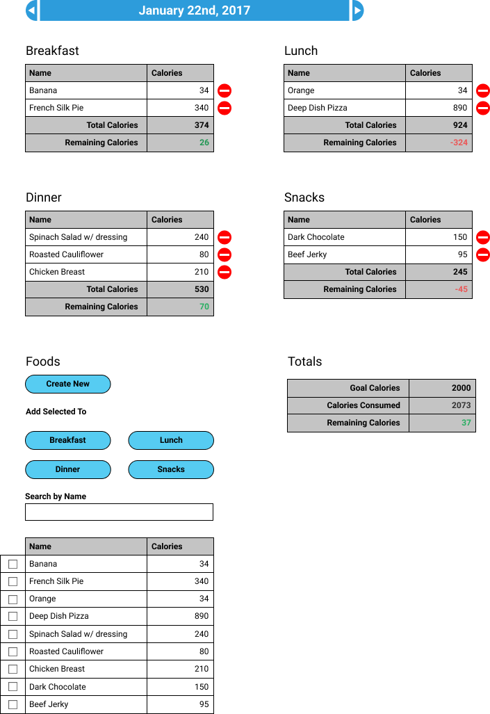

## Introduction

Pearson's Law:

> "That which is measured improves. That which is measured and reported improves exponentially." - Karl Pearson

Technology has enabled us to measure more, and shorten the period between measurement and reporting. Sensors are cheaper and smaller, computers are everywhere, and we can access data from anywhere. People who have recognized this, and applied it to themselves are part of a movement called "Quantified Self."

You are going to build a simple calorie tracker.

## Learning Goals

* Create a Rails API given specified endpoints and response formats.
* Create an Express API given specified endpoints and response formats.
* Create an API in a new language of the students choice given specified endpoints and response formats.
* Review and refactor code (in each of the three languages) so that it:
    * is well organized
    * clearly communicates intent
    * utilizes abstraction to hide complexity
    * breaks problems down into small methods/functions with a single responsibility

### Requirements Overview

You will be creating an API in three separate languages that supports a front-end that users will utilize to track calories in meals that they eat.

Your requirements for the application are detailed in the cards **you're going to create on Pivotal Tracker**.

#### Background: The Front End

The application that consumes your API will have two main layouts. A "foods" index page and a "diary" index page (as seen below).

##### **Manage Foods**


##### **Main Diary**



At a high level, users will be able to:

- CRUD foods
- Add a food to a meal
- Compare calories to goals (meal and total)
- View calorie calculations in diary
- Data persists across refreshes

#### Back End Features

During the three weeks of this project, you'll get the opportunity to build an API in three interations. First, you'll build it in Rails. Second, you'll build it using Node, Express, and Knex. Lastly, you'll use a wild card programming language.

- You'll start each of your new backend repositories from scratch.
- You'll need to accept your email invitation from Pivotal Tracker and use this as your Project Management tool.
- Create a Pivotal Tracker board and write stories for each of your endpoints.
- Add your assigned Technical Lead to your Pivotal Tracker and your repository.

You will need to build nine endpoints for each of the technologies you will be using. All endpoints will return the data as JSON.

##### Food Endpoints:

**GET /api/v1/foods**

Returns all foods currently in the database

Each individual food will be returned in the following format:

```js
{
    "id": 1,
    "name": "Banana",
    "calories": 150
},
```

**GET /api/v1/foods/:id**

Returns the food object with the specific `:id` you've passed in or 404 if the food is not found

**POST /api/v1/foods**

Allows creating a new food with the parameters:

```js
{ "food": { "name": "Name of food here", "calories": "Calories here"} }
```

If food is successfully created, the food item will be returned. If the food is not successfully created, a 400 status code will be returned. Both name and calories are required fields.

**PATCH /api/v1/foods/:id**

Allows one to update an existing food with the parameters:

```js
{ "food": { "name": "Mint", "calories": "14"} }
```

If food is successfully updated (name and calories are required fields), the food item will be returned. If the food is not successfully updated, a 400 status code will be returned.

**DELETE /api/v1/foods/:id**

Will delete the food with the id passed in and return a 204 status code. If the food can't be found, a 404 will be returned.

##### Meal Endpoints:

**GET /api/v1/meals**

Returns all the meals in the database along with their associated foods

If successful, this request will return a response in the following format:

```js
[
    {
        "id": 1,
        "name": "Breakfast",
        "foods": [
            {
                "id": 1,
                "name": "Banana",
                "calories": 150
            },
            {
                "id": 6,
                "name": "Yogurt",
                "calories": 550
            },
            {
                "id": 12,
                "name": "Apple",
                "calories": 220
            }
        ]
    },
    {
        "id": 2,
        "name": "Snack",
        "foods": [
            {
                "id": 1,
                "name": "Banana",
                "calories": 150
            },
            {
                "id": 9,
                "name": "Gum",
                "calories": 50
            },
            {
                "id": 10,
                "name": "Cheese",
                "calories": 400
            }
        ]
    },
    {
        "id": 3,
        "name": "Lunch",
        "foods": [
            {
                "id": 2,
                "name": "Bagel Bites - Four Cheese",
                "calories": 650
            },
            {
                "id": 3,
                "name": "Chicken Burrito",
                "calories": 800
            },
            {
                "id": 12,
                "name": "Apple",
                "calories": 220
            }
        ]
    },
    {
        "id": 4,
        "name": "Dinner",
        "foods": [
            {
                "id": 1,
                "name": "Banana",
                "calories": 150
            },
            {
                "id": 2,
                "name": "Bagel Bites - Four Cheese",
                "calories": 650
            },
            {
                "id": 3,
                "name": "Chicken Burrito",
                "calories": 800
            }
        ]
    }
]
```

**GET /api/v1/meals/:meal_id/foods**

Returns all the foods associated with the meal with an id specified by :meal_id or a 404 if the meal is not found

If successful, this request will return a response in the following format:

```js
{
    "id": 1,
    "name": "Breakfast",
    "foods": [
        {
            "id": 1,
            "name": "Banana",
            "calories": 150
        },
        {
            "id": 6,
            "name": "Yogurt",
            "calories": 550
        },
        {
            "id": 12,
            "name": "Apple",
            "calories": 220
        }
    ]
}
```

**POST /api/v1/meals/:meal_id/foods/:id**

Adds the food with :id to the meal with :meal_id

This creates a new record in the MealFoods table to establish the relationship between this food and meal. If the meal/food cannot be found, a 404 will be returned.

If successful, this request will return a status code of 201 with the following body:

```js
{
    "message": "Successfully added FOODNAME to MEALNAME"
}
```

**DELETE /api/v1/meals/:meal_id/foods/:id**

Removes the food with :id from the meal with :meal_id

This deletes the existing record in the MealFoods table that creates the relationship between this food and meal. If the meal/food cannot be found, a 404 will be returned.

If successful, this request will return:

```js
{
    "message": "Successfully removed FOODNAME to MEALNAME"
}
```

### Getting your project started

You'll have four separate code bases to complete this project.

* A code base for the front end (which will be supplied to you), which you can deploy by following the instructions on the [Quantified Self Front End Starter Kit](https://github.com/turingschool/qs-frontend-starter).
* A Rails code base.
* An Express code base.
* A code base in a language of your choice.

You may run into some errors when trying to communicate between the two code bases (most likely CORS problems), which you will need to debug.

### Expectations

- Tag instructors in PRs on Github wherever you'd like feedback.
- Reach out for extra support if you feel like your team is falling behind.
- If there's any question about functionality, ask. There's a [#qs-questions](slack://channel?team=T029P2S9M&id=C3VFECP60) channel specifically for this.

## Rubric

You will be subjectively (Friday of Week Three via Github) graded by an instructor on the criteria in [this rubric](./rubric). You'll need to self assess on this rubric when submitting your final project [here](https://github.com/turingschool/ruby-submissions/tree/master/1711-b/4module/quantified_self).

