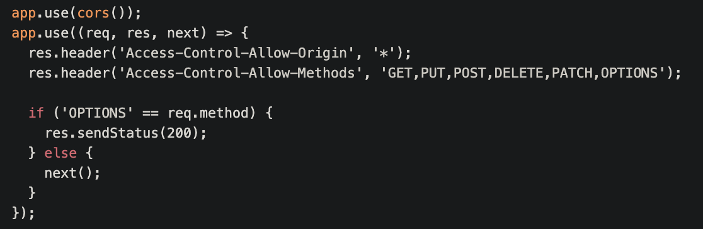

## Learning Goals
* Define CORS
* Understand why CORS is used
* Know how to set up an Express project with CORS

## Vocab
* CORS
* SOP
* Origin
* Pre-flight Request

## Warm Up

* Have you included external resources _(fonts, images, etc.)_ in your projects? How did you include them?
* Define the parts of a HTTP request and response?
* Define the parts of this URL `http://www.example.com/cats`

## What and Why?

Let's start by defining  __origin__. An origin is made up of three parts: a protocol, a host, and a port. Compare the url below to each in the list and determine if they have the same origin, and if not why.
_Hint: The defualt port for `http` is port 80_

`http://www.crafts.com/index.html`

1. `https://www.crafts.com/index.html`
1. `http://www.crafts.com/how-to-build-a-table.html`
1. `http://www.books.com/index.html`
1. `http://www.crafts.com:443/index.html`
1. `http://www.crafts.com/paper/how-to-make-an-oragmi-flower`

Web browsers have policies in place to help with built-in security.

One such policy is the __Same-Origin Policy__, also known as __SOP__. As the name suggests, it means that resources can be used on your web page only if it is requested from the same origin. For example, you can include a font, front-end JavaScript file, AJAX call, image, etc, only if the request for that resource also comes from your own server.

This policy is used to help protect requests to your site, similar to how Cross Site Request Forgery _(CSRF)_ would protect your form inputs. The font, images, and all of your content would have to be stored on the same server as your web application. In order to share resources, the Cross Origin Resource Sharing __CORS__ standard was created. As we develop APIs that interact with independent frontend applications it is necessary to consider who and how those applications are accessing the information.

__Technically speaking, implementing CORS will _relax_ the security of your resources__, allowing other sites to access your content. The default behavior is to ONLY allow same-origin requests.

The server will need to be set up to handle requests coming from different origins. To do this, CORS introduced new headers that can be passed as part of the HTTP request. The two that we are going to focus on are `Access-Control-Allow-Origin` and `Access-Control-Allow-Methods`. Within the backend of a project it is necessary to specify what origins and what methods will be allowed from cross origin requests. Below is an example of an Express app that is using a CORS package to handle requests.



In this example, `res.header('Access-Control-Allow-Origin', '*')`, the access control is open to any origin because it is set to `'*'`, which means _any_ origin is acceptable. To be more secure, the `Access-Control-Allow-Origin` should be set to only accept requests from trusted domains. You can provide a list of domains if there are more than one. 

On the next line, `res.header('Access-Control-Allow-Methods', 'GET,PUT,POST,DELETE,PATCH,OPTIONS');`, the accepted request methods are being defined. It is possible to restrict to as few or as many methods as you want to allow. 

Generally speaking, you only want to expose resources to domains you explicitly trust.


## Preflight Requests

GET methods are usually acceptable because each request is only _retrieving_ information. But what about requests that potentially alter data? These requests have an extra step in place to automatically check whether the request will be accepted or not. This extra step is a __preflight request__. It is made before the original request is sent to determine whether the original request will be acceptable. A good analogy would be calling a restaurant before driving there to make sure they were open. 

A preflight request is triggered if the request includes the following HTTP verbs (methods) : `PUT, PATCH, DELETE, CONNECT, OPTIONS, TRACE`. If we were to make a `PUT` request the sequence of requests and repsonses might look like this:

```
# preflight request

OPTIONS: /path HTTP 1.1
Origin: http://www.somewebsite.com
Acces-Control-Request-Method: PUT

                                                                           # response

                                                                      HTTP 1.1 200 OK
                              Access-Control-Allow-Origin: http://www.somewebsite.com
                                Access-Control-Allow-Methods: GET, PUT, POST, OPTIONS

# original request

PUT /path HTTP 1.1
Origin: http://www.somewebsite.com
Acces-Control-Request-Method: PUT

                                                                           # response

                                                                      HTTP 1.1 200 OK
                              Access-Control-Allow-Origin: http://www.somewebsite.com


```

## Wrap Up
- Implement CORS in your pair project in a way that another pair project could load your resources
- Write a summary of what is CORS and why it is necessary.
